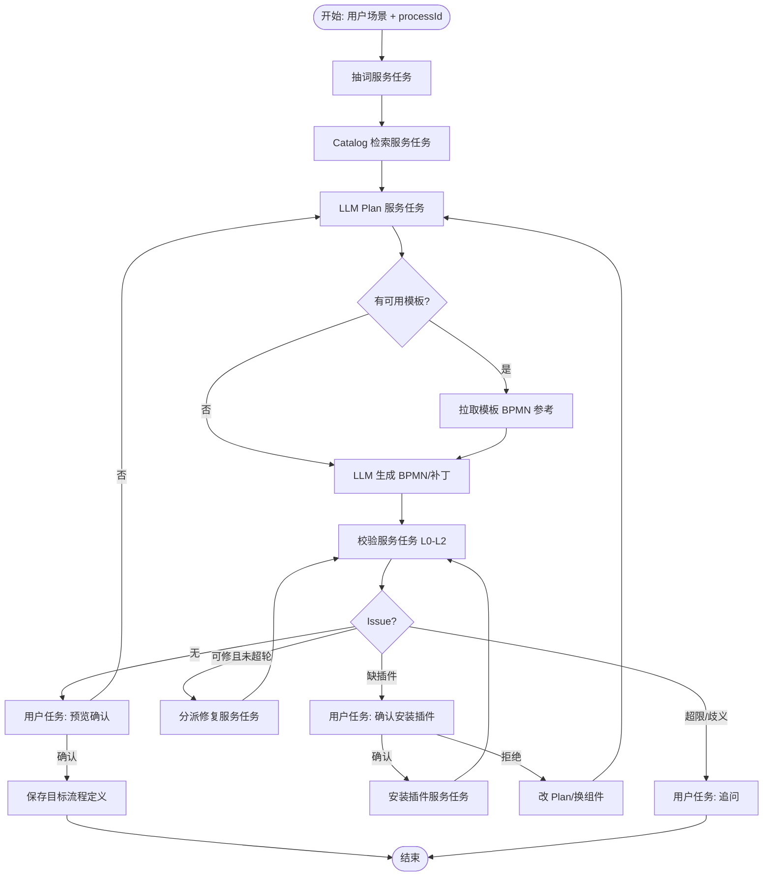

# AI 写工作流：用 Kiwi 流程实现验证闭环

## 目标

用户输入**应用场景** → 系统提供**组件 + 模板上下文** → LLM 设计 BPMN → **校验闭环**（语法 / 结构 / componentId / 缺插件）→ 预览确认落盘。

**编排载体：Kiwi/Operaton 内部流程（dogfood），不用 Dify；v1 不上 RAG。**

OpenSpec change：[`openspec/changes/ai-workflow-authoring-process`](../../openspec/changes/ai-workflow-authoring-process/)

## 关键决策

| 议题 | 结论 |
|------|------|
| 代码 vs Dify | **Kiwi BPMN 编排 + Java Delegate**；不上 Dify |
| 上下文给 LLM | **服务端检索注入 Catalog 为主**；MCP 仅按需加深 |
| RAG | **v1 不要**；场景→抽词→ keyword / `aiPage` |
| 抽词 | **要**轻量 LLM 或规则抽 `keywords/tags`，再查库 |
| MCP 自选 vs 注入 | **先查后注入为主** |
| 落盘 | **预览 → 用户确认 → 再保存**；坏图不落盘 |
| 缺插件 | AskUser 确认后再装，再校验 |
| 人机停顿 | **暂定 User Task**（缺插件 / 追问 / 预览）；备选见下节 |

## 人机停顿：User Task（暂定）vs 不用 User Task（备选）

三类停顿——**缺插件确认、追问、预览确认**——都要等人；差别在「谁记账」。

### 暂定：用 User Task（本期实现）

- 引擎在 Preview / Install / Ask 节点挂起；设计器 Chat 查任务、展示卡片、`complete` 带回变量（如 `confirmed`、`userAnswer`、`installAccepted`）。
- **优点**：状态可恢复、可观测、与 Kiwi 待办模型一致、适合长停顿（关页再开）。
- **成本**：需任务桥接 API / 完成契约；Chat UX 与 Tasklist 要对齐。

### 备选：不用 User Task（本期不做，记入备选）

- Service Task 把「请确认预览 / 是否装插件 / 追问」推到 Chat（ClientAction 或会话消息）；人在会话内回答后，下一轮 assistant 或 Message/Receive 事件把结果写回流程变量再继续。
- **优点**：和设计器对话贴合更快，少一层 Task 模型。
- **缺点**：停顿状态在会话/前端，重启与多端要自管；与「用 Kiwi 流程编排」的 dogfood 弱一截；超时/审计需自研。
- **若日后切换**：把三个 User Task 换成「推送 Chat + 消息关联/回调完成」；校验与 Catalog/Save 节点可不动。轻量追问也可混合：仍用 User Task 做预览/装插件，仅把简单缺参追问放会话里。

```text
暂定 (User Task):     Validate → [UT 预览/安装/追问] → 后续
备选 (无 UT):         Validate → 推 Chat → (引擎外等人) → 消息/回调 → 后续
```

## 系统内主流程

进程 key（建议）：`kiwi_ai_workflow_authoring`



### 阶段与实现

| 阶段 | Kiwi 实现 |
|------|-----------|
| 场景抽词 | Service Task → Delegate（小 LLM 或规则） |
| Catalog | Service Task → `CatalogContextBuilder` |
| Plan / 生成 | Service Task → `ChatClient`（Catalog 注入，不靠模型自觉搜目录） |
| 校验 | Service Task → `BpmAiWorkflowValidator` |
| 修复循环 | 排他网关 + `repairRound` ≤ 3 |
| 缺插件 / 追问 / 预览 | **User Task** + 设计器桥接 |
| 安装 / 保存 | Service Task → 现有 API |

入口：设计器 `bpm-ai-chat` / `POST /ai/assistant` **启动或信号驱动**该内部流程。

## Catalog（无 RAG）

```
场景 --(抽词)--> keywords/tags
     --(查询)--> 已装过滤 + bpmMarket_aiPage + 远程可装差集
     --(截断)--> Top-N JSON → Plan/生成节点输入变量
```

模板先摘要；选定后再拉 1 份 BPMN。MCP 仅补索。

## Issue 分派

| Issue | 走向 |
|-------|------|
| 语法/结构可修 | Repair → Validate |
| `PLUGIN_NOT_INSTALLED` | 安装确认 User Task |
| `UNKNOWN_COMPONENT` | 重匹配或 Ask |
| 缺参且上下文不足 | Ask User Task |
| 无 Issue | 预览确认 → Save |

## 范围

**做：** 内部流程 + Delegate + Catalog/抽词/Validator + 设计器预览/确认桥接  

**不做：** Dify、向量 RAG、未确认自动装插件/自动 save、deploy dry-run（二期）

## 成功标准

- Plan 的 `componentId` 均来自本轮 Catalog  
- 缺插件停在用户确认，不保存坏图  
- 通过 → 预览 → 确认后才写入目标流程  
- `repairRound` 可配置（默认 ≤ 3）

## 相对现状

当前：单轮 LLM → `assistant_designer_bpmn_xml` → 前端 import+自动 save；校验仅 well-formed；组件上下文前端 60 条 `id|name`。

目标：Kiwi 元流程编排 + Catalog 注入 + 多层校验 + User Task 人机停顿。
