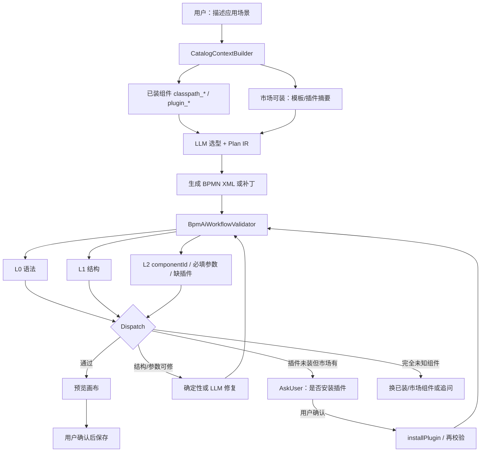
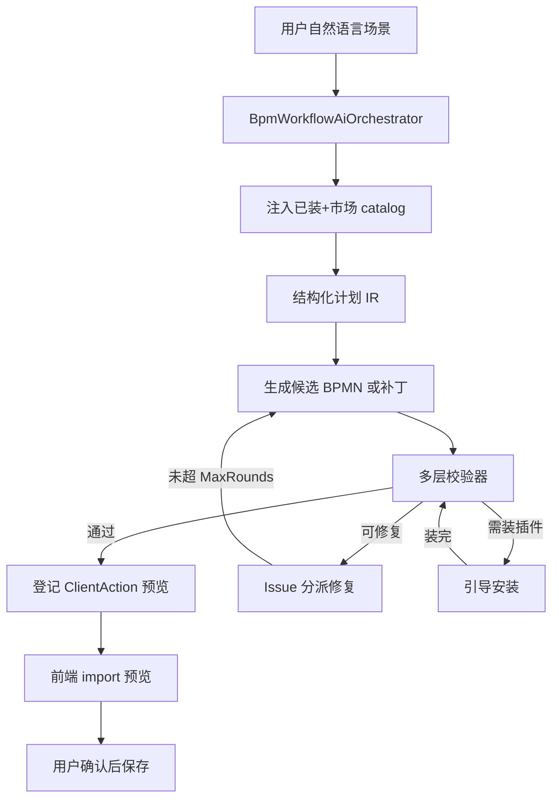
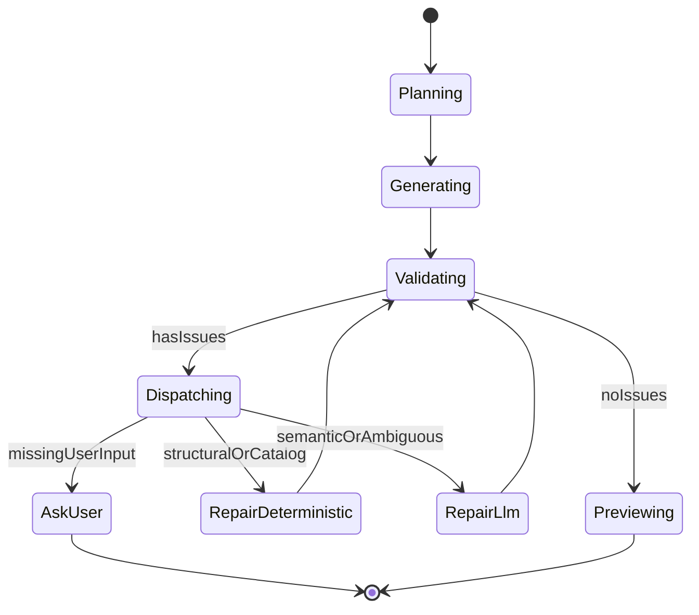

# AI 写工作流：验证闭环加强

## 问题本质

当前路径是 **单轮 LLM → `assistant_designer_bpmn_xml` → 前端 import+save**：

- 校验仅 [`BpmDesignerXmlValidator`](kiwi-admin/backend/src/main/java/com/kiwi/project/system/ai/BpmDesignerXmlValidator.java)（well-formed + 根 `definitions`）
- [`AiAssistantService`](kiwi-admin/backend/src/main/java/com/kiwi/project/ai/AiAssistantService.java) 的 retry 只处理「actions 为空的假成功」，**不处理「XML 语义错误 / 组件不存在 / 跑不起来」**
- `forcedBpmnXmlToolChoice()` 已写未接入；toolbar 工具与 prompt 不一致

把「写工作流」做成产品能力，正确骨架是闭环，而不是再加一长段 prompt。

## 旗舰场景（按你的例子锁定）

端到端约定：

1. **喂给 LLM 的不是「60 条 id|name」**，而是分类 catalog：
   - **已安装**：`componentId | name | source | group`（来自 `BpmComponentService` / `bpmComp_listGrouped`）
   - **市场可装但未装**：远程/站内插件与组件摘要（`bpmRemoteMarket_list?type=plugin`、模板 manifest 的 `requiredComponentKeys`）；标明 `status=available_to_install`
   - 体量过大时：**场景关键词检索后 Top-N**（复用 `bpmComp_aiPage` / `bpmMarket_aiPage`），其余可按需再查，而不是一次性塞全库
2. LLM **只能从 catalog 里的 id 选型**（Plan IR 引用 `componentId`）；若选 `available_to_install`，IR 标记 `requiresInstall=true`，**不假装已装**
3. 生成后 **服务端强制校验**（不靠模型自觉）：语法 → 结构 → 每个 `kiwi:componentId` 解析 → 区分「未知」vs「需装插件」
4. 缺插件：**不自动静默装**；发出结构化 issue + AskUser / ClientAction，用户确认后再走现有 `bpmRemoteMarket_installPlugin` / `bpmComp_uploadPlugin`，再进下一轮 Validate

## 目标架构（选定方案）

**默认策略（本期锁定）：**

1. **服务端确定性状态机**编排闭环（不是 Dify/LangGraph 式可视化 Agent 工作流，也不是开放 ReAct 自由选路）
2. **校验失败不入库、不自动 save**；通过后再登记 `bpmnXml`（前端改为「预览 import」，确认后 `PUT`）
3. **v1 不做引擎真实 deploy dry-run**；校验停在「可导入 + Kiwi 语义静态检查 + 插件就绪」
4. **优先增量补丁 IR**，整图 XML 仅作序列化结果
5. **校验分支用 issue taxonomy 分派**；缺插件走「引导安装」分支，不是再开 Agent 工作流
6. **Catalog 由编排器组装注入**，不依赖模型自己碰巧调用 MCP 才知道市场有什么

## 分支很多时怎么设计？（核心决策）

「很多分支」通常混着两件事，必须拆开：

| 分支类型 | 含义 | 正确处理 |
|----------|------|----------|
| **产物分支** | 生成的 BPMN 里有 gateway / 并行 / 条件流 | 校验器要能检查网关出边、条件表达式、汇聚；生成时 IR 显式表达 gateway，而不是指望模型自由画 XML |
| **控制分支** | 校验失败后走哪条修复路径 | **按 `ValidationIssue.code` 确定性路由**；同一轮可批量修复多条 issue，而不是为每个 code 拉一条独立 Agent 链 |

### 选定模式：状态机 + Issue 分派（不是 Dify）

**一轮 Validate 的正确姿势：**

1. **并行跑完所有检查层**，收集完整 `ValidationIssue[]`（不要 fail-fast 只报第一条）
2. **按严重度排序 / 去重 / 合并**（例如同一断连线不要报 5 次）
3. **Dispatch 表路由**（代码写死，可配置，但不是 LLM 选）：

| issue.code 示例 | 修复器 | 是否调 LLM |
|-----------------|--------|------------|
| `XML_MALFORMED` / `NOT_DEFINITIONS` | 要求重生或截断修复 | 有限 LLM |
| `UNKNOWN_COMPONENT` | 用已装+市场 catalog 重匹配；仍无则 AskUser | 小 LLM 或模糊匹配 |
| `PLUGIN_NOT_INSTALLED` | 解析目标 JAR（复用 `buildPluginJarIndex` / 远程 manifest）→ AskUser 安装 | **否**（确定性） |
| `MARKET_COMPONENT_AVAILABLE` | 同缺插件：给出安装入口，装完再 Validate | **否** |
| `MISSING_REQUIRED_PARAM` | 从用户话/上下文填；不足则 AskUser | 条件 LLM |
| `DANGLING_FLOW` / `ORPHAN_NODE` | 图修补算法（加边/删孤点） | **确定性优先** |
| `GATEWAY_NO_DEFAULT` / `GATEWAY_EDGE_MISSING` | 补边或补条件 | 确定性 + 少量 LLM |
| `AMBIGUOUS_INTENT` | 停止自动修 | AskUser |

关键点：**分支在「数据分类」上，不在「再嵌一套工作流引擎」上。**

### 要不要上 Dify 式 Agent 工作流？

**本期不上。理由：**

- Kiwi **自己就是 BPMN 工作流平台**；再引入 Dify/类似引擎做「写 BPMN 的元编排」，双运行时、双可观测、双调试，成本远高于收益
- 校验/修复的控制流是 **有界、可枚举、要确定性** 的；Dify 强项是开放式业务 Agent 编排与非工程师改图，不是编译器式校验管线
- 现有栈已够用：`AiAssistantService` + 进程内 Tool + MCP + 前端 ClientAction；缺的是 **编排器与校验分类**，不是新平台
- 开放 ReAct（模型自己决定下一步调什么）适合探索，但写 BPMN 时成本与翻车率高，难保证「坏图不落盘」

**什么时候才值得考虑「Agent 图」：**

- 非工程师要频繁改 AI 管线拓扑（产品运营调 prompt 图）
- 多专家并行（检索模板 / 写壳 / 配参 / 写测试）且拓扑常变
- 需要跨系统长事务人工审批节点（那反而更适合 **用 Kiwi/Operaton 自己 dogfood**，而不是 Dify）

若未来要可视化编排「AI 写流程」管线，**优先 dogfood Kiwi BPMN**（把 Plan/Validate/Repair 做成内部流程定义），而不是外挂 Dify。

### 对「BPMN 产物里很多分支」的专门处理

- Plan IR 增加 `gateway` / `condition` step，生成器按模板展开，避免模型手写复杂 DI/条件流
- L1 校验显式覆盖：排他/并行网关出边数量、条件非空、是否有汇聚、default flow
- Repair 对结构类网关错误走确定性图算法；仅条件文案/业务语义走 LLM

## 闭环各阶段

### 0. Catalog 组装（场景入口必做）

新服务 `BpmAiCatalogContextBuilder`：

- 已装：`BpmComponentService` 全量或按场景 keyword 检索（`bpmComp_aiPage`）
- 可装插件：`bpmComp_listPlugins` + `bpmRemoteMarket_list(type=plugin)` 差集
- 可选：相关模板包摘要 `bpmMarket_aiPage`（作「从模板起步」线索，非必须安装）
- 输出给 LLM 的文本/JSON 需带 **`installed` | `available_to_install`** 标记，避免模型把未装组件当成已可用

### 1. 规划（Plan IR）

模型先产出结构化意图，而不是直接吐整份 XML，例如：

- `intent`: create_from_scenario | edit | append | copy_from
- `steps[]`: add_task / connect / set_param / remove / gateway
- 每步：`componentId`、`requiresInstall`、锚点 `elementId`
- 选型约束：**id 必须出现在本轮 catalog**；未装则 `requiresInstall=true`

检测到「场景生图 / 改图」意图时走编排器，而非裸 `callAssistant`。

### 2. 生成（Generate）

- **小改**：由 IR + 当前 XML 做确定性/半确定性合并
- **场景从零 / 大改**：LLM 生成完整 definitions，仍必须过校验门
- 组件参数：用已装组件的 `@ComponentParameter` 元数据约束必填 key；未装组件只生成骨架 + 安装提示，或等安装后再填参

### 3. 多层校验（Validate）——闭环的「真」

| 层 | 检查内容 | 失败反馈 |
|----|----------|----------|
| L0 语法 | XML 可解析、根 `definitions`、大小上限 | 现有 validator |
| L1 结构 | Start/End、sequenceFlow 端点、孤儿节点、网关出边 | 结构化错误 |
| L2a 组件存在 | 解析 BPMN 全部 `componentId`；`resolveComponentById` | `UNKNOWN_COMPONENT` 或 `PLUGIN_NOT_INSTALLED` |
| L2b 缺插件 | 对照已装 plugin JAR / 远程可装列表（复用 `buildPluginJarIndex`、remote manifest） | `MARKET_COMPONENT_AVAILABLE` + 安装坐标 |
| L2c 必填参数 | 已装组件的 required input 是否有绑定 | `MISSING_REQUIRED_PARAM` |
| L3 画布 | bpmn-js import warnings（可二期） | warnings |
| L4 引擎 | Operaton deploy dry-run | **本期不做** |

新 API/服务：`BpmAiWorkflowValidator`（可附带 `POST` 批量校验供调试）；返回 `List<ValidationIssue>`（code、elementId、componentId、pluginHint、severity），而不是只 throw。

### 4. 修复（Repair）——分派，不是「再跑一个 Agent 工作流」

- 最大轮数：`kiwi.ai.bpm.max-repair-rounds`（建议默认 **3**）
- 每轮：先 **Dispatch**（按 issue.code 分组）→ 确定性修复器批量处理结构/目录类问题 → 剩余语义类一次性打包给 LLM（带 issue JSON）→ 再 Validate
- 禁止：为每个 issue 单独开一条开放式 Agent 链；禁止只喂自然语言摘要
- 超限或遇到 `AskUser` 类：返回可读报告 + 追问，**不**登记破坏性 `bpmnXml`

### 5. 应用（Apply）

- 通过校验后才 `ClientAction.bpmnXml`
- 前端 [`BpmnXmlAssistantActionHandler`](kiwi-admin/frontend/src/app/pages/bpm/design/assistant/bpm-designer-assistant.handlers.ts)：由「import+自动 save」改为 **预览 → 用户确认 → save**（与闭环一致）
- 会话进度可在 chat 中展示：`规划中 / 校验失败重试(2/3) / 待确认`

## 与现有代码的衔接

| 现有 | 闭环中的角色 |
|------|----------------|
| `POST /ai/assistant` + `AiAssistantService` | 入口保留；场景/改图意图分流到编排器 |
| `bpmComp_listGrouped` / `bpmComp_aiPage` | Catalog「已装」数据源 |
| `bpmComp_listPlugins` / `bpmRemoteMarket_list` | Catalog「可装插件」与缺插件引导 |
| `bpmMarket_aiPage` | 可选：相关模板线索 |
| `BpmComponentPluginLoader.buildPluginJarIndex` | L2b 内部复用；可暴露为 MCP/`bpmComp_pluginIndex` |
| `AssistantDesignerTools.designerBpmnXml` | 仅接受已通过校验的 XML，或由编排器直接登记 action |
| `BpmDesignerXmlValidator` | 升级为 L0，并入多层校验 |
| 前端 `bpm-ai-chat` | 改为消费编排器 catalog；去掉「仅 60 条 id\|name」主路径 |
| 远程安装 `missingComponentKeys` | 与 L2 语义对齐（统一用 componentId / resolve） |
| toolbar 工具注释 | 不依赖；安装/保存由确认流驱动 |

## 范围边界（本期）

**做：**

- Catalog（已装 + 市场可装）注入 + 场景 Plan IR
- 编排器 + 多层校验（含缺插件检测）+ ≤3 轮修复
- 缺插件 AskUser / 确认安装后再校验
- 校验通过后预览；确认再保存
- OpenSpec change：`ai-workflow-verify-loop`

**不做（明确非目标）：**

- 引入 Dify / LangGraph / 外挂 Agent 工作流平台
- 开放 ReAct 作为主控
- 未确认就自动安装市场插件
- 流式 SSE；Operaton deploy dry-run；多模态
- 一次改完公网 Registry / 模板市场 §8 全量（模板可作 catalog 线索即可）

## 关键改动面（实施时）

- 后端：`CatalogContextBuilder` + `BpmAiWorkflowValidator` + 状态机编排器；`AiAssistantService` 分流
- 前端：预览确认；缺插件安装确认 UI；chat 展示阶段状态
- 规格：Scenario 覆盖「场景→选型→缺插件引导→装完可用」

## 成功标准

- 用户描述场景后：LLM 收到已装+可装 catalog，Plan 中的 componentId 均来自 catalog
- 生成 XML：语法错误可修复；引用未装但市场有的组件时，**提示安装而非直接保存坏图**
- 用户确认安装插件并重跑校验后，可预览并保存
- 「加 HTTP + 填 url」等已装组件路径：≤2 轮修复可预览
