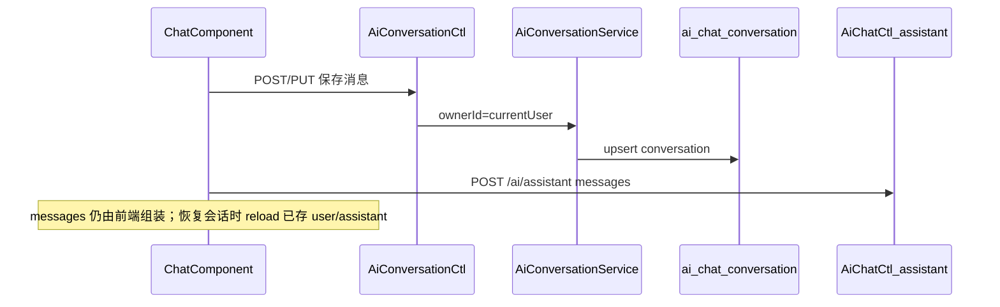

# AI 助手历史会话（Mongo + CRUD）

## 目标

- 跨设备恢复对话：会话与消息落库，绑定 `createdBy`（当前用户）
- 可检索：按标题/摘要关键字分页查询
- 可审计：继承 [`BaseEntity`](d:/Projects/kiwi/kiwi-common/src/main/java/com/kiwi/common/entity/BaseEntity.java) 的 `createdBy/createdTime/updatedBy/updatedTime`；管理员可选 `ai:conversation:audit` 跨用户列表
- 与现有 [`AiChatMessage`](d:/Projects/kiwi/kiwi-admin/backend/src/main/java/com/kiwi/project/ai/AiChatMessage.java) / 前端 [`AiChatMessage`](d:/Projects/kiwi/kiwi-admin/frontend/src/app/core/services/http/ai-chat/ai-chat.service.ts) 字段一致（`role` + `content`）

## 架构



**与 `/ai/assistant` 的关系**：推理接口保持无状态；会话 API 只负责存储/读取，不替代 `AiAssistantService`。

## 数据模型

### 集合 `ai_chat_conversation`

新建实体 [`AiChatConversation`](d:/Projects/kiwi/kiwi-admin/backend/src/main/java/com/kiwi/project/ai/)（建议路径 `com.kiwi.project.ai.conversation`）：

| 字段 | 说明 |
|------|------|
| 继承 `BaseEntity<String>` | Mongo 审计字段自动填充（[`MongoAuditor`](d:/Projects/kiwi/kiwi-admin/backend/src/main/java/com/kiwi/framework/mongo/MongoAuditor.java)） |
| `ownerId` | 冗余当前用户 ID（与 `createdBy` 一致，便于查询与 audit 过滤） |
| `scope` | `global` \| `bpm-designer`（区分全局浮动助手 / BPM 设计器） |
| `scopeRef` | 可选，如 BPM `processId` |
| `title` | 会话标题，默认取首条 user 消息前 40 字 |
| `searchText` | 拼接最近 N 条 user/assistant 摘要，供 [`QueryParams`](d:/Projects/kiwi/kiwi-common/src/main/java/com/kiwi/common/query/QueryParams.java) 模糊检索 |
| `lastMessagePreview` | 最后一条消息预览 |
| `messageCount` | 消息条数 |
| `messages` | `List<AiChatMessage>` **仅持久化 `user` / `assistant`** |

**不持久化 `system` 消息**（尤其 BPM [`enrichDesignerMessages`](d:/Projects/kiwi/kiwi-admin/frontend/src/app/pages/bpm/design/editor/bpm-ai-chat/bpm-ai-chat.component.ts) 注入的大段 BPMN/XML）。恢复 BPM 会话时仍由 `messagesEnricher` 在发送前注入上下文。

**容量护栏**（Service 层）：

- 单会话最多保留例如 200 条 user/assistant 消息（可配置 `kiwi.ai.conversation.max-messages`）
- 单条 `content` 上限例如 32_000 字符；超出截断并标记

### Dao

- `AiChatConversationDao extends BaseMongoRepository<AiChatConversation, String>`
- 自定义：`findByOwnerIdAndScopeOrderByUpdatedTimeDesc(...)`；audit 用 `findBy(QueryParams, pageable)` 不限 owner

## 后端 API

新建 [`AiConversationCtl`](d:/Projects/kiwi/kiwi-admin/backend/src/main/java/com/kiwi/project/ai/)，`@RequestMapping("/ai/conversations")`。

| 方法 | 路径 | 鉴权 | 行为 |
|------|------|------|------|
| GET | `/` | `@SaCheckLogin` | 分页列表；默认 `ownerId=currentUser`；`scope`/`q`（搜 title/searchText）查询参数 |
| GET | `/{id}` | `@SaCheckLogin` | 详情含 `messages`；非 owner 且非 audit 权限 → 403 |
| POST | `/` | `@SaCheckLogin` | 创建空会话或带初始 `messages`；设置 `ownerId`、scope |
| PUT | `/{id}` | `@SaCheckLogin` | 更新 title；或 **追加/全量替换** `messages`（请求体 DTO 明确 `mode: append \| replace`） |
| DELETE | `/{id}` | `@SaCheckLogin` | 仅 owner 可删 |
| GET | `/audit` | `@SaCheckPermission("ai:conversation:audit")` | 管理员跨用户分页（可选 `ownerId`、`q`、`scope`） |

Controller 继承 [`BaseCtl`](d:/Projects/kiwi/kiwi-admin/backend/src/main/java/com/kiwi/framework/ctl/BaseCtl.java) 取 `getCurrentUserId()`；Service 内统一 `assertOwnerOrAudit(conversation, userId, hasAudit)`。

**权限注册**：在 [`permission.json`](d:/Projects/kiwi/kiwi-admin/backend/src/main/resources/permission/permission.json) 增加一条描述即可：

```json
{ "key": "ai:conversation:audit", "description": "查看全部用户的 AI 会话（审计）" }
```

普通用户 CRUD **不需要** `@SaCheckPermission`（与 PAT、站内消息一致，你已选择 `user_scoped_login`）。

`/ai/chat`、`/ai/assistant` 保持现有 [`AiChatCtl`](d:/Projects/kiwi/kiwi-admin/backend/src/main/java/com/kiwi/project/ai/AiChatCtl.java) 不变。

## 前端

### HTTP 服务

新建 [`ai-conversation.service.ts`](d:/Projects/kiwi/kiwi-admin/frontend/src/app/core/services/http/ai-chat/)（或同级 `ai-conversation/`）：

- 类型复用/镜像 `AiChatMessage`
- `list(scope?, q?, page)`、`get(id)`、`create(body)`、`update(id, body)`、`remove(id)`
- 列表/分页遵循项目 [`CollectionResult`](d:/Projects/kiwi/.cursor/rules/api-frontend-integration.mdc) 的 `content` 约定

### [`ChatComponent`](d:/Projects/kiwi/kiwi-admin/frontend/src/app/shared/components/chat/chat.component.ts)

新增 `input`：

- `conversationScope`：`'global' | 'bpm-designer'`（默认 `global`）
- `scopeRef`：可选（BPM 传 `processId`）

行为：

1. **初始化**：拉取当前 scope（+ scopeRef）下最近会话列表；若有 `localStorage` 记录的 `lastConversationId` 则尝试恢复，否则空白新会话
2. **发送成功后**：`append` 本轮 user+assistant 到当前 `conversationId`（无 id 则先 `POST` 创建）
3. **UI**（卡片标题区）：会话下拉 / 「新建会话」/ 删除当前会话；嵌入与浮动模式共用
4. **恢复会话**：`messageArray` ← 已存 messages；继续对话时 `buildAiMessages()` 不变，BPM 仍走 `messagesEnricher`

### 嵌入点

| 位置 | scope | scopeRef |
|------|-------|----------|
| [`main.component.html`](d:/Projects/kiwi/kiwi-admin/frontend/src/app/layout/main.component.html) / 仪表盘 | `global` | — |
| [`bpm-ai-chat.component.html`](d:/Projects/kiwi/kiwi-admin/frontend/src/app/pages/bpm/design/editor/bpm-ai-chat/bpm-ai-chat.component.html) | `bpm-designer` | `processId` |

### 管理端审计（可选二期）

若需要 UI：在系统工具或 AI 菜单下增加简单列表页，调用 `GET /ai/conversations/audit`，仅分配给具备 `ai:conversation:audit` 的角色。**一期可只做 API**，审计走 Mongo/运维查询。

## OpenSpec

按仓库规范新建 change（例如 `admin-ai-conversation-persistence`）：`proposal.md`、`design.md`、`tasks.md`、spec 片段描述会话隔离与禁止持久化 system 消息。

## 测试要点

- 用户 A 无法读写用户 B 的会话（403）
- BPM scope + `scopeRef` 列表互不串线
- 恢复会话后发送：请求体含历史 user/assistant + 运行时 system enricher（BPM）
- 追加消息后 `updatedTime`、`searchText`、`title` 更新正确
- audit 接口：无权限 403；有权限可跨用户分页

## 主要改动文件（预估）

**后端**

- `.../ai/conversation/AiChatConversation.java`
- `.../ai/conversation/AiChatConversationDao.java`
- `.../ai/conversation/AiConversationService.java`
- `.../ai/conversation/AiConversationCtl.java`
- `.../ai/AiChatProperties.java`（max-messages 等，可选）
- `permission/permission.json`

**前端**

- `core/services/http/ai-chat/ai-conversation.service.ts`
- `shared/components/chat/chat.component.ts|html|less`
- `pages/bpm/design/editor/bpm-ai-chat/bpm-ai-chat.component.html`
- `layout/main.component.html`（如需传 scope，通常 Chat 默认 global 即可）
