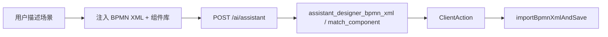
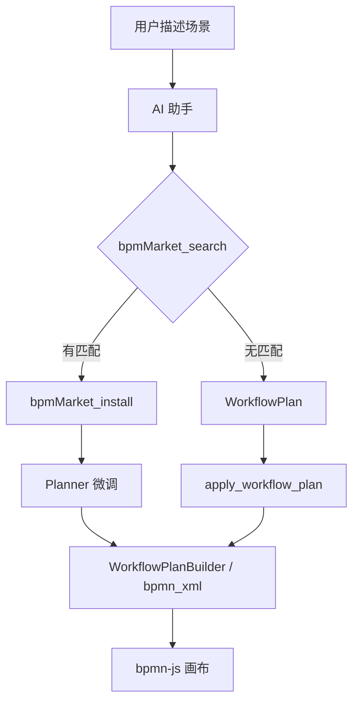

# AI 场景自动画流程图 — 优化思路与实现路径

> **流程模板 Market**（浏览 / 发布 / 公网分发）已拆至独立计划：[`bpm_流程模板_market_a8f3c21d.plan.md`](bpm_流程模板_market_a8f3c21d.plan.md)。本文档聚焦 AI 编排、Planner 与 Market 的集成契约。

## 现状：理论上能画，实际上难画好

项目已具备 **设计器内 AI Copilot**（[`bpm-ai-chat.component.ts`](kiwi-admin/frontend/src/app/pages/bpm/design/editor/bpm-ai-chat/bpm-ai-chat.component.ts)），链路为：



### 核心瓶颈

| 瓶颈 | 影响 |
|------|------|
| **LLM 直接写 XML** | BPMN + `bpmndi` + Kiwi `extensionElements` 格式错误率高 |
| **组件上下文贫瘠** | 仅前 60 个 `componentId\|name`，无 description / inputs |
| **无规划阶段** | 缺少「拆解 → 选型 → 连线 → 填参」中间表示 |
| **校验过弱** | [`BpmDesignerXmlValidator`](kiwi-admin/backend/src/main/java/com/kiwi/project/system/ai/BpmDesignerXmlValidator.java) 仅结构校验 |
| **无高质量起点** | 缺模板 Market（见 [独立 plan](bpm_流程模板_market_a8f3c21d.plan.md)） |
| **程序化建图未暴露** | AI 只能 `match_component` 单节点追加 |

---

## 推荐架构：Market 起点 + Planner 微调 + Builder 落图



---

## 分阶段路线（本 plan 范围）

### 阶段 A — 快赢（1～2 周）

1. 丰富 [`bpm-ai-chat`](kiwi-admin/frontend/src/app/pages/bpm/design/editor/bpm-ai-chat/bpm-ai-chat.component.ts) 组件目录注入
2. Prompt + few-shot（带 Kiwi extension 的小流程样本）
3. 修复 toolbar / retry / `forcedBpmnXmlToolChoice` 一致性
4. 生成后语义校验 + validation loop

### 阶段 B — Planner + Builder（核心）

| 层 | 改动 |
|----|------|
| 后端 | `@Tool assistant_designer_plan_workflow` / `assistant_designer_apply_workflow_plan` |
| 前端 | `WorkflowPlanBuilderService` + [`bpm-designer-assistant.handlers.ts`](kiwi-admin/frontend/src/app/pages/bpm/design/assistant/bpm-designer-assistant.handlers.ts) |
| Prompt | 多节点场景先 plan 再 apply |

**WorkflowPlan DSL** 示例：

```json
{
  "processName": "订单履约",
  "nodes": [
    { "id": "n1", "kind": "start" },
    { "id": "n2", "kind": "task", "componentId": "shell", "name": "校验库存" }
  ],
  "flows": [{ "from": "n1", "to": "n2" }]
}
```

### 阶段 C — 检索增强（本 plan，非 Market 本体）

- **相似流程 RAG**：对本实例 `BpmProcess` 建索引（名称 + 节点组件列表）
- **组件语义匹配**：`bpmComp_matchByIntent(description)`
- 激活 [`analyzeProcessAsComponent`](kiwi-admin/backend/src/main/java/com/kiwi/project/bpm/ctl/BpmProcessDefinitionCtl.java)（子流程封装）

### 阶段 D — 体验（可选）

- 属性面板 Copilot（选中节点填参，避免整图 XML）
- 流式输出 SSE
- 锚点选择 UI

### Market 集成（消费 [Market plan](bpm_流程模板_market_a8f3c21d.plan.md)）

**前置**：Market C1 `bpmMarket_*` API 就绪。

| 集成项 | 说明 |
|--------|------|
| MCP | `bpmMarket_search`（模板**包**）、`bpmMarket_installPack`、`installProcess` |
| Prompt | 多流程/子流程场景优先推荐 `kind=solution` 包 |
| ClientAction | 可选 `applyWorkflowTemplate` 或 install 后 navigate 设计器 |
| UI | Market 详情「用 AI 基于此模板创建」（Market plan 定义） |

「从场景创建」完整向导（场景 → Market 推荐 → 安装 → AI 微调）跨两个 plan：Market 提供入口，本 plan 提供 AI 编排。

---

## 策略对比

| 策略 | 优点 | 缺点 |
|------|------|------|
| A. 强化 XML | 改动小 | 大图不稳 |
| B. Planner + Builder | 可靠、可测 | 需新工具 |
| Market 起点（[独立 plan](bpm_流程模板_market_a8f3c21d.plan.md)） | 最接近「给场景就出图」 | Market C1 需先落地 |
| 纯后端拼 XML | 解耦前端 | 双份 extension 逻辑 |

**建议**：**Market（独立 plan）+ B（本 plan）+ A（过渡）**。

**实施顺序**：

1. Market C1（[bpm_流程模板_market plan](bpm_流程模板_market_a8f3c21d.plan.md)）与本 plan 的 **A、B 可并行**
2. Market C1 完成后做 **Market AI 集成**
3. 本 plan **C（RAG）** 与 Market C2/C3 可并行

---

## 代码衔接（本 plan）

| 能力 | 路径 |
|------|------|
| AI 上下文 | [`bpm-ai-chat.component.ts`](kiwi-admin/frontend/src/app/pages/bpm/design/editor/bpm-ai-chat/bpm-ai-chat.component.ts) |
| 工具 / Action | [`AssistantDesignerTools.java`](kiwi-admin/backend/src/main/java/com/kiwi/project/system/ai/AssistantDesignerTools.java)、[`ClientAction.java`](kiwi-admin/backend/src/main/java/com/kiwi/project/ai/ClientAction.java) |
| 编排 | [`AiAssistantService.java`](kiwi-admin/backend/src/main/java/com/kiwi/project/ai/AiAssistantService.java)、[`KiwiAdminAiMcpConfiguration.java`](kiwi-admin/backend/src/main/java/com/kiwi/project/ai/mcp/KiwiAdminAiMcpConfiguration.java) |
| 建图 | 新建 `workflow-plan-builder.service.ts` |

OpenSpec：AI 改动可用 `bpm-editor-ai-planner`；Market 用独立 change（见 Market plan）。

---

## 验收标准（本 plan）

1. 空画布：描述 3～5 步业务，得到可部署流程
2. Market 可用时：优先 install 模板再微调（集成项）
3. 无模板时：WorkflowPlan 从零建图成功
4. 组件选型正确；失败可观测，无假成功

Market 自身验收见 [`bpm_流程模板_market_a8f3c21d.plan.md`](bpm_流程模板_market_a8f3c21d.plan.md)。
