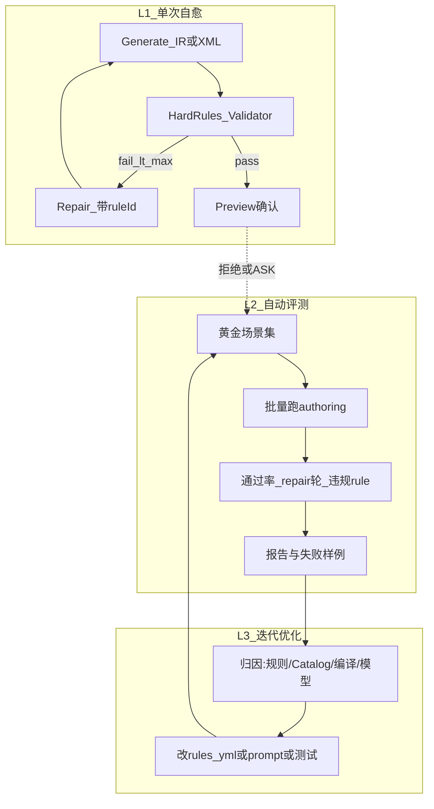

# AI 写工作流：质量改进 + 闭环开发测试迭代

## 结论

效果差的主因是整图 XML、薄 Catalog、空壳 planIr、浅校验。**可以做成闭环**：不是无人全自动改产品代码，而是三层环——单次生成自愈、自动评测回归、人工确认后的规则/提示迭代。

## 闭环三层（选定架构）

| 层 | 自动化程度 | 做什么 |
|----|------------|--------|
| L1 单次自愈 | 全自动（有上限） | Soft rule 进 prompt → 生成 → Hard rule 校验 → repair≤N → 再失败 ASK |
| L2 自动评测 | 全自动（CI/本地脚本） | 固定场景 fixture → 跑管线 → 断言硬规则 / 快照 IR / 指标 |
| L3 优化迭代 | 半自动 | 失败归因报告；改 `authoring-rules` / prompt / Catalog；**不**自动改生产业务 BPMN；规则变更需单测绿 |

**明确不做（本期）**：无人值守自动改仓库并推送、用 LLM 无限自我改 prompt 无评测门禁、未确认自动 save。

## Rule（生成/修改时）

双层：Soft → prompt；Hard → Validator（失败 REPAIR/ASK）。`mode=create|modify` 分轨。Issue 带 `ruleId`，repair 引用规则原文。

## 分阶段开发 / 测试 / 迭代

### P1（先做，可立即测）

- `AiAuthoringRule` + `authoring-rules.yml`（或代码常量）
- Soft 拼进 [`AiAuthoringPlanGenerateService`](kiwi-admin/backend/src/main/java/com/kiwi/project/ai/authoring/AiAuthoringPlanGenerateService.java)
- Hard 并入 [`BpmAiWorkflowValidator`](kiwi-admin/backend/src/main/java/com/kiwi/project/ai/authoring/BpmAiWorkflowValidator.java)；必填按节点而非全文 `contains`
- `userAnswer` / `ruleId` 注入 repair
- 默认 `aiAuthoringAutoSave=false`
- 单测：规则过滤、硬规则 fixture、repair 参数传递

### P2

- Catalog 加 description / required inputs / 示例绑定片段
- 命中模板拉 1 份 BPMN 参考进 Generate

### P3

- 窄 Plan IR + 服务端编译合法 Kiwi BPMN
- 硬规则优先校 IR；模型不再对最终 XML 负责

### P4（评测闭环）

- `src/test/resources/ai-authoring/cases/`：scenario + 期望（必含组件、禁止违规、可选 IR 快照）
- 测试或脚本跑 extract→catalog→generate→validate（可 mock ChatClient）
- 指标：首轮通过率、平均 repair 轮、按 `ruleId` 计数
- 失败样例入库/报告，驱动改规则或加 case（迭代节奏：改一处 → 跑 suite → 对比指标）

## 与旧根因的对应

1. 整图 XML → P3 IR 编译  
2. 薄 Catalog → P2  
3. 无 Rule / 浅校验 → P1  
4. 反馈断 → P1  
5. auto-save → P1  
6. 「自动开发测试优化」→ L1+L2+L3（P1 起修 L1，P4 建成 L2/L3）

## 实施时入口

从 **P1** 开始改代码与单测；P1 绿后再 P2→P3→P4。OpenSpec change [`ai-workflow-authoring-process`](openspec/changes/ai-workflow-authoring-process/) 可在实施中同步补 tasks/NOTES。

## 实施结果（2026-08-10）

- P1–P4 已落地；create 模式优先走确定性 IR 编译，modify 模式保留现有 XML 以避免破坏复杂原图
- 市场插件确认后已接真实安装 Delegate，再回校验
- AI authoring 专项 17 项测试通过；黄金集当前 3/3 通过
- 前端 development build 通过
- 全量 Maven 仍被 Windows 下既有 Slurm 路径测试阻塞；production 前端 build 仍被既有 login.less budget 阻塞
