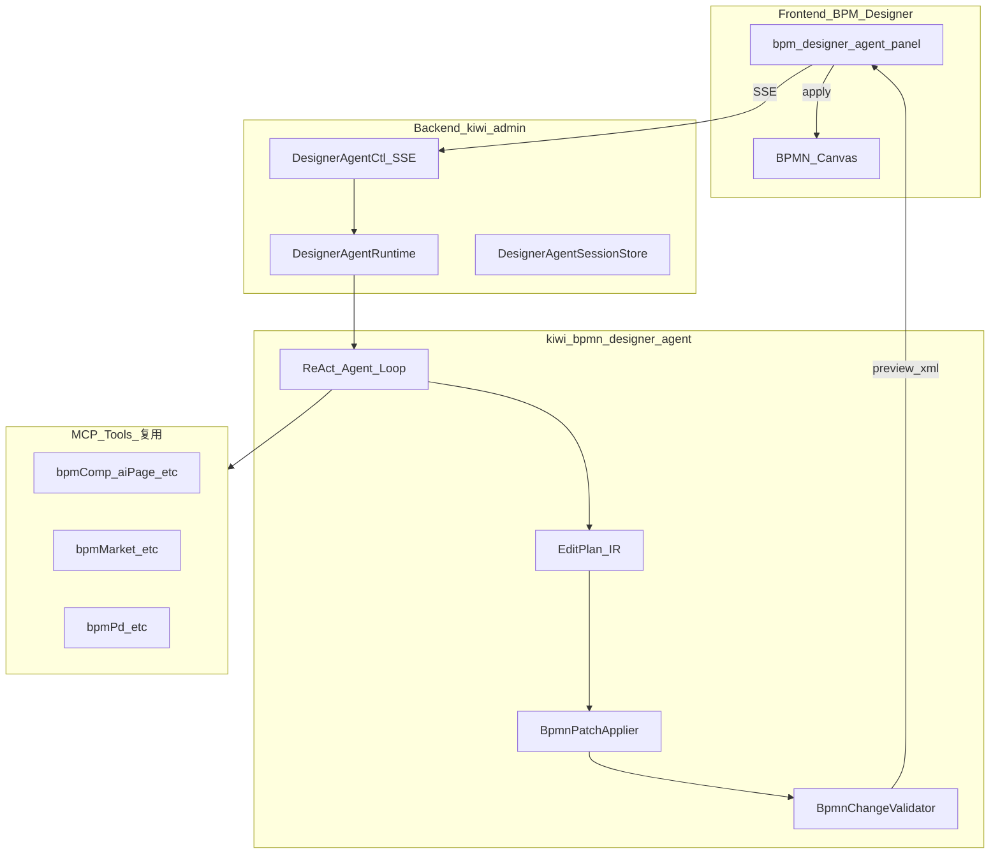

# BPM 设计器 Agent — Greenfield 方案

> **行业参考**（第三项交付）：[bpm_designer_agent_industry_reference.md](./bpm_designer_agent_industry_reference.md) — AI 写 BPM（BPMN Assistant、Camunda Copilot）与 AI 开发工具（Cursor、Copilot、Windsurf）架构归纳。  
> **编排架构决策**（2026-08-19）：[designer_agent_orchestrator_arch_a7f3c2e1.plan.md](./designer_agent_orchestrator_arch_a7f3c2e1.plan.md) — `DesignerAgentOrchestrator` 手写状态机 vs 成熟框架（Spring AI Alibaba Graph 等）评估与演进路径。

## 原则（与用户确认一致）

| 决策 | 选择 |
|------|------|
| 范围 | **仅 BPM 设计器 AI**；全局 `app-chat` / `AiAssistantService` **不改动** |
| 旧实现 | **抛开** `WriteWorkflowOrchestrator`、`kiwi-bpmn-assistant` 写工作流管线、`AiAssistantService.tryWriteWorkflow`、`bpm-ai-chat` 对 write-workflow 的耦合 — **可废弃，不扩展** |
| 保留 | **MCP 工具生态**（OpenAPI 同步的 `bpmComp_*`、`bpmMarket_*`、`bpmPd_*` 等） |
| Plan IR | **重新设计**（不沿用 `AssistantPlan` / Plan IR JSON schema） |

目标：像 Cursor 编辑代码一样编辑工作流 — **可观测思考、工具轨迹、Plan 审阅、增量应用、流式反馈**。

---

## 实现进度（2026-08-19）

> **状态**：MVP 已落地，后端编译 + `EditPlanApplicatorTest` 通过；默认 `enabled=false`，需显式开启。

### 已完成

| 层 | 交付物 | 路径 |
|----|--------|------|
| 模块 | EditPlan / EditOperation / AgentStreamEvent | `kiwi-bpmn-designer-agent/src/main/java/com/kiwi/bpmn/designer/agent/model/` |
| 应用链 | EditPlanApplicator（→ AssistantPlanCompiler） | `.../apply/EditPlanApplicator.java` |
| 应用链 | PlanSkipEvaluator | `.../apply/PlanSkipEvaluator.java` |
| 编排 | DesignerAgentOrchestrator + PlanGenerator（手写状态机，见 [编排架构决策](./designer_agent_orchestrator_arch_a7f3c2e1.plan.md)） | `.../runtime/` |
| 后端 | DesignerAgentCtl（SSE + REST） | `kiwi-admin/.../designer/agent/DesignerAgentCtl.java` |
| 后端 | DesignerAgentSessionService + Configuration | 同目录 |
| 配置 | `kiwi.bpm.designer-agent.*` | `application.yml` |
| 前端 | Agent 面板 + SSE 客户端 | `frontend/.../design/agent/` |
| 前端 | 设计器入口替换 bpm-ai-chat | `bpm-editor.html` |
| 文档 | OpenSpec change | `openspec/changes/bpm-designer-agent/` |
| 测试 | EditPlanApplicatorTest | `kiwi-bpmn-designer-agent/src/test/...` |

### 部分完成 / 与计划差异

| 项 | 计划 | 实际 |
|----|------|------|
| Patch 层命名 | `BpmnPatchApplier` + 独立 `BpmnChangeValidator` | `EditPlanApplicator`；校验复用 `AssistantWorkflowValidator` |
| ReAct 循环 | 多步 think→tool→observe | 单轮 LLM+MCP 生成 EditPlan（工具调用在 LLM 内，无 `tool_start/end` 事件） |
| 废弃旧路径 | 删除/标记 deprecated | 仅切换设计器入口；`bpm-ai-chat`、write-workflow 代码仍在 |
| Plan 确认续推 | SSE 全程 | `confirm-plan` 走 REST，SSE 在 `await_plan` 处可能已 idle |
| 能力矩阵 OpenSpec | spec 文件逐条 A1–A10 | 仅在 plan 正文，未写 `specs/` |

### 待办（下一迭代）

1. MCP **tool_start / tool_end** 事件 + 前端工具轨迹
2. **confirm-plan** 后 SSE 续推或统一长连接
3. **await_install** 前端卡点 + install 流程
4. EditPlan **黄金用例**扩展（updateNode、removeNode、网关）
5. Agent SSE **集成测试**（mock ChatClient）
6. 删除或 `@Deprecated` 旧 write-workflow / `bpm-ai-chat`
7. OpenSpec **capability spec**（A1–A10 acceptance scenarios）
8. Run **Mongo 持久化**
9. 编排演进：Stage Handler 拆分 + ReAct 内环增强（详见 [designer_agent_orchestrator_arch_a7f3c2e1.plan.md](./designer_agent_orchestrator_arch_a7f3c2e1.plan.md)）

### 启用方式

```yaml
# application-local.yml
kiwi:
  bpm:
    designer-agent:
      enabled: true
```

或环境变量 `KIWI_BPM_DESIGNER_AGENT_ENABLED=true`（仍需 `kiwi.ai.enabled` + API Key）。

---

## Kiwi 现有能力 vs Agent 应做什么

> **设计前提**：Agent 不是「再造一个设计器」，而是 **在用户已打开的流程上下文中**，用自然语言驱动 Kiwi **已有** 的 BPM 能力。先盘点 Kiwi 有什么，再定义 AI 能做什么、缺什么要补。

### 1. Kiwi 为 Agent 提供什么（资产清单）

#### 1.1 设计器上下文（Agent ingest 自动携带）

| 资产 | 来源 | 限制 |
|------|------|------|
| 当前流程 id / 名称 | 设计器 session | — |
| 画布选中元素 id | bpmn-js selection | 单选 |
| 当前 BPMN XML | `modeler.saveXML` | 前端注入约 **48KB 截断**；大图需 MCP `bpmPd_get` |
| 组件库摘要 | ComponentProvider | 约 **60 条** id+name；全库需 MCP |
| 项目 env | 表达式补全服务 | 设计器 context **未完整注入**；需 MCP `bpmProjEnv_list` |

#### 1.2 MCP 可读工具（Agent ReAct 按需调用）

| 域 | 代表 operationId | 用途 |
|----|------------------|------|
| 流程 | `bpmPd_get`, `bpmPd_aiPage` | 读/搜流程定义与完整 XML |
| 组件 | `bpmComp_aiPage`, `bpmComp_listGrouped`, `bpmComp_recentUsage` | 查组件 schema、默认值、分组 |
| 本地模板 | `bpmMarket_aiPage`, `bpmMarket_getProcess` | 参考/复制模板内流程 |
| 远程市场 | `bpmRemoteMarket_list/get`, `bpmRemoteMarket_installPlugin` | 发现与安装插件 |
| 项目 | `bpmProj_get`, `bpmProjEnv_list` | 项目元数据与环境变量 |

**注意**：无 `bpmComp_get` 单条接口；用 `bpmComp_aiPage(keyword)` 或 `listGrouped` 过滤。

#### 1.3 MCP 可写工具（Agent 在用户确认后可调用）

| 域 | 代表 operationId | 典型场景 |
|----|------------------|----------|
| 流程 | `bpmPd_save`, `bpmPd_deploy`, `bpmPd_start` | 确认预览后保存、部署、试跑 |
| 组件 | `bpmComp_add`, `fromOpenApi`, `fromJdbcSchema`… | **v2** 从 API/表生成组件草稿 |
| 市场 | `bpmMarket_installProcess`, `bpmRemoteMarket_installTemplate` | 从模板安装到新/现有项目 |
| 插件 | `bpmRemoteMarket_installPlugin`, `bpmComp_listPlugins` | 缺组件时安装插件 JAR |

#### 1.4 运行时组件生态（Agent 选 componentId 的依据）

**Classpath 核心**（`kiwi-bpmn-component`）：shell、httpRequest、jdbc、mongo、assignment、jsonMap、sleep、uuid、file、email、webhook、sftp 等。

**可选插件 JAR**（需市场安装）：kafka、rabbitmq、s3、slack、payment 等。

组件解析：classpath + plugin + MongoDB 用户自定义 + 继承子组件（`BpmComponentService`）。

#### 1.5 人类在设计器能做、但 Agent 尚无对等能力的事

| 人类 UI | Kiwi 后端/API | Agent v1 策略 |
|---------|---------------|---------------|
| 属性面板改单个参数 | 无 granular API | **EditPlan `updateNode.patch.parameters`** + PatchApplier |
| 上下文菜单「替换组件」 | `BpmEditorReplaceService` 仅前端 | EditPlan `updateNode.componentId` + 参数合并规则 |
| 指定锚点追加组件 | `appendComponent(sourceElementId)` 仅前端 | EditPlan `addNode.afterRef` / `connectTo` |
| 拖拽网关/分支 | bpmn-js | EditPlan `addNode(type=gateway)` + flows |
| 保存/部署/启动 | toolbar / `bpmPd_*` | 用户确认后 Agent 调 MCP 或前端 toolbar |
| 从模板应用到**当前画布** | 部分 API 仅安装到新流程 | v1：`bpmMarket_getProcess` + EditPlan 合并；v2 专用 merge API |
| 上传插件 JAR 文件 | Multipart，**不进 MCP** | v1：`bpmRemoteMarket_installPlugin` + install 人机卡点 |
| 导出 SVG | 纯前端 | **不做**（非 Agent 核心） |
| 运行态调试实例 | `bpmInst_*` MCP | **v2** 设计器 Agent 外环 |

---

### 2. Agent 能力域（用户视角：AI 能做什么）

按 **Cursor 类比** 与设计器场景划分：

```mermaid
flowchart LR
  subgraph read [Read_理解]
    R1[读当前流程图]
    R2[查组件库与参数]
    R3[查模板与其他流程]
    R4[查市场插件]
  end

  subgraph plan [Plan_规划]
    P1[产出 EditPlan]
    P2[解释将改什么]
    P3[Plan 审阅闸门]
  end

  subgraph edit [Edit_改图]
    E1[增删节点与连线]
    E2[改组件参数]
    E3[替换组件保留参数]
    E4[加网关与条件分支]
  end

  subgraph scaffold [Scaffold_生成]
    S1[从零搭流程骨架]
    S2[从模板初始化]
    S3[按场景选组件组链]
  end

  subgraph ops [Ops_运维]
    O1[保存预览]
    O2[部署]
    O3[启动试跑]
    O4[安装缺失插件]
  end

  read --> plan --> edit
  read --> scaffold --> plan
  edit --> ops
```



#### 2.1 v1 必须支持（MVP 能力）

| # | 用户说法示例 | Agent 行为 | 依赖 Kiwi |
|---|-------------|-----------|-----------|
| A1 | 「加一个 HTTP 请求节点」 | MCP 查 httpRequest → EditPlan addNode → preview | `bpmComp_aiPage`, PatchApplier |
| A2 | 「删掉这个节点」 | EditPlan removeNode + removeFlow | 选中 id + PatchApplier |
| A3 | 「把 command 改成 xxx」 | EditPlan updateNode.parameters | PatchApplier |
| A4 | 「用通知组件替换邮件节点」 | MCP 查组件 → updateNode.componentId + 参数合并 | `bpmComp_aiPage`, 替换规则 |
| A5 | 「在 A 和 B 之间插入任务」 | addNode + addFlow + removeFlow | PatchApplier |
| A6 | 「帮我做一个下单流程：创建订单→支付→通知」 | MCP 多轮查组件 → EditPlan 多步 → Plan 审阅 | 组件库 + Validator |
| A7 | 「参考 CryoEMS 流程的 HTTP 配置」 | `bpmPd_get` 读源 → EditPlan 合并参数 | `bpmPd_aiPage/get` |
| A8 | 「需要 kafka 组件」 | `bpmRemoteMarket_list` → install 卡点 | installPlugin + 确认 |
| A9 | 「保存 / 部署 / 跑一下」 | 预览确认 → `bpmPd_save/deploy/start` | MCP 写 API |
| A10 | 「解释一下这个流程干什么」 | 只读：读 XML + 组件名 → 自然语言 | 无写操作 |

#### 2.2 v2 扩展（不阻塞 v1）

| 能力 | 说明 |
|------|------|
| 从 OpenAPI/JDBC 生成组件并插入流程 | `bpmComp_fromOpenApi` 等 + 组件管理流 |
| 模板一键应用到当前画布 | 新 API 或增强 merge |
| 项目 env 读写 | `bpmProjEnv_*` |
| 流程级克隆/另存为组件 | `bpmPd_clone`, `bpmPd_saveAsComponent` |
| 运行实例联调 | `bpmInst_*` 只读诊断 |
| 批量部署 | 项目页能力，低优先级 |

#### 2.3 明确不做（Agent 范围外）

- 替代 bpmn-js 直接拖拽（人类精细布局仍用手）
- 网格吸附、缩放、SVG 导出等 **纯 UI** 操作
- 全局导航、菜单管理、非 BPM 的 system 配置
- 代替 Operaton 引擎做流程执行逻辑调试（v2 仅只读查看）

---

### 3. 能力 × 工具映射（Agent 工具白名单）

Agent **只**通过以下层与 Kiwi 交互：

| 层 | 机制 | v1 工具/操作 |
|----|------|-------------|
| **读** | MCP 白名单 | `bpmComp_*`(aiPage/listGrouped/recentUsage), `bpmPd_*`(get/aiPage), `bpmMarket_*`, `bpmRemoteMarket_*`(list/get), `bpmProjEnv_list` |
| **规划** | LLM 产出 | `EditPlan` JSON（非 MCP） |
| **写画布** | 服务端 PatchApplier | `EditPlan` → candidateXml → SSE `preview_ready` → 前端 import |
| **写库** | MCP（用户 confirm 后） | `bpmPd_save`, `bpmPd_deploy`, `bpmPd_start`, `bpmRemoteMarket_installPlugin` |
| **观测** | SSE | thinking / tool / plan / validation / await_human |

**不再使用**旧 ClientAction 路径（`assistant_designer_*`）；save/deploy 走 MCP 或前端显式回调。

---

### 4. EditPlan 操作与 Kiwi 概念对齐

| EditOperation | 对应 Kiwi / BPMN 概念 |
|---------------|----------------------|
| `addNode` + `componentId` | 组件库 ServiceTask + `extensionElements` kiwi 扩展 |
| `updateNode.parameters` | 属性面板 `@ComponentParameter` 输入 |
| `updateNode.componentId` | 上下文菜单「替换组件」 |
| `addFlow` + `condition` | 排他网关出线条件 / JUEL |
| `removeNode` / `removeFlow` | 删除选中 / 清理 BPMNDI |
| `applyTemplate`（v2） | `bpmMarket_getProcess` 子图合并 |

PatchApplier 必须理解 Kiwi BPMN 扩展命名空间（`xmlns:kiwi`）与 componentId 约定（classpath_/plugin_）。

---

### 5. 分阶段能力与交付对齐

| Phase | 交付 | 覆盖能力 |
|-------|------|----------|
| 0–1 | EditPlan + PatchApplier + Validator | A2, A3, A5 部分（无 LLM 单测） |
| 2 | Agent + MCP + SSE | A1, A4, A6–A8, A10 |
| 3 | 前端 Agent 面板 | 思考块 + Plan 卡片 + preview 卡点 |
| 4 | 切换入口 | A9 save/deploy；废弃旧路径 |
| v2 | 扩展 | 组件生成、模板 merge、实例诊断 |

OpenSpec `bpm-designer-agent` 的 **spec 章节**应逐条引用上表 A1–A10 作为 acceptance scenarios。

---

## 为什么要 Greenfield

现有实现的问题不是「缺几个 UI 字段」，而是架构绑定了错误抽象：

1. **双路径并存**：write-workflow（Plan IR 管线）vs ChatClient 直接 `assistant_designer_bpmn_xml` — 行为不一致、难观测
2. **Chat 为中心**：设计器 AI 挂在通用 `POST /ai/assistant` 上，无法自然做长时 Agent + SSE
3. **Plan IR 过窄**：只为「整图生成/替换」设计，不适合 Cursor 式「读上下文 → 多步工具 → 小步 patch」
4. **前端黑盒**：`bpm-ai-chat` 复用全局 chat 气泡，没有 Agent 专用 UX 容器

因此：**新建设计器 Agent 子系统**，旧代码标记 deprecated，设计器入口切换后删除。

---

## 目标架构



### 与旧系统边界

```
保留不动：
  POST /ai/assistant          → 全局助手
  app-chat                    → 全局聊天 UI
  KiwiAdminAiMcpConfiguration → 全局 ChatClient + MCP

新建：
  POST /bpm/designer-agent/runs        → 启动 Agent run（返回 runId）
  GET  /bpm/designer-agent/runs/{id}/events  → SSE 事件流
  POST /bpm/designer-agent/runs/{id}/confirm → 人机确认（plan/preview/install/ask）

废弃（设计器改图场景）：
  kiwi.ai.write-workflow.*
  WriteWorkflowOrchestrator / WriteWorkflowCtl
  assistant_designer_bpmn_xml / match_component（设计器改图不再走 ClientAction 登记）
  bpm-ai-chat 内 write-workflow 面板逻辑
```

---

## 核心概念（新 IR：EditPlan）

不再用「整图 nodes/flows JSON」作为唯一中间表示，改为 **Cursor 式变更计划**：

```typescript
interface EditPlan {
  processId: string;
  summary: string;           // 给用户看的计划摘要
  operations: EditOperation[]; // 有序变更步骤
}

type EditOperation =
  | { op: 'addNode'; node: NodeSpec; afterRef?: string }
  | { op: 'removeNode'; nodeId: string }
  | { op: 'updateNode'; nodeId: string; patch: Partial<NodeSpec> }
  | { op: 'addFlow'; flow: FlowSpec }
  | { op: 'removeFlow'; flowId: string }
  | { op: 'setProcessMeta'; name?: string };
```

**优势**：
- Plan 卡片展示「将要做什么」（增删改连线），比裸 IR 更接近 Cursor diff 语义
- 简单操作自然只有 1–2 条 operation，可 **自动跳过 Plan 闸门**（用户已选：默认可配置跳过）
- `BpmnPatchApplier` 对当前 XML **确定性应用** patch，不依赖 LLM 输出 XML
- modify 模式：Agent 先 `read` 当前图（解析为内部模型），再产出 operations

编译/应用链：

```
baseBpmnXml + EditPlan.operations → BpmnPatchApplier → candidateXml → BpmnChangeValidator
```

Validator 职责（新写，可参考旧 Validator 规则但独立实现）：
- XML 良构、单一开始/结束、componentId 可解析、必填参数、未授权换组件、缺插件 → install 卡点

---

## Agent 运行时（ReAct + 事件流）

### 循环

```
1. ingest   — 接收用户指令 + 画布上下文（processId, selectedElementId, bpmnXml 摘要）
2. think    — LLM 产出下一步意图（可流式 reasoning/summary）
3. act      — 调用 MCP 工具（检索组件/模板/流程）或 产出/修订 EditPlan
4. observe  — 工具结果写入 trace；EditPlan 进入审阅或继续迭代
5. apply    — 用户批准 Plan 后 patch + validate
6. gate     — preview / ask / install 人机卡点（与旧语义对齐，新 session 模型）
```

### SSE 事件（`AgentStreamEvent`）

| type | 说明 |
|------|------|
| `thinking_delta` | 推理/规划文字流 |
| `tool_start` / `tool_end` | MCP 调用轨迹 |
| `plan_ready` | EditPlan JSON + summary；含 `skipped: boolean` |
| `validation` | 校验 issue 列表 |
| `preview_ready` | candidateXml（前端 import 预览） |
| `await_human` | plan / preview / install / ask |
| `text_delta` | 面向用户的回复流 |
| `done` / `error` | 结束 |

### Plan 闸门（可配置跳过）

配置 `kiwi.bpm.designer-agent.plan-mode`（默认 true）+ `plan-mode-skip-simple`（默认 true）：

跳过条件（规则，无额外 LLM）：
- operations.length ≤ 2
- 仅 addNode / updateNode / removeNode / addFlow
- 用户描述不含「网关/分支/重构/整流程」等复杂词

---

## 模块与包结构

### 新 Maven 模块：`kiwi-bpmn-designer-agent`

```
kiwi-bpmn-designer-agent/
  src/main/java/com/kiwi/bpmn/designer/agent/
    model/EditPlan.java, EditOperation.java, NodeSpec.java, ...
    model/AgentRun.java, AgentStreamEvent.java
    runtime/DesignerAgentRuntime.java      # ReAct 主循环
    runtime/DesignerAgentSession.java
    runtime/PlanSkipEvaluator.java
    apply/BpmnPatchApplier.java            # EditPlan → XML
    apply/BpmnGraphReader.java             # XML → 内部图（modify 基线）
    validate/BpmnChangeValidator.java
    mcp/DesignerAgentToolScope.java        # 限定可用 MCP 工具名
    spi/ComponentLookup.java               # 复用宿主组件解析（接口可委托 AdminAssistantComponentLookup）
```

依赖：`kiwi-bpmn-core`（如需）、Spring AI ChatClient（**独立 bean `designerAgentChatClient`**，不共用 `kiwiChatClient`）。

### kiwi-admin 接入层

```
com.kiwi.project.bpm.designer.agent/
  DesignerAgentCtl.java          # REST + SSE
  DesignerAgentSessionService.java
  DesignerAgentProperties.java   # kiwi.bpm.designer-agent.*
  spi/AdminDesignerAgentConfig.java  # ChatClient + MCP tool 白名单
```

### 前端（新建，不改造全局 chat）

```
pages/bpm/design/agent/
  bpm-designer-agent.component.ts/html/scss   # 设计器右侧 Agent 面板
  bpm-designer-agent-plan-card.component.ts   # EditPlan 审阅
  bpm-designer-agent-thinking.component.ts    # 可折叠思考/工具时间线
  services/bpm-designer-agent.service.ts      # SSE + confirm API
```

**入口**：BPM 编辑器用 `bpm-designer-agent` **替换** `bpm-ai-chat`（或 feature flag 并行灰度后切换）。

全局 `app-chat` 保持原样；设计器不再 embed 通用 chat 做改图。

---

## MCP 工具策略

**复用**（通过 OpenAPI MCP，Agent 白名单）：
- `bpmComp_aiPage`, `bpmComp_listGrouped`, `bpmComp_recentUsage`
- `bpmRemoteMarket_list`, `bpmRemoteMarket_get`, `bpmRemoteMarket_installPlugin`
- `bpmMarket_aiPage`, `bpmMarket_get`, `bpmMarket_getProcess`
- `bpmPd_aiPage`, `bpmPd_get`, `bpmPd_save`, `bpmPd_deploy`, `bpmPd_start`
- `bpmProjEnv_list`（读 env，辅助参数建议）

**不再使用**（设计器改图）：
- `assistant_designer_bpmn_xml` — 改为服务端 patch + 前端 `importBpmnXml(preview)`
- `assistant_designer_match_component` — 改为 EditPlan `addNode` + 前端 append
- `assistant_designer_toolbar` — 用户显式点工具栏；Agent 不驱动

画布更新协议（新）：
- SSE `preview_ready` → 前端 `editor.importBpmnXml(xml)`（预览）
- 用户 `confirm preview` → 后端 save 或前端 `importBpmnXmlAndSave`

---

## 实施阶段

### Phase 0 — OpenSpec + 模块骨架 ✅
- [x] OpenSpec change `bpm-designer-agent`
- [x] 创建 `kiwi-bpmn-designer-agent` 模块 + pom 依赖
- [x] `EditPlan` / `AgentStreamEvent` 模型 + Orchestrator

### Phase 1 — 应用链 ✅（最小用例）
- [x] `EditPlanApplicator` + 复用 `AssistantWorkflowValidator`
- [x] 单测：addNode 插入 serviceTask（`EditPlanApplicatorTest`）
- [ ] 黄金用例：updateNode / removeNode / 网关 / 多 operation

### Phase 2 — Agent 循环 + SSE ✅（MVP）
- [x] `DesignerAgentOrchestrator` + `DesignerAgentPlanGenerator`（MCP 白名单）
- [x] `DesignerAgentCtl` SSE + confirm API
- [x] 事件：stage、thinking_delta、plan_ready、preview_ready、await_human、done
- [ ] 事件：tool_start / tool_end
- [ ] 真·多步 ReAct（逐步 observe 再 act）

### Phase 3 — 前端 Agent 面板 ✅（MVP）
- [x] 思考时间线（可折叠 `<details>`）
- [x] Plan 卡片 + 批准/拒绝
- [x] preview / ask 卡点
- [x] SSE `fetch` 流式消费
- [ ] install 卡点 UI
- [ ] 独立 thinking 子组件（可选）

### Phase 4 — 切换与废弃 🔄
- [x] 设计器入口切到 `bpm-designer-agent`
- [x] 配置 `kiwi.bpm.designer-agent.enabled`（默认 false）
- [ ] enabled 时禁用 `AiAssistantService.tryWriteWorkflow` 设计器桥接
- [ ] 标记 deprecated / 删除旧代码
- [ ] 迁移文档

### Phase 5 — 测试与验收 🔄
- [x] EditPlanApplicator 单测
- [ ] Agent SSE 集成测试
- [ ] 手工验收 A1–A9

---

## 验收标准

| # | 标准 | 状态 |
|---|------|------|
| 1 | 设计器改图不经过 `/ai/assistant` 与 write-workflow | ✅ 入口已切；旧代码未删 |
| 2 | 面板内可见思考流、EditPlan、阶段进度 | ✅ stage + thinking；❌ MCP tool 轨迹 |
| 3 | 复杂改图 Plan 审阅；简单操作可跳过 | ✅ PlanSkipEvaluator |
| 4 | patch → 预览；preview/install/ask 卡点 | ✅ preview/ask；⚠️ install UI 待补 |
| 5 | 全局 Chat 无回归 | ✅ 未改 app-chat |
| 6 | A1–A9 手工场景 | ⏳ 待验收 |

---

## 风险

| 风险 | 缓解 |
|------|------|
| Patch applier 覆盖 BPMN 编辑全场景 | Phase 1 黄金用例；复杂布局先整段 replace 作为 fallback operation |
| 双 UI 过渡期 | feature flag `designer-agent.enabled` 与旧 `bpm-ai-chat` 并行 |
| MCP 工具结果过大 | tool_end 只推送摘要（条数/名称），不全量 JSON |
| 会话内存 | 首版内存；后续 Mongo `DesignerAgentRun` 持久化 |

---

## 不再作为本方案基础的文件（仅参考/废弃）

- [WriteWorkflowOrchestrator.java](kiwi-admin/backend/src/main/java/com/kiwi/project/ai/assistant/WriteWorkflowOrchestrator.java)
- [WriteWorkflowSessionService.java](kiwi-admin/backend/src/main/java/com/kiwi/project/ai/assistant/WriteWorkflowSessionService.java)
- [AssistantPlanGenerateService.java](kiwi-bpmn-assistant/src/main/java/com/kiwi/bpmn/assistant/AssistantPlanGenerateService.java)
- [AiAssistantService.tryWriteWorkflow](kiwi-admin/backend/src/main/java/com/kiwi/project/ai/AiAssistantService.java)
- [bpm-ai-chat 写工作流面板](kiwi-admin/frontend/src/app/pages/bpm/design/editor/bpm-ai-chat/bpm-ai-chat.component.ts)
