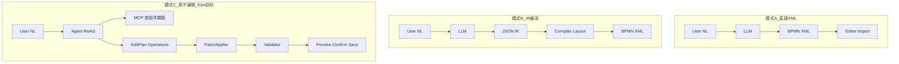
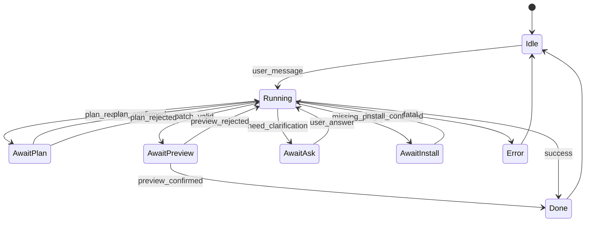

# 行业参考：AI 写 BPM 与 AI 开发工具架构

> 供 Kiwi **BPM 设计器 Agent（Greenfield）** 方案参考。整理时间：2026-08。  
> 关联计划：[bpm_designer_agent_greenfield_13dbd3a0.plan.md](./bpm_designer_agent_greenfield_13dbd3a0.plan.md)

---

## 1. 结论摘要

| 维度 | 行业共识 | 对 Kiwi 的启示 |
|------|----------|----------------|
| **BPM 中间表示** | 避免 LLM 直接吐 BPMN XML；用 **JSON IR / 原子编辑操作** 更可靠 | 采用 **EditPlan（有序 EditOperation）**，服务端 PatchApplier |
| **改图 vs 生图** | 学术与开源均强调 **incremental edit** 优于整图重生成 | Agent 默认 modify + patch，复杂场景才整图 scaffold |
| **Agent 循环** | ReAct（think→act→observe）是编码/工具型 Agent 的事实标准 | DesignerAgentRuntime 用 ReAct + 可选 Plan 闸门 |
| **Plan 模式** | Cursor / Windsurf 均分离「规划」与「执行」，Plan 可审阅 | `await_plan` + EditPlan 卡片；简单操作可跳过 |
| **可观测性** | 工具轨迹、流式输出、Todo/阶段进度是标配 | SSE：`thinking_delta` / `tool_*` / `plan_ready` |
| **人机卡点** | Diff 确认、工具预算、continue 续跑 | preview / install / ask；工具调用上限可配置 |
| **工具生态** | MCP 成为扩展标准（Camunda、Windsurf、Kiwi 均已采用） | 复用 Kiwi OpenAPI→MCP，白名单给设计器 Agent |
| **Harness 重于模型** | Cursor/GitHub 强调 orchestration、routing、sandbox | 投资 `DesignerAgentRuntime` + 事件协议，而非换模型 |

---

## 2. AI 写 BPM 的主流做法

### 2.1 BPMN Assistant（开源 + 论文）

- **项目**：[jtlicardo/bpmn-assistant](https://github.com/jtlicardo/bpmn-assistant)（Kiwi `kiwi-bpmn-assistant` 思路来源）
- **论文**：[BPMN Assistant: An LLM-Based Approach to Business Process Modeling](https://arxiv.org/abs/2509.24592)（MDPI Applied Sciences, 2025）

**核心思路**：

1. LLM **不直接生成 BPMN XML**，而生成 **JSON 中间表示（IR）**。
2. 编辑通过 **原子 function calling / 结构化操作** 完成，而非每次重写整份 XML。
3. 服务端（或客户端）将 IR **确定性编译/布局** 为 BPMN 2.0 XML（常用 bpmn-auto-layout）。

**论文数据（相对直接 XML）**：

| 指标 | JSON IR | 直接 XML |
|------|---------|----------|
| 编辑成功率 | 更高（各模型一致） | 较低 |
| 生成延迟 | ~14s vs ~24s | 更慢 |
| 输出 token | ~364 vs ~2665 | XML 冗长 |
| 编辑延迟 | ~21s vs ~47s | XML 修改更慢 |

**产品能力**：

- 创建 / 编辑 / **解释** BPMN（自然语言 ↔ 图）
- 拖拽已有 BPMN 文件进编辑器再对话修改
- Vision：上传流程图图片生成 BPMN（OpenAI 模型）
- 支持 Task、Gateway、Event 等子集；**不支持 pool/lane**

**已知限制（官方 README）**：

- AI **看不到**用户手动改图后的状态，仍基于「上一版 AI 生成结果」— **上下文同步是行业共性难题**。
- Kiwi 需用 **每次 run 携带最新 `bpmnXml`** + 服务端 GraphReader 解决。

**与 Kiwi Greenfield 关系**：

- 可借鉴：**IR + 确定性编译** 原则。
- 应超越：BPMN Assistant 是「聊天 + 整图 IR」，Kiwi 需要 **EditOperation patch** + **MCP 组件发现** + **Kiwi 扩展命名空间（componentId）**。

---

### 2.2 Camunda Copilot / BPMN Copilot

- **文档**：[Build with AI](https://docs.camunda.io/docs/guides/build-with-ai/overview/)、[BPMN Copilot Alpha](https://docs.camunda.io/docs/8.8/components/early-access/alpha/bpmn-copilot/)
- **博客**：[The Power of Camunda Copilots](https://camunda.com/blog/2025/08/the-power-of-camunda-copilots/)（2025-08）

**定位**：嵌入 **Camunda 8 Web Modeler** 的对话式 Copilot，面向业务与技术用户。

**能力矩阵**：

| 能力 | 说明 |
|------|------|
| 自然语言生图 | 「Generate a mortgage loan process」→ BPMN |
| 迭代改图 | SLA、成本、错误处理、 unhappy path、集成 AI |
| 代码/文档 → BPMN | 粘贴 Java/BPEL/COBOL/Python 或 Confluence 文档 |
| 图 → 文档 | BPMN 反向生成说明文本 |
| 元素级建议 | 空白 Task 上「Show Suggestions」推荐元素类型（早期 Copilot） |
| 问答 | 解释流程、推荐测试用例、KPI |

**交互**：

- Web Modeler 内 **Chat 窗口**；响应约 **20–50 秒**。
- 生成新版本时可看 **diff / 版本 progression**（SaaS 8.7+）。
- **警告**：用 Copilot 生图可能 **覆盖** 现有工作；官方主要支持改 **Copilot 自己创建的图**。

**限制**：

- 流程约 **≤400KB**；不支持 pool/lane/collaboration。
- 与 Kiwi 不同：Camunda 是 **闭源 SaaS + 标准 BPMN**，无 Kiwi 式 **componentId / 插件市场** 语义。

**Camunda 的另一条线：Agentic Orchestration**

- 方向相反：在 **BPMN 流程内嵌入 AI Agent**（AI Agent Connector、ad-hoc subprocess）。
- 设计器 Copilot = **AI 帮人类画 BPMN**；Runtime Agent = **BPMN 编排 AI**。
- Kiwi 两者都可做：本方案聚焦前者；后者已有 Operaton + 组件生态。

**MCP 集成（Camunda 2025）**：

- Docs MCP、Orchestration Cluster MCP — 让外部 AI 读文档、操作集群。
- 与 Kiwi **OpenAPI→MCP** 路线一致；Kiwi 优势是 **组件/模板/插件** MCP 更贴近「画流程」。

---

### 2.3 其他相关产品（简述）

| 产品/方向 | 特点 | 备注 |
|-----------|------|------|
| **Flowable / Signavio 等** | 企业 BPM 套件 + AI 助手（多为 NL→模型、文档） | 闭源；强调合规与 SAP 集成 |
| **ChatGPT + BPMN 插件** | 通用 LLM + 自定义 GPT | 无深度 IDE 集成、无 component 语义 |
| **bpmn.io 生态** | 编辑器库，非 AI 产品 | Kiwi 基于 bpmn-js；AI 层需自建 |

**行业趋势归纳**：

1. **设计器内嵌 Chat** 成为标配（Camunda、BPMN Assistant、Kiwi）。
2. **NL → 结构化 → 确定性渲染**，而非 NL → XML 一步到位。
3. **双向**：生图 + 改图 + 解释 + 文档互转。
4. **与企业资产结合**：模板、代码遗留、DMN/表单（Camunda 扩展）；Kiwi 对应 **组件库 + 模板市场 + 插件**。

---

### 2.4 AI 写 BPM 架构模式对比



| 模式 | 代表 | 优点 | 缺点 |
|------|------|------|------|
| A 直接 XML | 早期 ChatGPT、Kiwi 旧 `assistant_designer_bpmn_xml` | 实现简单 | 易错、慢、难 diff、难观测 |
| B IR 编译 | BPMN Assistant、Kiwi 旧 write-workflow | 可靠、快 | 偏整图；改小参数也重编译 |
| C 原子编辑 + Agent | 论文推荐方向 + Cursor 式 | 可 patch、可 Plan、可工具链 | 需 PatchApplier + 校验投资 |

**Kiwi Greenfield 选 C**，并保留 B 的「从零 scaffold 整图」作为 EditPlan 多 operation 组合。

---

## 3. 主流 AI 开发工具：架构与思路

### 3.1 共同架构（Harness 层）

各产品公开资料与工程博客归纳，**编码 Agent 的共性**可抽象为：

```
User Intent
  → Mode Router（Chat / Agent / Plan）
  → Context Builder（repo snapshot, open files, selection）
  → Agent Loop（LLM ↔ Tool Harness）
  → Human Gates（diff accept, terminal approve）
  → Apply Changes（workspace / git worktree）
  → Verify（tests, linter）→ 可选 Reflexion 重试
```

**Harness（挽具）** 负责的事往往比模型更重要：

- 工具 schema、权限、确认策略
- 上下文裁剪与 summarization
- 流式事件协议
- 沙箱 / worktree 隔离
- 模型路由与并行 race（Cursor Cloud）
- 步数/工具预算与 stop 条件

来源：[VS Code Copilot Agent Harness](https://code.visualstudio.com/blogs/2026/05/15/agent-harnesses-github-copilot-vscode)、[Cursor Cloud Harness 分析](https://cozypet.github.io/cursor-cloud-harness/)、[ByteByteGo Cursor Agent](https://blog.bytebytego.com/p/how-cursor-shipped-its-coding-agent)

---

### 3.2 Cursor

**文档**：[Plan Mode](https://cursor.com/docs/agent/plan-mode)

| 特性 | 说明 |
|------|------|
| **模式** | Agent / Plan / Ask；`Shift+Tab` 切换 |
| **Plan Mode** | 先调研代码库 → 产出 **可编辑 Markdown Plan** → 用户批准后再 Build |
| **Agent Loop** | Orchestrator 执行：模型选工具 → 执行 → 结果回填上下文 → 下一轮 |
| **工具** | 搜索、读写文件、apply patch、终端等 10+ 工具 |
| **Composer 模型** | 自研模型 + 工具 harness；Auto 路由按任务复杂度选模型 |
| **性能** | Speculative decoding；Cloud Agent 用 VM 沙箱、快速 provisioning |
| **Plan 持久化** | 默认用户目录；可 **Save to workspace**（与 Kiwi `.cursor/plans/` 类似） |
| **Cloud Agents** | 本地 Plan → 云端实现；多模型 **race** 取最优 |

**对话 UX**：

- 流式输出 + **Thinking 块**（可折叠）
- 工具调用可见（读文件、搜索等）
- 大改 **先 Plan 再执行**；小改直接 Agent

**对 Kiwi 映射**：

| Cursor | Kiwi Designer Agent |
|--------|---------------------|
| Codebase | 当前 BPMN XML + 组件库 |
| Plan.md | EditPlan + plan 卡片 |
| apply_patch | BpmnPatchApplier |
| Read file | bpmPd_get / GraphReader |
| grep/search | bpmComp_aiPage |
| Build/Test | BpmnChangeValidator |
| Save to workspace | preview → confirm → bpmPd_save |

---

### 3.3 GitHub Copilot（VS Code / CLI SDK）

**文档**：[Copilot SDK Agent Loop](https://github.com/github/copilot-sdk/blob/main/docs/features/agent-loop.md)

| 特性 | 说明 |
|------|------|
| **Loop 定义** | 每次 **assistant.turn** = 一次 LLM 调用 + 其触发的工具执行 |
| **CLI 角色** | 机械循环：「模型要工具 → 执行 → 再调模型」；**停止由模型决定** |
| **Autopilot** | 若未调用 `task_complete`，CLI 注入 synthetic nudge 继续 |
| **工具** | read_file、apply_patch、run_in_terminal、semantic_search；MCP/扩展可追加 |
| **Harness** | 每轮重建 prompt（含最新 workspace 状态）；历史 summarization |
| **Human gate** | 部分工具需用户确认；loop 上限与 cancel |

**对 Kiwi 映射**：

- `session.idle` / `turn_end` ≈ SSE `done`
- `task_complete` ≈ preview 确认 + save 完成
- 工具结果截断与 summarization ≈ MCP tool_end 摘要

---

### 3.4 Windsurf Cascade（Devin Desktop）

**文档**：[Cascade](https://docs.windsurf.com/windsurf/cascade/cascade)

| 特性 | 说明 |
|------|------|
| **模式** | Code（改代码）/ Chat（问答） |
| **双 Agent** | **Planning agent** 维护长期计划；主模型执行短期动作 |
| **Todo 列表** | 复杂任务在对话内显式 Todo，用户可改 |
| **工具** | Search、Analyze、Web、**MCP**、Terminal |
| **预算** | **20 tool calls / prompt**，需 Continue（消耗 credit） |
| **Checkpoint** | 命名还原点 |
| **Real-time awareness** | 读用户当前操作，无需每次手动 @ 文件 |

**对 Kiwi 映射**：

- Planning agent + Executor ≈ Plan-and-Execute
- Todo 列表 ≈ EditPlan operations 进度 UI
- 20 步预算 ≈ `max-tool-calls` 配置
- Real-time awareness ≈ 设计器自动注入 selection + latest XML

---

### 3.5 主流开发工具对比表

| 维度 | Cursor | GitHub Copilot | Windsurf Cascade |
|------|--------|----------------|------------------|
| 核心循环 | ReAct + Plan mode | Tool-use loop（CLI） | ReAct + Planning agent |
| Plan 审阅 | Markdown Plan 文件 | 较弱（靠 prompt） | Todo + 后台 planner |
| 流式 | 是 | 是（SSE/events） | 是 |
| Thinking 展示 | 是（可折叠） | 部分模型 reasoning | 较少强调 |
| MCP | 支持 | VS Code MCP 扩展 | 原生，100 tool 上限 |
| 工具预算 | 动态 | loop limit | 20 calls/prompt |
| 沙箱 | Cloud VM | 本地/remote dev container | 本地 IDE |
| 确认卡点 | Diff 接受 | 工具级确认 | Diff + Accept |

---

## 4. Agent 架构模式（理论基础）

### 4.1 ReAct（Reason + Act）

- **论文**：[ReAct: Synergizing Reasoning and Acting in Language Models](https://arxiv.org/abs/2210.03629)（Yao et al., 2022）
- **循环**：Thought → Action（一次 tool）→ Observation → 重复
- **适用**：下一步依赖上一步结果；探索性任务（查组件、读流程）
- **产品**：Cursor、Copilot、Cascade、Claude Code 等 **默认内环**

### 4.2 Plan-and-Execute

- **循环**：Planner 一次产出多步计划 → Executor 逐步执行 → 失败则 Replan
- **适用**：步骤相对独立、成本可预测、需「先看计划再动手」
- **产品**：Windsurf 后台 planner；Cursor Plan Mode；LangGraph 常见组合

### 4.3 混合（生产推荐）

来源：[ReAct vs Plan-and-Execute 对比](https://buildingagenticai.com/blog/react-vs-plan-and-execute/)、[The AI Engineer 四种模式](https://theaiengineer.substack.com/p/the-4-single-agent-patterns)

```
外层：Plan-and-Execute（分解目标 → EditPlan）
内层：ReAct（查 MCP、消歧、修订 Plan）
失败：Reflexion / Repair loop（校验 issue 反馈再生成）
```

**Kiwi Designer Agent 建议采用此混合**：

1. ReAct 收集上下文（组件、模板、源流程）。
2. 产出 EditPlan → **await_plan**（Camunda/Cursor 式审阅）。
3. PatchApplier 执行 → Validator → 失败则 repair（带 issues 再问 LLM）。
4. preview → 用户 confirm → save/deploy。

### 4.4 其他模式（了解即可）

| 模式 | 要点 | BPM 场景 |
|------|------|----------|
| **ReWOO** | 一次写全计划+变量，worker 并行执行 | 适合纯只读调研（批量查组件） |
| **Reflexion** | 失败后自我反思再试 | 校验 repair 轮 |
| **Multi-agent race** | 多模型并行取最优 | 成本高，非 v1 |

---

## 5. AI 对话架构：UX 与协议共性

### 5.1 消息与事件模型

现代 Agent UI 普遍 **不再** 只有「用户一条 / 助手一条」，而是：

```typescript
// 概念模型（多产品趋同）
type AgentEvent =
  | { type: 'thinking_delta'; text: string }
  | { type: 'text_delta'; text: string }
  | { type: 'tool_start'; tool: string; argsPreview?: string }
  | { type: 'tool_end'; tool: string; summary: string }
  | { type: 'plan'; plan: unknown; editable: boolean }
  | { type: 'await_human'; reason: 'plan' | 'preview' | 'install' | 'ask' }
  | { type: 'done'; content: string; artifacts?: unknown }
  | { type: 'error'; message: string };
```

传输：**SSE** 或 **WebSocket**；GitHub/Cursor 系多用 SSE/流式 HTTP。

### 5.2 会话状态机（简化）



与 Kiwi 旧 write-workflow 阶段（`await_preview` 等）**语义可继承**，但协议与实现应新建。

### 5.3 上下文管理

| 策略 | 做法 | Kiwi 适用 |
|------|------|-----------|
| **全量快照** | 每次 run 带最新 BPMN | 设计器 ingest（注意 48KB 限制） |
| **按需拉取** | 大图用 MCP `bpmPd_get` | Agent 工具链 |
| **Summarization** | 长对话压缩早期轮次 | 多轮改图 session |
| **Selection** | 当前选中元素 | `selectedElementId` |
| **Real-time sync** | 手动改图后 AI 可见 | **必须** run 前 read canvas（BPMN Assistant 痛点） |

### 5.4 人机卡点（Human-in-the-loop）

行业共识：**写操作** 默认需确认。

| 卡点 | Cursor | Camunda | Kiwi 建议 |
|------|--------|---------|-----------|
| 改代码/改图 | Diff accept | 新版本 diff | preview XML |
| 运行终端 | 确认 | — | deploy/start 确认 |
| 装依赖/插件 | — | — | installPlugin 确认 |
| 模糊意图 | Ask | 澄清 prompt | await_ask |

---

## 6. 对 Kiwi Greenfield 方案的对照建议

### 6.1 应采纳的行业实践

1. **EditPlan + PatchApplier**（对齐 BPMN Assistant 论文 + Cursor diff 语义）
2. **SSE 事件流 + 可折叠 Thinking + 工具轨迹**（对齐 Cursor/Copilot）
3. **Plan 闸门可配置跳过**（对齐 Cursor Plan Mode + Windsurf Todo）
4. **ReAct 内环 + Plan 外环**（混合架构）
5. **MCP 白名单**（对齐 Camunda/Windsurf/Kiwi 现有投资）
6. **每次 run 读最新画布**（修复 BPMN Assistant「看不见手动编辑」问题）
7. **Validator + repair loop**（对齐 Copilot stop hooks / Reflexion）

### 6.2 Kiwi 差异化（相对 Camunda / BPMN Assistant）

| Kiwi 独有 | Agent 应利用 |
|-----------|--------------|
| Kiwi componentId + 插件市场 | MCP + install 卡点 |
| 模板市场 / 远程市场 |  scaffold 与跨流程复制 |
| Operaton 嵌入式引擎 | save/deploy/start 闭环 |
| bpmn-js + 属性面板语义 | EditPlan 对齐 parameter schema |
| 项目 env | 参数建议、`bpmProjEnv_list` |

### 6.3 不建议照搬

| 做法 | 原因 |
|------|------|
| 继续 `assistant_designer_bpmn_xml` 主路径 | 行业已证伪（模式 A） |
| 仅整图 Plan IR | 小改太重；应用 EditOperation |
| 绑定通用 `app-chat` | 无法承载 Agent 事件 UX |
| 无 preview 直接 save | 违反人机卡点共识 |

---

## 7. 参考文献与链接

### AI 写 BPM

- BPMN Assistant GitHub: https://github.com/jtlicardo/bpmn-assistant  
- BPMN Assistant 论文: https://arxiv.org/abs/2509.24592  
- Camunda Build with AI: https://docs.camunda.io/docs/guides/build-with-ai/overview/  
- Camunda BPMN Copilot Docs: https://docs.camunda.io/docs/8.8/components/early-access/alpha/bpmn-copilot/  
- Camunda Copilot 博客: https://camunda.com/blog/2025/08/the-power-of-camunda-copilots/  

### AI 开发工具

- Cursor Plan Mode: https://cursor.com/docs/agent/plan-mode  
- Cursor Agent 工程: https://blog.bytebytego.com/p/how-cursor-shipped-its-coding-agent  
- Cursor Cloud Harness: https://cozypet.github.io/cursor-cloud-harness/  
- VS Code Copilot Harness: https://code.visualstudio.com/blogs/2026/05/15/agent-harnesses-github-copilot-vscode  
- GitHub Copilot SDK Agent Loop: https://github.com/github/copilot-sdk/blob/main/docs/features/agent-loop.md  
- Windsurf Cascade: https://docs.windsurf.com/windsurf/cascade/cascade  

### Agent 模式

- ReAct 论文: https://arxiv.org/abs/2210.03629  
- ReAct vs Plan-and-Execute: https://buildingagenticai.com/blog/react-vs-plan-and-execute/  
- 四种 Single-Agent 模式: https://theaiengineer.substack.com/p/the-4-single-agent-patterns  
- Agent Patterns — ReAct: https://aipatternbook.com/react  

---

## 8. 文档维护

- 本文件随行业动态与 Kiwi 方案演进更新；重大变更请同步 OpenSpec `bpm-designer-agent`。
- 若 Camunda Copilot  GA 行为变化或 Kiwi 完成 Phase 1，应修订 §2.2 与 §6。
