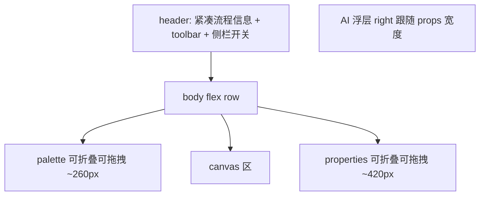

# BPM 编辑器布局优化

## 目标结构



替换现有嵌套 [`bpm-editor.html`](kiwi-admin/frontend/src/app/pages/bpm/design/editor/bpm-editor.html) 的 `nz-layout` / `nz-sider` 双层结构。

## 1. 结构清理（flex 壳层）

改写 [`bpm-editor.html`](kiwi-admin/frontend/src/app/pages/bpm/design/editor/bpm-editor.html) / [`bpm-editor.scss`](kiwi-admin/frontend/src/app/pages/bpm/design/editor/bpm-editor.scss)：

- 去掉外层/内层 `nz-layout`、`nz-sider`，以及依赖全局的 `mix-sider-height` / `full-height` 覆盖。
- 页面改为：

```html
<div class="bpm-editor-page">
  <header class="bpm-editor-header">…</header>
  <div class="bpm-editor-body">
    <aside class="bpm-editor-palette" [class.is-collapsed]="…">…</aside>
    <div class="bpm-editor-resizer" data-side="palette"></div>
    <main class="bpm-editor-canvas-pane">…</main>
    <div class="bpm-editor-resizer" data-side="properties"></div>
    <aside class="bpm-editor-properties" [class.is-collapsed]="…">…</aside>
  </div>
  <bpm-ai-chat … />
</div>
```

- 删除未使用的死样式：`.containers`、`.editor`、`.statusbar`、`.bpmn-button` 等。
- 从 [`bpm-editor.ts`](kiwi-admin/frontend/src/app/pages/bpm/design/editor/bpm-editor.ts) `imports` 中移除不再需要的 `NzLayoutModule` / `NzLayoutComponent`。
- 属性面板高度：保留 flex 填满；更新 `--bpm-collapse-vh-offset` 为「单行顶栏」后的新合计，并视情况调整 `usedHeight`（当前硬编码 `50`）。

## 2. 顶栏整合（更紧凑）

把流程元信息与工具栏收进同一 `bpm-editor-header`：

- 左侧：精简版 [`bpm-editor-process-meta`](kiwi-admin/frontend/src/app/pages/bpm/design/editor/bpm-editor-process-meta/) —— 主标题 + 版本摘要；修改/部署时间与 ID 收入更紧凑的次要行或 tooltip/popover，避免再占一整条灰底条。
- 中间：现有 [`bpm-toolbar`](kiwi-admin/frontend/src/app/pages/bpm/design/toolbar/bpm-toolbar.html)（去掉独立灰底条的「第二顶栏」感，改入 header 内联样式）。
- 右侧：组件库 / 属性面板折叠按钮。

目标：纵向只占约 **一条约 48px 的顶栏**，把原先 meta(~64px) + toolbar(~40px) 合并。

## 3. 画布空间（可折叠 + 收窄）

在 `BpmEditor` 增加：

- `paletteCollapsed` / `propertiesCollapsed`（`signal`，默认展开）。
- 默认宽度：组件库 **260px**、属性面板 **420px**（相对现状 300/500）。
- 折叠时 `width: 0` + `overflow: hidden`（或极窄把手），主区吃满剩余宽度；折叠时隐藏对应 resizer。
- 折叠/展开后调用 `bpmnModeler.get('canvas').resized?.()`，避免画布裁切。
- 折叠状态写入 `localStorage`（key 如 `bpm-editor.paletteCollapsed` / `propertiesCollapsed`），刷新后恢复。

## 4. 窄屏适配 + 侧栏拖拽调宽

在左右 aside 与 canvas 之间各放一条 **4–6px 的拖拽条**（`cursor: col-resize`）：

- `paletteWidth` / `propertiesWidth` 用 `signal` 驱动，`style.width` 绑定；拖拽中 `pointermove` 更新，结束时写 `localStorage`。
- 宽度钳制：
  - palette：`min 180` / `max 400` / 默认 `260`
  - properties：`min 280` / `max 640` / 默认 `420`
- 拖拽过程中与结束后调用 `canvas.resized?.()`；`--bpm-properties-width` 同步为当前实际宽度（折叠时为 `0`），保证 AI 浮层跟随。
- **窄屏断点**（`matchMedia('(max-width: 1200px)')`）：
  - 进入窄屏时自动折叠属性面板（画布优先），用户仍可手动展开。
  - 更窄（如 `max-width: 900px`）时再折叠组件库。
  - 离开窄屏时恢复用户上次手动偏好（以 localStorage 为准，不强制展开）。
- 不引入第三方库；用原生 pointer events（`setPointerCapture`）实现，避免与 bpmn-js 画布拖拽冲突（resizer 在 aside 外、独立元素）。

## 5. AI 浮层避让属性面板

[`bpm-ai-chat.component.scss`](kiwi-admin/frontend/src/app/pages/bpm/design/editor/bpm-ai-chat/bpm-ai-chat.component.scss) 当前 `fixed; top: 72px; right: 30px`，会压在 420–500px 属性栏上。

- 由编辑器在 `.bpm-editor-page` 上设置 CSS 变量，例如：
  - `--bpm-properties-width: <实际宽度或 0px>`
  - `--bpm-editor-header-height: 48px`
- AI authoring / FAB 改为：
  - `top: calc(var(--bpm-editor-header-height) + layout-header + 8px)`
  - `right: calc(var(--bpm-properties-width) + 16px)`
- `app-chat` 仍在右下角；若与属性栏重叠感强，同样用 `--bpm-properties-width` 右偏移（仅在 BPM 设计器宿主内通过 CSS 变量影响，不改全局 chat 默认）。

实现方式：优先 **CSS 变量**，少改 TS；拖拽调宽时变量实时更新。

## 主要改动文件

- [`bpm-editor.html`](kiwi-admin/frontend/src/app/pages/bpm/design/editor/bpm-editor.html) / [`.scss`](kiwi-admin/frontend/src/app/pages/bpm/design/editor/bpm-editor.scss) / [`.ts`](kiwi-admin/frontend/src/app/pages/bpm/design/editor/bpm-editor.ts)：flex 壳层、折叠/宽度信号、resizer、matchMedia、CSS 变量、去 nz-layout
- [`bpm-editor-process-meta.*`](kiwi-admin/frontend/src/app/pages/bpm/design/editor/bpm-editor-process-meta/)：紧凑单行样式，适配 header
- [`bpm-toolbar.css`](kiwi-admin/frontend/src/app/pages/bpm/design/toolbar/bpm-toolbar.css)：去掉独立底边/灰底或改为透明嵌入 header
- [`bpm-ai-chat.component.scss`](kiwi-admin/frontend/src/app/pages/bpm/design/editor/bpm-ai-chat/bpm-ai-chat.component.scss)：right/top 跟随变量避让
- `chat`（仅必要时）：设计器内通过宿主变量偏移，避免改全局默认

## 验收

- 顶栏合并后纵向占用明显减少，画布更高。
- 左右栏可折叠，折叠后画布变宽且 `resized` 正常。
- 拖拽条可调整左右栏宽度，刷新后宽度与折叠状态保持；AI 浮层 `right` 随属性栏宽度变化。
- 窄屏（≤1200 / ≤900）自动优先收起属性栏/组件库，手动展开仍可用。
- 属性面板展开时，AI 写工作流面板/FAB 不压在属性栏上。
- 无嵌套 `nz-layout`；死样式清理干净。
