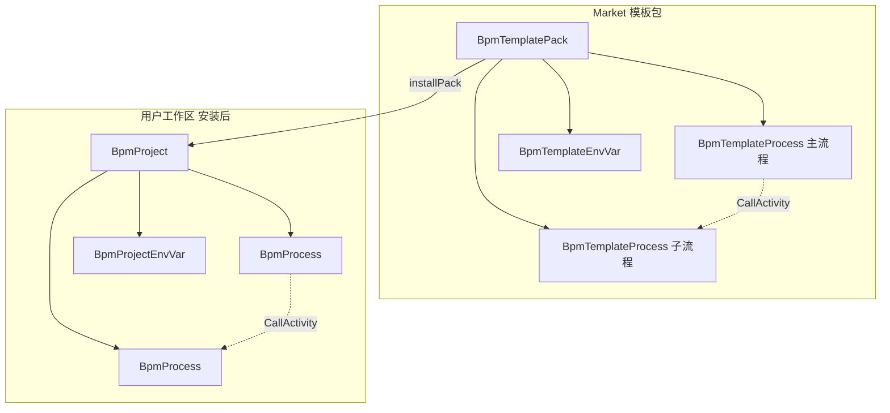
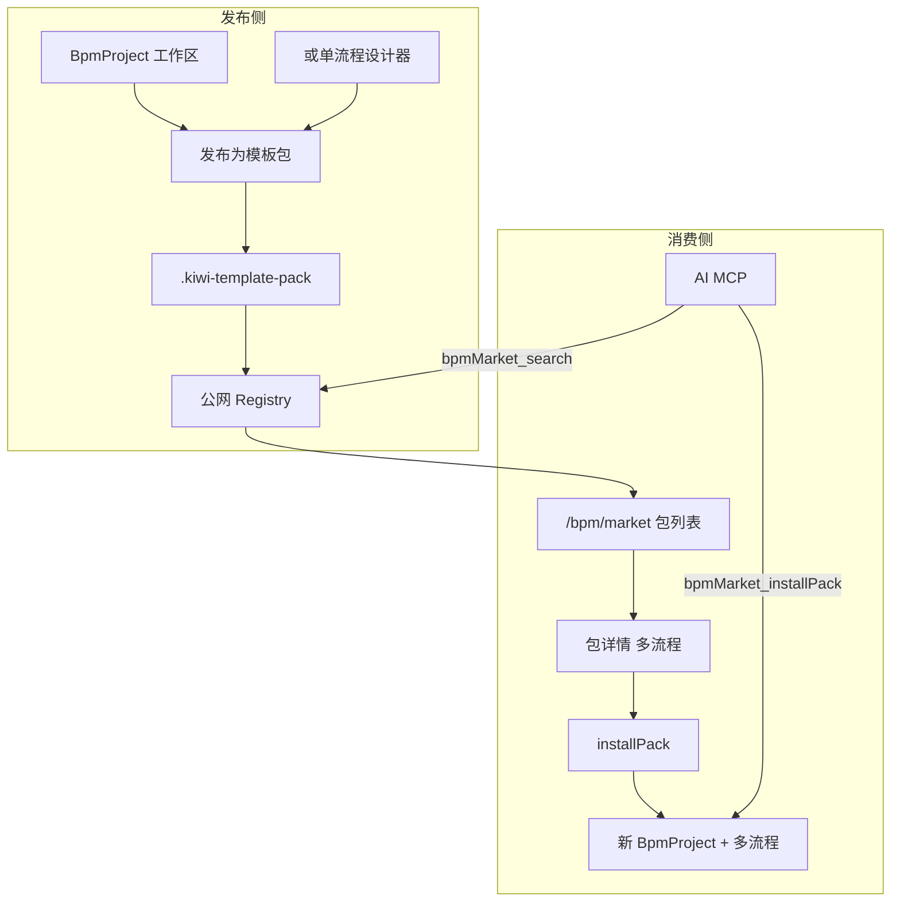
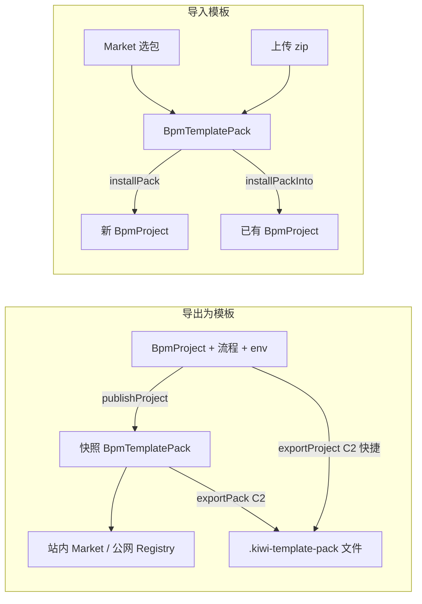
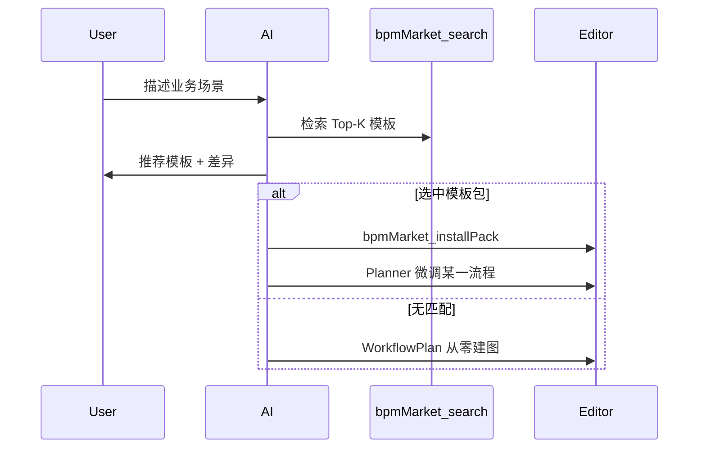
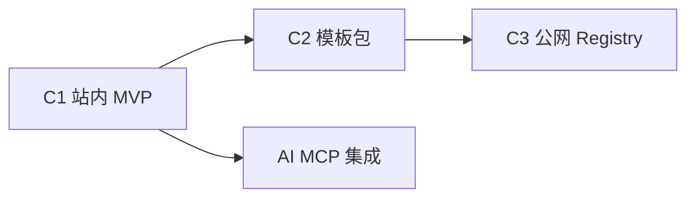

# BPM 流程模板 Market — 独立实施计划

> 与 AI 场景生图的关系见 [ai_场景生图优化_73adc83b.plan.md](ai_场景生图优化_73adc83b.plan.md)：Market 提供高质量流程起点，AI Planner 负责搜模板、安装与微调。

## 目标

把「流程模板库」做成 **Market 形态**：

- **发现**：分类、标签、搜索、预览
- **安装**：一键装进 `BpmProject`，生成新 `BpmProcess`（不覆盖已有流程）
- **发布**：从设计器导出 listing，团队或公网共享
- **分发**：最终支持 **跨 Kiwi 实例** 的公网 Registry（签名、版本、审核）

Market 售卖对象是 **模板包（Template Pack）**：结构上对标 [`BpmProject`](kiwi-admin/backend/src/main/java/com/kiwi/project/bpm/model/BpmProject.java)，可包含 **多个流程模板**、**共享环境变量** 与 **入口流程** 声明；单流程场景退化为「仅含 1 个流程的包」。

---

## 模板包：对标 BpmProject 的两层模型

**可以，且推荐这样做。** 许多真实方案本就不是单张图（主流程 + 子流程 CallActivity、多入口 `entry` 流程、共享 `BpmProjectEnvVar`）。与现网工作区一一对应：

| 用户工作区（运行时） | Market 模板侧（发布态） |
|---------------------|-------------------------|
| [`BpmProject`](kiwi-admin/backend/src/main/java/com/kiwi/project/bpm/model/BpmProject.java) | **`BpmTemplatePack`**（Market 列表卡片 / slug） |
| [`BpmProcess`](kiwi-admin/backend/src/main/java/com/kiwi/project/bpm/model/BpmProcess.java)（`projectId`） | **`BpmTemplateProcess`**（`packId` + `processKey`） |
| [`BpmProjectEnvVar`](kiwi-admin/backend/src/main/java/com/kiwi/project/bpm/model/BpmProjectEnvVar.java) | **`BpmTemplateEnvVar`**（`packId`） |
| 项目内流程列表页 | Market **包详情**内的流程子列表 |
| 克隆/新建项目 | **`installPack`** → 新建 `BpmProject` + 批量 `BpmProcess` + env |



### 包类型 `kind`

| kind | 说明 | 典型场景 |
|------|------|----------|
| `single` | 仅 1 个 `BpmTemplateProcess` | 简单串行流程；与「单模板」心智兼容 |
| `solution` | 多流程 + 可选 env | CryoEMS pipeline、ETL 套件、主流程 + 可复用子流程 |

Market **列表默认展示 Pack**；`single` 包在 UI 上可简化（详情直接预览唯一流程图）。

### 安装模式

| API | 行为 |
|-----|------|
| **`bpmMarket_installPack`**（主路径） | 新建 `BpmProject`（可改项目名）+ 复制包内全部流程与环境变量 |
| `bpmMarket_installPackInto` | 装入**已有** `projectId`（需处理流程名冲突） |
| `bpmMarket_installProcess` | 仅从包内挑 **一个** 流程装进已有项目（轻量场景） |

安装器须处理：

- **CallActivity / 子流程引用**：包内 `processKey` → 新 `BpmProcess.id` 映射，重写 BPMN 中 `calledElement` 或组件库 CallActivity 绑定
- **`entry` 标记**：[`BpmProcess.entry`](kiwi-admin/backend/src/main/java/com/kiwi/project/bpm/model/BpmProcess.java) 随模板保留
- **环境变量**：复制为 [`BpmProjectEnvVar`](kiwi-admin/backend/src/main/java/com/kiwi/project/bpm/model/BpmProjectEnvVar.java)，值可为占位符

### 发布来源

| 来源 | 说明 |
|------|------|
| **整个 `BpmProject` 发布**（推荐） | 项目流程列表「发布为模板包」→ 快照所有 `projectId` 下流程 + env |
| 单流程发布 | 生成 `kind=single` 的包（仅含当前 `BpmProcess`） |
| import zip | C2 `.kiwi-template-pack` |

---

## 与现有能力对齐

| 已有能力 | Market 复用方式 |
|----------|----------------|
| [`BpmProcess`](kiwi-admin/backend/src/main/java/com/kiwi/project/bpm/model/BpmProcess.java) | `installPack` / `installProcess` 时复制为项目内流程 |
| [`BpmProject`](kiwi-admin/backend/src/main/java/com/kiwi/project/bpm/model/BpmProject.java) | `installPack` 创建目标项目；结构镜像为 `BpmTemplatePack` |
| [`BpmProjectEnvVar`](kiwi-admin/backend/src/main/java/com/kiwi/project/bpm/model/BpmProjectEnvVar.java) | 发布/安装时随包复制为 `BpmTemplateEnvVar` |
| [`bpmPd_saveAsComponent`](kiwi-admin/backend/src/main/java/com/kiwi/project/bpm/ctl/BpmProcessDefinitionCtl.java) | 发布向导参考「另存为」的元数据收集 |
| [`BpmProcessDefinitionService`](kiwi-admin/backend/src/main/java/com/kiwi/project/bpm/service/BpmProcessDefinitionService.java) + [`bpm-template.xml`](kiwi-admin/backend/src/main/resources/bpm/bpm-template.xml) | 空白流程创建 vs 模板安装两条路径 |
| [`BpmComponentBundleService`](kiwi-admin/backend/src/main/java/com/kiwi/project/bpm/service/BpmComponentBundleService.java) | manifest + 签名校验 + 上传/分发心智 |
| [`kiwi_组件生态路线图`](kiwi_组件生态路线图_0125f55e.plan.md) | remote provider、component-bundle.json 同级设计 |
| [`cryo-movie-minimal.bpmn`](kiwi-admin/backend/src/main/resources/bpm/samples/cryo-movie-minimal.bpmn) | 首批官方种子模板 |

---

## 架构总览



---

## 核心数据模型

### 实体 1：`BpmTemplatePack`（Market 主 listing）

对标 `BpmProject`；MongoDB 文档；C3 与 Registry 同步。

| 字段 | 说明 |
|------|------|
| `id` / `slug` | 主键；公网 slug 如 `cryoems/movie-suite` |
| `kind` | `single` \| `solution` |
| `name` / `summary` / `readme` | 包级展示与检索 |
| `tags` / `category` | 分类标签 |
| `manifest` | 包级清单（见下） |
| `processCount` | 冗余计数，列表展示 |
| `entryProcessKeys` | 入口流程（对应 `BpmProcess.entry`） |
| `publisherId` / `publisherOrg` | 发布者 |
| `version` / `changelog` | SemVer（**整包**版本） |
| `status` / `visibility` | 同前 |
| `signature` / `checksum` | C2+ |
| `installCount` | 包安装次数 |
| `previewImageUrl` | 主流程缩略图 |

### 实体 2：`BpmTemplateProcess`（包内流程）

对标 `BpmProcess`；`packId` 替代 `projectId`。

| 字段 | 说明 |
|------|------|
| `id` | 主键 |
| `packId` | 所属模板包 |
| `processKey` | 包内稳定键（安装时映射到新流程 id；用于 CallActivity 解析） |
| `name` | 流程显示名 |
| `bpmnXml` / `artifactUrl` | BPMN 内容 |
| `entry` | 是否入口流程 |
| `sort` | 包内排序（可选） |

### 实体 3：`BpmTemplateEnvVar`（包内环境变量）

对标 `BpmProjectEnvVar`。

| 字段 | 说明 |
|------|------|
| `packId` | 所属包 |
| `key` / `description` / `defaultValue` | 与项目 env 一致；安装时复制到 `BpmProjectEnvVar` |

### `manifest.json`（包级清单）

```json
{
  "kiwiMinVersion": "1.0.0",
  "kind": "solution",
  "requiredComponentKeys": ["httpRequest", "mongo"],
  "processKeys": ["main", "prepare", "notify"],
  "entryProcessKeys": ["main"],
  "callActivityBindings": [
    { "callerProcessKey": "main", "activityId": "Call_Sub", "calleeProcessKey": "prepare" }
  ]
}
```

`callActivityBindings` 可在发布时从 BPMN 自动扫描生成，供安装器重写引用。

**安装前依赖检查**：合并包内**所有**流程扫描得到的 `componentId` → `requiredComponentKeys`。

---

## BpmProject 导出 / 导入模板（核心用户路径）

**是的**——[`BpmProject`](kiwi-admin/backend/src/main/java/com/kiwi/project/bpm/model/BpmProject.java) 工作区应提供与模板包对称的 **导出**、**导入** 能力；Market 是模板的**发现与分发层**，不是唯一载体。



### 导出（Project → Template）

| 能力 | API / 入口 | 说明 |
|------|------------|------|
| **发布为模板包** | `bpmMarket_publishProject` | 项目流程页 [`bpm-project-process`](kiwi-admin/frontend/src/app/pages/bpm/project/bpm-project-process.ts) 工具栏「导出为模板 / 发布到 Market」 |
| **项目列表快捷** | 同上 | [`bpm-project`](kiwi-admin/frontend/src/app/pages/bpm/project/bpm-project.ts) 行操作「导出为模板」 |
| **快照内容** | 服务层 `BpmTemplatePackPublishService` | 复制该项目下全部 `BpmProcess`（`projectId`）、全部 `BpmProjectEnvVar`；生成 `processKey`（默认用流程 `id` 或 slug 化 `name`） |
| **仅团队可见** | `visibility=org` | 导出到站内 Market，不一定公网 |
| **导出文件**（C2） | `bpmMarket_exportProject` 或 `exportPack` | 不经过 listing 也可直接下载 zip（备份、邮件、CI） |
| **单流程** | `bpmMarket_publishProcess` | 设计器内「导出当前流程为模板」→ `kind=single` 包 |

导出向导字段：包名、摘要、tags、readme、visibility（私有 / 团队 / 提交公网审核）、是否同步生成可下载 zip。

**与「另存为组件」区分**：`saveAsComponent` 产出可拖拽的 **组件**；导出模板产出可 **整包安装为新项目** 的 **流程包**。

### 导入（Template → Project）

| 能力 | API / 入口 | 说明 |
|------|------------|------|
| **从 Market 安装** | `bpmMarket_installPack` | Market 详情 / 项目列表「从模板新建项目」→ 新建 `BpmProject` + 流程 + env |
| **装入已有项目** | `bpmMarket_installPackInto` | 项目流程页「导入模板包」→ 合并进当前 `projectId`（冲突时重命名流程） |
| **上传文件导入**（C2） | `bpmMarket_importPack` + `installPack` | 上传 `.kiwi-template-pack`：可先入库为 listing，或直接 `importAndInstall` 一步建项目 |
| **仅导入单流程** | `bpmMarket_installProcess` | 从包内选一条装进当前项目 |

导入向导：选择来源（Market / 本地上传）→ 预览包内流程列表与 env → 选择「新建项目」或「装入当前项目」→ 依赖检查 → 确认。

### 建议在 `BpmProjectCtl` 暴露的别名（便于 MCP 与菜单）

与 Market API 复用同一 Service，但在项目域也注册 `@Operation`，方便 AI / 用户从「项目」上下文发现：

| operationId | 委托 |
|-------------|------|
| `bpmProj_exportAsTemplate` | → `publishProject` |
| `bpmProj_importTemplatePack` | → `installPack` / `installPackInto` |
| `bpmProj_exportTemplateFile` | → `exportProject`（C2） |

### C1 必须落地的项目侧 UI

| 页面 | 动作 |
|------|------|
| [`bpm-project.ts`](kiwi-admin/frontend/src/app/pages/bpm/project/bpm-project.ts) | 「从模板新建项目」「导入模板包（上传，C2 可占位）」 |
| [`bpm-project-process.ts`](kiwi-admin/frontend/src/app/pages/bpm/project/bpm-project-process.ts) | 「导出为模板 / 发布到 Market」「导入模板到本项目」 |
| `/bpm/market` | 浏览与 `installPack`（与项目页导入共用安装向导组件） |

**C1 导出/导入验收**（补充）：

5. 从项目 A 导出模板包 → 项目 B 用户 `installPack` 得到结构等价的项目（流程数、env key、entry 标记一致）
6. `installPackInto` 将包内流程合并进已有项目且不破坏未重名流程

---

## 分阶段实施

### C1 — 站内 Market MVP

**目标**：单实例内验证浏览 / 安装 / 发布完整闭环。

#### 后端

| API（operationId） | 说明 |
|--------------------|------|
| `bpmMarket_page` | **模板包**分页；`category`、`tag`、`keyword`、`kind` |
| `bpmMarket_get` | 包详情 + `processes[]` 摘要（不含全文时可 lazy load） |
| `bpmMarket_listProcesses` | 包内流程列表（对标项目流程页） |
| `bpmMarket_getProcess` | 单条流程 BPMN（预览） |
| `bpmMarket_publishProject` | 从 `projectId` 快照发布为 `BpmTemplatePack`（**导出为模板**） |
| `bpmMarket_publishProcess` | 从单 `processId` 发布为 `kind=single` 包 |
| `bpmMarket_installPack` | **导入模板**：新建 `BpmProject` + 流程 + env；返回 `projectId` |
| `bpmMarket_installPackInto` | **导入到已有项目** |
| `bpmMarket_installProcess` | 仅安装包内某一 `processKey` 到目标项目 |
| `bpmMarket_exportProject` | （C2）从 `projectId` 直接导出 zip，可不创建 Market listing |
| `bpmMarket_importAndInstall` | （C2）上传 zip 并一步 `installPack` |
| `bpmProj_exportAsTemplate` | 项目域别名 → `publishProject` |
| `bpmProj_importTemplatePack` | 项目域别名 → `installPack` / `installPackInto` |
| `bpmMarket_aiPage` | MCP 友好分页 |

- 包路径：`BpmTemplatePack`、`BpmTemplateProcess`、`BpmTemplateEnvVar`；`BpmTemplatePackInstallService`（含 CallActivity 重映射）
- 校验：包内每个 BPMN 走扩展后的 [`BpmDesignerXmlValidator`](kiwi-admin/backend/src/main/java/com/kiwi/project/system/ai/BpmDesignerXmlValidator.java)

#### 前端

| 模块 | 说明 |
|------|------|
| `pages/bpm/market/` | 包列表、详情、**共用** `TemplatePackInstallWizard` |
| `pages/bpm/project/` | **导出/导入**入口（见上文「BpmProject 导出/导入」） |
| 路由 | `/bpm/market`、`/bpm/market/:packId`；项目页无新路由 |
| 设计器 | 单流程「导出为模板」（`publishProcess`） |

#### 种子数据

- 官方 `single` 包：[`cryo-movie-minimal.bpmn`](kiwi-admin/backend/src/main/resources/bpm/samples/cryo-movie-minimal.bpmn) 等
- 后续可增加 `solution` 官方包（多流程 + env 示例）

**C1 验收**：

1. 浏览 / 搜索模板**包**；详情可见多流程列表
2. `installPack` 生成完整项目工作区（多流程 + env）
3. 从现有 `BpmProject` 发布包，站内可见
4. `single` 包安装后行为与单流程模板一致

---

### C2 — 可移植包 `.kiwi-template-pack`

**目标**：离线交换多流程解决方案；为公网签名打基础。

#### 包结构（zip）

```
cryo-movie-suite-1.0.0.kiwi-template-pack/
  manifest.json
  README.md
  preview.svg
  env-vars.json              # BpmTemplateEnvVar 列表
  processes/
    main.bpmn
    prepare.bpmn
  SIGNATURE
```

（`kind=single` 时 `processes/` 仅一个文件。）

#### API

| operationId | 说明 |
|-------------|------|
| `bpmMarket_exportPack` | 导出整包 zip |
| `bpmMarket_importPack` | 导入 zip → 创建/升级 `BpmTemplatePack` |

#### 安装器逻辑

1. 校验 zip 结构与 checksum
2. 解析 manifest，`requiredComponentKeys` 依赖检查
3. BPMN 语义校验
4. （C3）验证 `SIGNATURE` 与 `trustKeys`

---

### C3 — 公网 Registry（跨实例分发）

**目标**：中央目录 + 各 Kiwi 实例拉取；用户此前选择的 **公网 Market** 方案。

#### Registry 服务（可独立部署）

- 存储 listings 多版本、审核队列、安装统计聚合
- REST：`GET /registry/packs`、`GET /registry/packs/{slug}/versions/{ver}`
- 发布：`POST /registry/publish`（上传 signed `.kiwi-template-pack`）

#### 实例侧配置

```yaml
kiwi:
  bpm:
    market:
      registry-url: https://market.kiwi.example/registry
      sync-interval: 1h
      trust-keys: [...]
```

- `BpmMarketSyncJob`：拉取 `published` listing 缓存到本地 Mongo（或纯代理模式）
- `install` 时优先本地缓存，失败回源 Registry

#### 治理

| 能力 | 说明 |
|------|------|
| 审核 | `pending_review` → 管理员 `approve` / `reject` |
| 签名 | 发布方组织密钥；实例 `trustKeys` 校验 |
| 版本 | `install` 默认 latest stable；支持 `@1.2.0` pin |
| 安全 | BPMN 静态扫描（硬编码密钥）；举报 / 下架 |
| 升级 | 默认不覆盖已安装流程；可选「升级副本」显式操作 |

**C3 验收**：

1. 实例 A 发布 → Registry 审核通过 → 实例 B sync 后可浏览安装
2. 篡改包签名校验失败，拒绝安装
3. AI 通过 `bpmMarket_search` 检索公网模板

---

## AI 集成（与 Market 的契约）

独立 plan 的 AI 侧只消费 Market 暴露的 MCP 工具，不重复实现 Market 本体。



| 集成点 | 说明 |
|--------|------|
| MCP | `bpmMarket_search`（搜**包**）、`get`、`listProcesses`、`installPack`、`installProcess` |
| ClientAction | `applyTemplatePack(packId, projectName?)` 或 install 后 navigate 项目工作区 |
| Prompt | 推荐 **solution 包** 优先于单流程；多步骤场景匹配 `kind=solution` |
| UI | 包详情「用 AI 基于此包创建」→ `installPack` 后打开入口流程设计器 |

**依赖**：AI 集成任务可在 C1 API 就绪后启动，与 C2/C3 并行。

---

## Market UI 规格摘要

### 列表页

- 卡片：包名、摘要、`kind` 徽章（单流程 / 解决方案）、流程数量、标签、安装量

### 详情页（对标项目工作区预览）

- README、包级 manifest、依赖组件、环境变量说明
- **流程子列表**（名称、`entry` 标记、预览入口）— 类似 `/bpm/process-definition?projectId=`
- 主 CTA：**「安装整个包（新建项目）」**
- 次 CTA：「仅安装某一流程到已有项目」；「用 AI 基于此包创建」

### 发布向导

1. **推荐**：从 [`BpmProject`](kiwi-admin/frontend/src/app/pages/bpm/project/bpm-project.ts) 流程列表「发布为模板包」
2. 或从设计器发布 `kind=single` 包
3. 自动扫描各流程 BPMN → manifest + `callActivityBindings`
4. 填写包元数据、visibility；公网 → `pending_review`

### 项目内新建

- 空白项目 / 流程
- **从 Market 安装包**（新建项目，推荐）
- 用 AI 描述（见 [AI plan](ai_场景生图优化_73adc83b.plan.md)）

---

## 后端模块与文件（实施清单）

| 层级 | 路径（建议） |
|------|----------------|
| Model | `BpmTemplatePack`、`BpmTemplateProcess`、`BpmTemplateEnvVar`、`BpmTemplatePackManifest` |
| Dao | 各实体 Dao（`process` 按 `packId` 查询） |
| Service | `BpmTemplatePackService`、`BpmTemplatePackInstallService`（含引用重映射）、`BpmTemplatePackPublishService`（从 project 快照）、`ManifestScanner` |
| Ctl | `BpmTemplatePackCtl`（`bpmMarket_*`） |
| C2 | `bpm/service/BpmWorkflowTemplateBundleService.java` |
| C3 | `bpm/market/registry/`（或独立模块 `kiwi-market-registry`） |
| Migration | `mongo/migration/versioned/V*__BpmWorkflowTemplate.json` 或 Mongock |
| 前端 | `frontend/src/app/pages/bpm/market/*` |
| 路由 | [`app.routes.ts`](kiwi-admin/frontend/src/app/app.routes.ts) 增加 market 路由 |

---

## OpenSpec

- **C1～C2**：`openspec new change "bpm-workflow-template-market"`
- **C3 Registry**：可拆 `bpm-market-registry`（独立服务规格）

---

## 实施顺序与并行



- **C1** 可独立交付，立刻改善人工建图与团队共享
- **C2** 为公网签名与离线分发铺路
- **C3** 生态二期；可与 [组件 remote provider](kiwi_组件生态路线图_0125f55e.plan.md) 协同
- **AI 集成** 在 C1 API 完成后即可开始，不必等 C3

---

## 验收标准（汇总）

| 阶段 | 标准 |
|------|------|
| C1 | 包浏览 / `installPack` 新建完整项目 / `publishProject` / `single` 包兼容 |
| C2 | export/import `.kiwi-template-pack`；多流程 + env |
| C3 | 跨实例 sync **包**；审核 + 签名 |
| AI | 推荐并 `installPack`；solution 场景优先整包 |

---

## 风险与边界

- **不覆盖已有项目**：`installPack` 默认新建 `BpmProject`；装入已有项目需显式 `installPackInto` 并处理重名
- **CallActivity 映射**：solution 包安装失败时须返回可读的 `processKey` / `activityId` 错误
- **组件缺失**：包级合并检查所有流程的 `componentId`
- **大图**：单流程 `bpmnXml` 可外置 `artifactUrl`；列表接口不返回全文
- **与 saveAsComponent 区分**：组件 vs **流程包**；与 **运行时 BpmProject** 区分：Pack 是只读发布态，安装后才变为可编辑工作区
