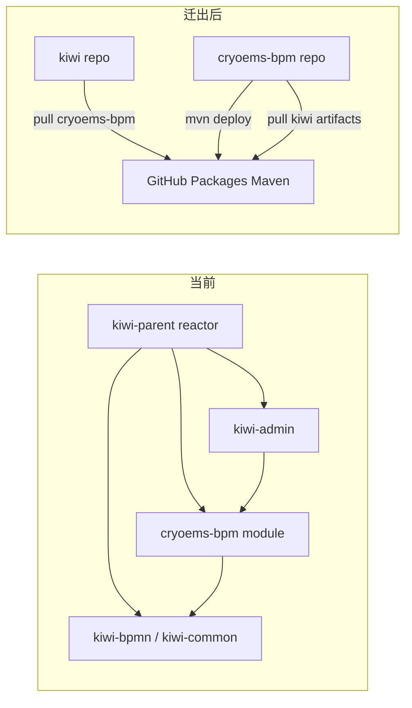

# cryoems-bpm 迁出独立仓库

## 现状

- `cryoems-bpm` 位于 [`d:\Projects\kiwi\cryoems-bpm`](d:\Projects\kiwi\cryoems-bpm)，共 **94** 个文件被 kiwi Git 跟踪
- 作为 kiwi Maven 子模块注册于 [`pom.xml`](d:\Projects\kiwi\pom.xml) 第 22 行
- [`kiwi-admin/backend/pom.xml`](d:\Projects\kiwi\kiwi-admin\backend\pom.xml) 第 211–215 行依赖 `com.kiwi:cryoems-bpm:${project.version}`
- `cryoems-bpm` 反向依赖 `kiwi-bpmn-core`、`kiwi-bpmn-component`、`kiwi-bpmn-external-task`、`kiwi-common`（见 [`cryoems-bpm/pom.xml`](d:\Projects\kiwi\cryoems-bpm\pom.xml)）
- kiwi 远程仓库：`git@github.com:xc404/kiwi.git`
- 目标目录 `d:\Projects\cryoems-bpm` 尚不存在



## 目标结构

```
d:\Projects\
├── kiwi\                 # 不再包含 cryoems-bpm/
└── cryoems-bpm\          # 独立 Git 仓库 → github.com/xc404/cryoems-bpm
```

## 实施步骤

### 1. 物理迁移 + 独立 Git 初始化

1. 将 `d:\Projects\kiwi\cryoems-bpm` **移动**（非复制）到 `d:\Projects\cryoems-bpm`
2. 在新目录执行 `git init`，添加标准 Java/Maven `.gitignore`（`target/`、`.idea/`、`*.iml` 等）
3. 首次提交：`git add . && git commit -m "Initial import from kiwi monorepo"`
4. 在 GitHub 创建仓库 `xc404/cryoems-bpm`（或与 kiwi 同 org 下的目标仓库），绑定 remote
5. 在 kiwi 仓库执行 `git rm -r cryoems-bpm`，从版本库删除该目录

> 按你的选择：**不保留** kiwi 中的提交历史。

### 2. 改造 cryoems-bpm 为独立 Maven 根项目

重写 [`cryoems-bpm/pom.xml`](d:\Projects\kiwi\cryoems-bpm\pom.xml)：

- **移除** `kiwi-parent` 父 POM
- **改用** `spring-boot-starter-parent:3.5.8`（与 kiwi 当前版本对齐）
- 显式声明：
  - `groupId`: `com.kiwi`
  - `artifactId`: `cryoems-bpm`
  - `version`: `1.0.0`（独立版本号，后续可单独发版）
- 新增属性对齐 kiwi 构建链：

```xml
<properties>
  <java.version>25</java.version>
  <kiwi.version>1.0.0</kiwi.version>
  <lombok.version>1.18.42</lombok.version>
  <camunda.version>7.24.0</camunda.version>
  <spring-framework.version>6.2.14</spring-framework.version>
  <github.owner>xc404</github.owner>
  <github.repo.cryoems-bpm>cryoems-bpm</github.repo.cryoems-bpm>
  <github.repo.kiwi>kiwi</github.repo.kiwi>
</properties>
```

- kiwi 依赖改为 `${kiwi.version}` 固定版本（不再用 `${project.version}`）
- 复制 kiwi-parent 中与 cryoems-bpm 相关的 `dependencyManagement`（spring-framework-bom、swagger 版本锁定）

#### GitHub Packages — 发布（cryoems-bpm 侧）

`distributionManagement` 使用 GitHub Packages Maven 端点（releases 与 snapshots 共用同一 URL）：

```xml
<distributionManagement>
  <repository>
    <id>github-cryoems-bpm</id>
    <name>GitHub Packages — cryoems-bpm</name>
    <url>https://maven.pkg.github.com/${github.owner}/${github.repo.cryoems-bpm}</url>
  </repository>
  <snapshotRepository>
    <id>github-cryoems-bpm</id>
    <name>GitHub Packages — cryoems-bpm</name>
    <url>https://maven.pkg.github.com/${github.owner}/${github.repo.cryoems-bpm}</url>
  </snapshotRepository>
</distributionManagement>
```

> `server.id` 必须与 `~/.m2/settings.xml` 及 CI 中的 `<server><id>` **完全一致**（`github-cryoems-bpm`）。

#### GitHub Packages — 拉取 kiwi 构件（cryoems-bpm 侧）

cryoems-bpm 仍依赖 kiwi 模块，需在 pom 中声明 kiwi 仓库（若 kiwi 也发布到 GitHub Packages）：

```xml
<repositories>
  <repository>
    <id>github-kiwi</id>
    <name>GitHub Packages — kiwi</name>
    <url>https://maven.pkg.github.com/${github.owner}/${github.repo.kiwi}</url>
    <snapshots><enabled>true</enabled></snapshots>
  </repository>
</repositories>
```

> 若 kiwi 构件尚未发布到 GitHub Packages，过渡期仍可通过本地 `mvn install` 安装到 `~/.m2`；长期建议 kiwi 同样配置 `distributionManagement` 发布 bpmn/common 模块。

- 新增 [`README.md`](d:\Projects\cryoems-bpm\README.md)：构建顺序、发布命令、GitHub Packages 认证说明

### 3. Maven 认证配置（GitHub Packages）

在 `~/.m2/settings.xml`（**不入库**，仅本地/CI secret）添加：

```xml
<servers>
  <server>
    <id>github-cryoems-bpm</id>
    <username><!-- GitHub 用户名，如 xc404 --></username>
    <password><!-- GitHub PAT，scope: read:packages + write:packages --></password>
  </server>
  <server>
    <id>github-kiwi</id>
    <username>xc404</username>
    <password><!-- 同上 PAT 或 read:packages 只读 token --></password>
  </server>
</servers>
```

GitHub Actions（cryoems-bpm 仓库 `.github/workflows/deploy.yml`）：

```yaml
- name: Publish to GitHub Packages
  run: mvn --batch-mode deploy -DskipTests
  env:
    GITHUB_TOKEN: ${{ secrets.GITHUB_TOKEN }}
```

并在 workflow 或 `settings.xml` 生成步骤中将 `GITHUB_TOKEN` 映射到 `github-cryoems-bpm` server（`username` = `${{ github.actor }}`，`password` = token）。`GITHUB_TOKEN` 默认可读写**本仓库** Packages。

### 4. 调整 kiwi 侧 Maven 配置

**[`pom.xml`](d:\Projects\kiwi\pom.xml)**：

- 删除 `<module>cryoems-bpm</module>`
- 新增属性：`<cryoems-bpm.version>1.0.0</cryoems-bpm.version>`
- 新增 **GitHub Packages 拉取仓库**（非 profile 时从 Packages 解析 cryoems-bpm）：

```xml
<repositories>
  <repository>
    <id>github-cryoems-bpm</id>
    <name>GitHub Packages — cryoems-bpm</name>
    <url>https://maven.pkg.github.com/xc404/cryoems-bpm</url>
    <snapshots><enabled>true</enabled></snapshots>
  </repository>
</repositories>
```

- 新增本地联调 profile `cryoems-bpm-local`（优先级高于远程仓库，reactor 直接编译 sibling）：

```xml
<profile>
  <id>cryoems-bpm-local</id>
  <modules>
    <module>../cryoems-bpm</module>
  </modules>
</profile>
```

**[`kiwi-admin/backend/pom.xml`](d:\Projects\kiwi\kiwi-admin\backend\pom.xml)**：

```xml
<dependency>
  <groupId>com.kiwi</groupId>
  <artifactId>cryoems-bpm</artifactId>
  <version>${cryoems-bpm.version}</version>
</dependency>
```

> `dependency-reduced-pom.xml` 为构建产物，build 后自动更新。

### 5. 构建与发布工作流

| 场景 | 命令 |
|------|------|
| **本地联调（profile C）** | `cd d:\Projects\kiwi && mvn -Pcryoems-bpm-local clean install -pl kiwi-admin/backend -am -DskipTests` |
| **发布 cryoems-bpm** | `cd d:\Projects\cryoems-bpm && mvn deploy -DskipTests`（需 settings.xml 认证） |
| **kiwi CI / 无 local profile** | 从 `https://maven.pkg.github.com/xc404/cryoems-bpm` 拉取 `com.kiwi:cryoems-bpm:${cryoems-bpm.version}` |
| **cryoems-bpm CI** | push tag / main → GitHub Actions `mvn deploy` |

本地联调前提：`d:\Projects\cryoems-bpm` 与 `d:\Projects\kiwi` 为同级目录。

### 6. 验证

1. **cryoems-bpm 独立构建**：`cd d:\Projects\cryoems-bpm && mvn test`（kiwi 构件已在 `.m2` 或 GitHub Packages）
2. **发布 smoke**：`mvn deploy -DskipTests`，在 GitHub 仓库 Packages 页确认 `com.kiwi:cryoems-bpm:1.0.0` 出现
3. **kiwi 拉取**：不启 local profile，`mvn -pl kiwi-admin/backend -DskipTests compile` 能从 GitHub Packages 解析
4. **kiwi 本地联调**：`mvn -Pcryoems-bpm-local -pl kiwi-admin/backend -am -DskipTests compile`

### 7. 不在本次范围 / 低优先级

- **openspec/** 历史 change 文档路径引用：归档记录，不修改
- Java 包名 `com.kiwi.cryoems.bpm`：保持不变
- kiwi 全模块发布到 GitHub Packages：建议后续单独 change；本次 cryoems-bpm 可先依赖本地 install 的 kiwi 构件

## 风险与注意

- **GitHub Packages 可见性**：Package 可见性跟随仓库；私有仓库需 PAT / `GITHUB_TOKEN` 才能拉取
- **server id 一致性**：`distributionManagement`、`repositories`、`settings.xml`、CI 四处 id 必须统一为 `github-cryoems-bpm` / `github-kiwi`
- **版本漂移**：`kiwi.version` 与 `cryoems-bpm.version` 解耦后需人工对齐
- **首次构建顺序**：cryoems-bpm 无法单独编译 unless kiwi 构件已在 `.m2` 或 GitHub Packages
- **Windows 路径**：移动目录时用 PowerShell `Move-Item`，确保 IDE 关闭对旧路径的文件锁
