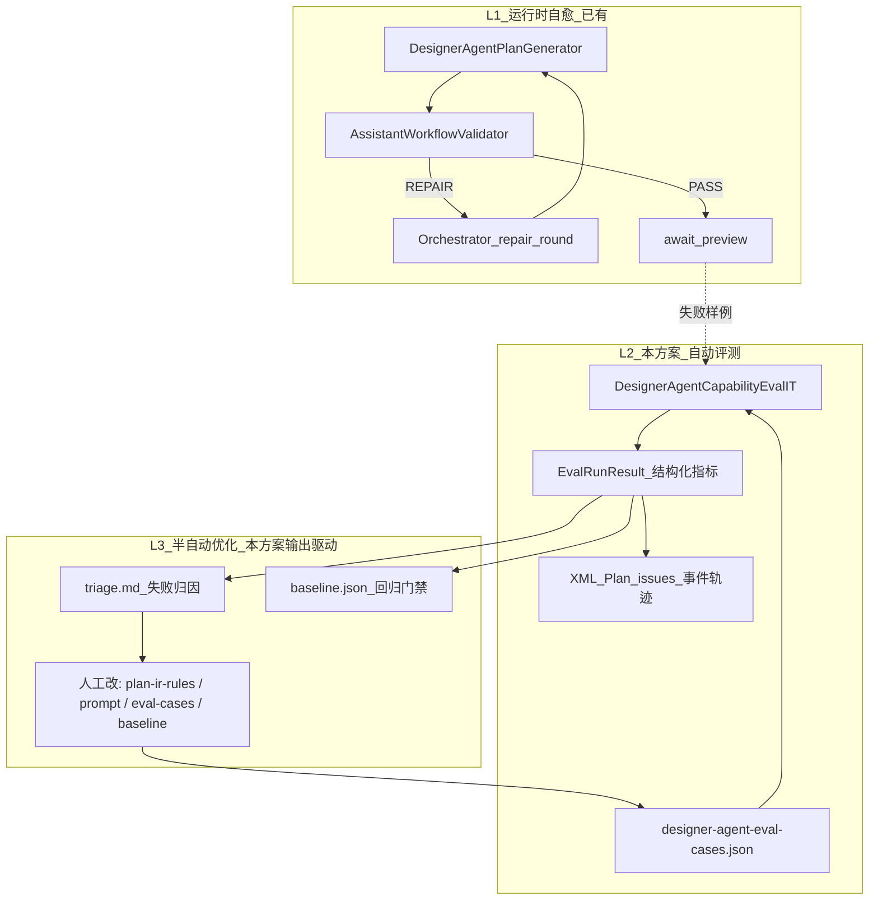
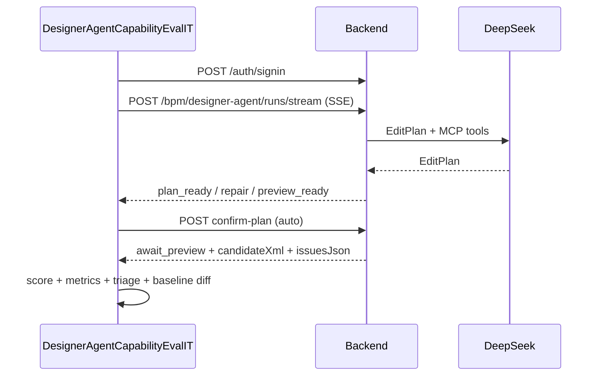

# Designer Agent AI 写工作流能力 HTTP 集成评测（含自我优化闭环）

## 背景

现有评测仅覆盖旧路径 [`AssistantCreateOrderApiIT.java`](kiwi-admin/backend/src/test/java/com/kiwi/project/ai/assistant/AssistantCreateOrderApiIT.java)（`/ai/write-workflow/start`），且只有「创建订单」单场景。新 [`DesignerAgentCtl`](kiwi-admin/backend/src/main/java/com/kiwi/project/bpm/designer/agent/DesignerAgentCtl.java) 使用 **SSE + EditPlan + 人机闸门**，OpenSpec 任务 [`openspec/changes/bpm-designer-agent/tasks.md`](openspec/changes/bpm-designer-agent/tasks.md) 中「Agent SSE 集成测试」仍为空。

用户选择：**designer-agent + HTTP IT**，且评测需**可用于 AI 写工作流的自我优化**（对齐既有 [`ai写工作流效果差根因_6f7fa4eb.plan.md`](.cursor/plans/ai写工作流效果差根因_6f7fa4eb.plan.md) 三层闭环架构）。

## 在闭环中的定位



| 层 | 本方案做什么 | 自动化边界 |
|----|-------------|-----------|
| **L1** | 不新建；评测**观测** repair 轮数、issuesJson、最终 stage | 运行时已有 `max-repair-rounds` |
| **L2** | HTTP IT 批量跑场景 → 打分 + 结构化落盘 | 全自动（有 Key/backend 时） |
| **L3** | 输出 `triage.md` + `summary.json`，映射 ruleId → 建议改动点 | **半自动**：不自动改仓库/prompt，人确认后迭代 |

**明确不做（本期）**：LLM 无人值守自动改 prompt 并推送；评测失败时自动修改 `plan-ir-rules.json`；未确认自动 save 流程。

## 目标

新增可重复运行的能力评测套件，且每次运行都能**反哺优化**：



- **多场景**：JSON 配置，首批 3 条（A1/A6/A10）
- **真实 LLM**：走已启动 backend（需 `DEEPSEEK_API_KEY` + `KIWI_BPM_DESIGNER_AGENT_ENABLED=true`）
- **CI 友好**：前置条件不满足时 `assumeTrue` 跳过
- **可优化**：结构化指标 + baseline 回归 + 失败归因报告

## 新增文件

| 路径 | 职责 |
|------|------|
| [`kiwi-admin/backend/src/test/resources/ai-authoring/designer-agent-eval-cases.json`](kiwi-admin/backend/src/test/resources/ai-authoring/designer-agent-eval-cases.json) | 评测用例定义 |
| [`kiwi-admin/backend/src/test/resources/ai-authoring/designer-agent-eval-baseline.json`](kiwi-admin/backend/src/test/resources/ai-authoring/designer-agent-eval-baseline.json) | 回归基线（通过率 + 各 case minScore） |
| [`kiwi-admin/backend/src/test/java/com/kiwi/project/bpm/designer/agent/support/DesignerAgentEvalClient.java`](kiwi-admin/backend/src/test/java/com/kiwi/project/bpm/designer/agent/support/DesignerAgentEvalClient.java) | 登录、SSE 消费、REST 确认/轮询、事件轨迹 |
| [`kiwi-admin/backend/src/test/java/com/kiwi/project/bpm/designer/agent/support/DesignerAgentEvalScorer.java`](kiwi-admin/backend/src/test/java/com/kiwi/project/bpm/designer/agent/support/DesignerAgentEvalScorer.java) | 打分 |
| [`kiwi-admin/backend/src/test/java/com/kiwi/project/bpm/designer/agent/support/DesignerAgentEvalRunResult.java`](kiwi-admin/backend/src/test/java/com/kiwi/project/bpm/designer/agent/support/DesignerAgentEvalRunResult.java) | 单次 run 结构化结果 |
| [`kiwi-admin/backend/src/test/java/com/kiwi/project/bpm/designer/agent/support/DesignerAgentEvalTriage.java`](kiwi-admin/backend/src/test/java/com/kiwi/project/bpm/designer/agent/support/DesignerAgentEvalTriage.java) | 失败归因 → 优化建议 |
| [`kiwi-admin/backend/src/test/java/com/kiwi/project/bpm/designer/agent/DesignerAgentCapabilityEvalIT.java`](kiwi-admin/backend/src/test/java/com/kiwi/project/bpm/designer/agent/DesignerAgentCapabilityEvalIT.java) | 参数化集成测试入口 |

## 评测用例 JSON 结构

每条 case 字段（示例）：

```json
{
  "id": "create-order-greenfield",
  "scenario": "我想做一个创建订单的流程：先生成订单号，再组装订单变量",
  "baseBpmnXml": null,
  "readOnly": false,
  "autoConfirmPlan": true,
  "expectedStage": "await_preview",
  "expectedComponentIds": ["classpath_uuidGenerate", "classpath_assignmentActivity"],
  "matchAllComponents": false,
  "expectedFragments": ["startEvent", "endEvent", "BPMNDiagram"],
  "forbiddenFragments": ["invented_component"],
  "keywordHints": ["订单"],
  "minScore": 7,
  "maxScore": 11,
  "maxRepairRounds": 3
}
```

**首批用例**：

1. **create-order-greenfield** — 空画布整图（A6）
2. **add-http-node** — 最小 base XML + 「加 HTTP 节点」（A1）
3. **read-only-explain** — 只读解释（A10）

## 结构化指标（`EvalRunResult`，供 L3 优化）

每条 case 运行后写入 `target/designer-agent-eval/runs/{caseId}-{timestamp}.json`：

```json
{
  "caseId": "create-order-greenfield",
  "passed": true,
  "score": 9,
  "maxScore": 11,
  "elapsedMs": 42000,
  "stage": "await_preview",
  "planSkipped": false,
  "repairRoundsObserved": 1,
  "dispatchHint": "PASS",
  "componentIdsUsed": ["classpath_uuidGenerate", "classpath_assignmentActivity"],
  "issues": [{"ruleId": "...", "severity": "REPAIR", "message": "..."}],
  "scoreBreakdown": {"structure": 2, "diagram": 1, "components": 2, "...": 1},
  "sseEventTypes": ["stage", "plan_ready", "await_human", "validation", "preview_ready"],
  "artifacts": {
    "candidateXml": "target/designer-agent-eval/create-order-greenfield.bpmn.xml",
    "editPlanJson": "target/designer-agent-eval/create-order-greenfield.edit-plan.json"
  }
}
```

**从 SSE 轨迹采集的优化信号**（写入 `EvalRunResult`）：

- `repairRoundsObserved` — 统计 `stage=repair` 次数
- `planSkipped` — 是否跳过 Plan 审阅（`plan-mode-skip-simple`）
- `issues` — 解析 `issuesJson`，保留 `ruleId` / `severity` / `message`
- `componentIdsUsed` — 从 candidateXml 提取 `kiwi:componentId`
- `sseEventTypes` — 事件序列摘要（排查卡 ask/install）

## 失败归因与优化建议（`DesignerAgentEvalTriage`）

跑完所有 case 后生成 `target/designer-agent-eval/triage.md`，按失败类型给出**可执行的优化方向**（人读 + 可被 Agent 读）：

| 归因类型 | 触发条件 | 建议改动点 |
|---------|---------|-----------|
| **规则违规** | `issues[].ruleId` 非空 | 改 [`plan-ir-rules.json`](kiwi-bpmn-assistant/src/main/resources/assistant/plan-ir-rules.json) 对应 hard/soft rule；或加强 [`AssistantWorkflowValidator`](kiwi-bpmn-assistant/src/main/java/com/kiwi/bpmn/assistant/AssistantWorkflowValidator.java) |
| **组件选型错误** | 用了 forbidden / 未命中 expectedComponentIds | 加强 [`DesignerAgentPlanGenerator.buildPrompt`](kiwi-bpmn-designer-agent/src/main/java/com/kiwi/bpmn/designer/agent/runtime/DesignerAgentPlanGenerator.java) 的 MCP 约束；或 Catalog 示例 |
| **Repair 耗尽** | `repairRoundsObserved >= maxRepairRounds` 且未 PASS | 提高 repair prompt 的 issues 注入质量；或调高 `kiwi.bpm.designer-agent.max-repair-rounds` 做 A/B |
| **Plan 质量差** | 未到 `expectedStage` / EditPlan 为空 | 调整 EditPlan schema 示例；或关闭 `plan-mode-skip-simple` 做对比 |
| **场景理解偏差** | keywordHints 未命中 | 扩展 eval case 的 `scenario` 或增加 `keywordHints` 权重 |
| **卡人机** | stage=`await_ask`/`await_install` | 补 eval case 的 `allowPartial` 或增加自动 answer 策略（本期仅报告，不自动装插件） |

`triage.md` 模板示例：

```markdown
## 回归摘要
- 通过率: 2/3 (baseline 3/3) ❌ 回归
- 平均分: 7.3 (baseline 8.5)

## 待优化项（按优先级）
1. [create-order-greenfield] ruleId=component_id_resolvable → 建议检查 MCP 工具回环 / soft rule `use_mcp_discovery`
2. [add-http-node] repairRounds=3 仍 FAIL → 建议查看 issues 详情并加强 repair 上下文
```

## Baseline 回归（自我优化的「门禁」）

[`designer-agent-eval-baseline.json`](kiwi-admin/backend/src/test/resources/ai-authoring/designer-agent-eval-baseline.json) 提交到仓库，结构：

```json
{
  "version": 1,
  "minPassRate": 1.0,
  "cases": {
    "create-order-greenfield": {"minScore": 7},
    "add-http-node": {"minScore": 6},
    "read-only-explain": {"minScore": 5}
  }
}
```

- 默认：`summary.json` 与 baseline 对比；**任一 case 低于 baseline minScore 或通过率下降 → 测试失败**（回归门禁）
- 显式刷新基线（优化完成后人工确认）：
  ```bash
  KIWI_EVAL_UPDATE_BASELINE=true mvn -pl kiwi-admin/backend test -Dtest=DesignerAgentCapabilityEvalIT
  ```
  将本次 `summary.json` 合并写回 `designer-agent-eval-baseline.json`（仅当 env 显式设置时）

## HTTP 客户端（`DesignerAgentEvalClient`）

复用 [`AssistantCreateOrderApiIT`](kiwi-admin/backend/src/test/java/com/kiwi/project/ai/assistant/AssistantCreateOrderApiIT.java) 模式 + 前端 [`bpm-designer-agent.service.ts`](kiwi-admin/frontend/src/app/pages/bpm/design/design/agent/bpm-designer-agent.service.ts) SSE 解析逻辑。

- 环境变量：`KIWI_API_BASE_URL`、`KIWI_API_USERNAME`、`KIWI_API_PASSWORD`
- `await_plan` → 自动 `confirm-plan`
- **不** `confirm-preview`（避免 DB 流程不存在）
- 轮询 `GET /runs/{runId}` 至目标 stage

## 打分规则（`DesignerAgentEvalScorer`）

| 维度 | 分值 | 条件 |
|------|------|------|
| 结构 | +2 | startEvent + endEvent |
| 图面 | +1 | BPMNDiagram |
| 组件 | +2 | 至少 1 个 componentId |
| 期望组件 | +2 | 命中 expectedComponentIds |
| 语义 | +1 | keywordHints |
| 阶段 | +1 | 到达 expectedStage |
| 校验 | +1 | issues 为空或仅 INFO |
| 低 repair 奖励 | +1 | `repairRoundsObserved == 0` 且 PASS（鼓励一次生成质量） |
| 禁止项 | 否决 | forbiddenFragments |

只读 case：检查 `assistantReply` 非空、`stage=done`、无 candidateXml 变更。

## 主测试类

[`DesignerAgentCapabilityEvalIT`](kiwi-admin/backend/src/test/java/com/kiwi/project/bpm/designer/agent/DesignerAgentCapabilityEvalIT.java)：

- `@Tag("api")` + `@Tag("llm")` + `@Tag("designer-agent")`
- `@ParameterizedTest` 读 JSON cases
- `@Timeout(240s)` per case
- 输出目录 `target/designer-agent-eval/`：
  - `{caseId}.bpmn.xml`、`{caseId}.edit-plan.json`
  - `{caseId}.md`（人类可读）
  - `summary.json`、`summary.md`、`triage.md`
  - `runs/*.json`（结构化单次结果）

## 典型优化工作流（使用者手册）

1. **跑评测**：backend 启动 + Agent 启用 → `mvn ... -Dtest=DesignerAgentCapabilityEvalIT`
2. **看 triage.md**：按 ruleId / 归因类型决定改 rules、prompt 还是 eval case
3. **改产品**：例如加强 `plan-ir-rules.json` soft rule、或 `DesignerAgentPlanGenerator.buildPrompt`
4. **重跑评测**：确认 `summary.json` 分数提升且无 regression
5. **刷新 baseline**：`KIWI_EVAL_UPDATE_BASELINE=true` 更新门禁基线并提交

与 [`AssistantWorkflowGoldenEvaluationTest`](kiwi-admin/backend/src/test/java/com/kiwi/project/ai/assistant/AssistantWorkflowGoldenEvaluationTest.java) 分工：

- **Golden**：确定性编译器/regression（无 LLM，CI 必跑）
- **本 IT**：端到端 LLM + MCP 效果评测（可选跑，驱动 L3 优化）

## 运行方式

```bash
# 1. 启动 backend，启用 Agent + AI Key
#    KIWI_BPM_DESIGNER_AGENT_ENABLED=true
#    DEEPSEEK_API_KEY=...

# 2. 跑评测 + 优化报告
mvn -pl kiwi-admin/backend test -Dtest=DesignerAgentCapabilityEvalIT

# 3. 优化后刷新 baseline（可选）
KIWI_EVAL_UPDATE_BASELINE=true mvn -pl kiwi-admin/backend test -Dtest=DesignerAgentCapabilityEvalIT
```

## 与现有测试的关系

- 不修改旧 `write-workflow` 测试
- 不新增 `@SpringBootTest`
- 评测输出设计对齐既有 P4「黄金场景 + 指标落盘 + 失败归因」([`ai写工作流效果差根因`](.cursor/plans/ai写工作流效果差根因_6f7fa4eb.plan.md))

## OpenSpec 同步

实现完成后勾选 [`openspec/changes/bpm-designer-agent/tasks.md`](openspec/changes/bpm-designer-agent/tasks.md)：

```markdown
- [x] Agent SSE 集成测试（含 eval 指标与 triage 报告）
```
