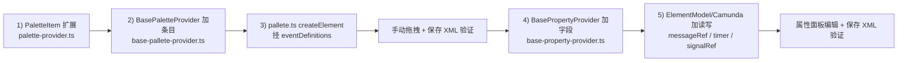

---

name: frontend intermediate catch event
overview: 在 kiwi-admin BPMN 设计器前端补齐中间捕获事件、接收任务的可视化建模能力：palette 可拖拽 + 事件定义自动挂载 + 属性面板可配置 messageRef / timer / signalRef。本次不含 EventBasedGateway。
todos:

- id: palette-item-type
content: 拓宽 PaletteItem / getElementOptions 返回类型，增加 eventDefinitionType；pallete.ts createElement 中在 businessObject 上追加 eventDefinitions
status: pending
- id: palette-items
content: BasePaletteProvider 增加中间事件分组（3 种 catch）+ ReceiveTask 条目，选合适图标
status: pending
- id: property-fields
content: BasePropertyProvider getProperties 按 eventDefinition 类型返回 messageName / timerType+timerValue / signalName 字段
status: pending
- id: element-model-rw
content: ElementModel 及 CamundaElementModel 中实现这些 key 的 getValue/setValue，含 rootElements 中 Message/Signal 的复用与创建、Timer 子元素的切换与 body 写入
status: pending
- id: icon-migration
content: 把 pallete.html 渲染机制改为 span [class]；base-pallete-provider.ts 8 个数字图标全替换为官方 bpmn-icon-xxx；component-service.ts / component-provider.ts / kiwi-append-component-module.ts 的默认值同步替换；component-service.ts 加 legacyIconAlias 兜底函数处理 DB 历史值
status: pending
- id: manual-verify
content: 手动验证：拖出 4 种新节点（3 种 catch + ReceiveTask）、配置后导出 XML 及重新导入；现有 palette 8 种节点图标也要确认全部正常显示；可用 cyro-et 轮询示例骨架验证
status: pending
- id: decide-message-input-style
content: messageName / signalName 用纯文本输入（已确认 A 档：input + setValue 时按 name 复用/新建 rootElements 下的 bpmn:Message / bpmn:Signal）
status: completed
isProject: false

---

## 目标范围

让用户能在画板上：

1. 从 palette 拖出"中间消息/定时/信号 捕获事件"、"接收任务"
2. 新建出来的节点 XML 自动带正确的 `<bpmn:xxxEventDefinition>`（而不是裸 `<bpmn:intermediateCatchEvent />`）
3. 在右侧属性面板里配置 messageRef（消息名）、timer 值、signalRef（信号名）

不在本次范围：

- **EventBasedGateway**（事件网关），后续按需补
- 消息抛出事件、消息启动事件、边界事件、错误事件
- 消息广播下拉选择 UI（统一用文本输入消息名，代码按 name 自动复用 `<bpmn:Message>` rootElement）

## 1) 扩展 PaletteItem 携带 eventDefinitionType

[palette-provider.ts](kiwi-admin/frontend/src/app/pages/bpm/design/palette/palette-provider.ts) 的 `PaletteItem` 已经是 `& { [k:string]: any }` 开放结构，无需改类型。但把约定显式化更清晰：在该文件 `PaletteItem` 上加可选字段 `eventDefinitionType?: string`。

修改 [pallete.ts](kiwi-admin/frontend/src/app/pages/bpm/design/palette/pallete.ts) `createElement`（115-127 行）：在 `bpmnFactory.create(type, options)` 之后、`elementFactory.createShape` 之前，如果 `getElementOptions` 返回里含 `eventDefinitionType`，就追加：

```ts
const def = bpmnFactory.create(eventDefinitionType, {});
businessObject.eventDefinitions = [def];
def.$parent = businessObject;
```

并让 `PaletteProvider.getElementOptions` 的返回类型加上可选 `eventDefinitionType?: string`。

## 2) 在 [base-pallete-provider.ts](kiwi-admin/frontend/src/app/pages/bpm/design/palette/base-pallete-provider.ts) 加分组与条目

新分组 "中间事件"（放在"网关"之前）：

- 中间消息捕获事件 — `id: "IntermediateCatchEvent"`, `eventDefinitionType: "bpmn:MessageEventDefinition"`, icon: `bpmn-icon46` 或现有 message 图标
- 中间定时捕获事件 — `eventDefinitionType: "bpmn:TimerEventDefinition"`
- 中间信号捕获事件 — `eventDefinitionType: "bpmn:SignalEventDefinition"`

"基本任务"分组追加：

- 接收任务 — `id: "ReceiveTask"`, 无 eventDefinitionType

`getElementOptions` 改为透传 `eventDefinitionType`：

```ts
getElementOptions(item: PaletteItem) {
  return {
    type: `bpmn:${item.id}`,
    options: item.options || {},
    eventDefinitionType: item.eventDefinitionType,
  };
}
```

并相应放宽 `PaletteProvider` 接口签名。

## 3) 属性面板：在 [base-property-provider.ts](kiwi-admin/frontend/src/app/pages/bpm/design/property-panel/base-property-provider.ts) 增加事件/接收任务专属字段

在 `getProperties` 里根据 `element.type` + `eventDefinitions[0].$type` 追加属性组 "事件配置"：

- `bpmn:MessageEventDefinition` / ReceiveTask → 1 个字段 `messageName`（input，required）
- `bpmn:TimerEventDefinition` → 2 个字段：
  - `timerType`（select：`timeDuration` / `timeDate` / `timeCycle`，默认 duration）
  - `timerValue`（input，placeholder：`PT30S / 2026-06-01T00:00:00 / R3/PT1H`）
- `bpmn:SignalEventDefinition` → 1 个字段 `signalName`

## 4) [element-model.ts](kiwi-admin/frontend/src/app/pages/bpm/design/extension/element-model.ts) 增加这些 key 的读写

在父类 `ElementModel`（或 [camunda-element-model.ts](kiwi-admin/frontend/src/app/pages/bpm/design/extension/camunda/camunda-element-model.ts)）里追加：

### getValue 分支

- `messageName` / `signalName`：从 `eventDefinitions[0].messageRef.name` / `.signalRef.name` 取
- `timerType`：返回 `eventDefinitions[0]` 上首个非空的 `timeDuration / timeDate / timeCycle` 子元素名
- `timerValue`：返回对应子元素的 `body`

### setValue 分支

- `messageName=value`：
  1. 从 `definitions.rootElements` 找 `bpmn:Message` 且 `name == value` 的；找不到就 `bpmnFactory.create('bpmn:Message', { id: 'Message_' + 随机, name: value })` 并 push 到 `rootElements`
  2. `updateModdleProperties` 设 `eventDefinitions[0].messageRef = msg`
- `signalName=value`：同上，针对 `bpmn:Signal`
- `timerType=value`：清空 `eventDefinitions[0]` 的 timeDuration/timeDate/timeCycle，根据 value 创建对应空子元素
- `timerValue=value`：把现有 timer 子元素的 `body` 设为 value（用 `FormalExpression`）

需要新增一个 helper：`getRootElements(modeler): any[]`、`addRootElement(modeler, element)`，可放在 [element-model.ts](kiwi-admin/frontend/src/app/pages/bpm/design/extension/element-model.ts)，通过 `modeler.get('canvas').getRootElement().businessObject.$parent`（即 Definitions）访问。

## 5) （可选）context-pad 不动

[replace-component-module.ts](kiwi-admin/frontend/src/app/pages/bpm/design/context-pad/replace-component-module.ts) 现在只对 ServiceTask 起作用，新增的事件/接收任务节点用 bpmn-js 原生 context-pad（含连线、删除、追加）即可，不需要改。

[kiwi-append-component-module.ts](kiwi-admin/frontend/src/app/pages/bpm/design/context-pad/kiwi-append-component-module.ts) 的 `canAppendComponent` 已经允许 FlowNode（含事件、网关、ReceiveTask），新节点能继续追加业务组件。

## 6) 测试与验证

- 手动：拖出 3 种 catch event + ReceiveTask，配置 messageName/timerValue，保存导出 XML，确认结构正确并能反向加载
- 把前面给的 `cyro-et.bpmn` 改造方案（serviceTask + 排他网关 + timer 自循环）在编辑器里画出来，确认 timer PT30S 可保存可重载
- 已有 BPMN 文件（含 catch event 或 EventBasedGateway）导入也应正常显示/编辑（即使本次不在 palette 提供 EventBasedGateway，原生 bpmn-js 仍能渲染已有 XML）

## 实施顺序与影响面




每一步都向后兼容，已有流程不受影响。

## 已确认决策

- `messageName` / `signalName` 用**纯文本输入**（A 档）。`setValue` 时：
  - 在 `definitions.rootElements` 里查 `bpmn:Message` / `bpmn:Signal`，找到同名则复用其 ref
  - 找不到则 `bpmnFactory.create('bpmn:Message', { id: 'Message_' + nanoid, name: value })` 并 push 到 `rootElements`，再设 `messageRef`
  - 节点删除/改名时不主动清理 rootElements（避免误删被其他节点引用的 Message）；运行时 Camunda 按 name correlate，孤儿 Message 不影响功能

## 图标决策（已确认）

**统一迁移到 bpmn-js 官方字体图标**（[bpmn-editor.ts](kiwi-admin/frontend/src/app/pages/bpm/design/editor/bpm-editor.ts) 第 4-6 行已 import `bpmn-codes.css` / `bpmn-embedded.css` / `bpmn.css`）。现有数字图标和新增条目一起迁移，统一一套渲染机制。

### 渲染机制迁移

[pallete.html](kiwi-admin/frontend/src/app/pages/bpm/design/palette/pallete.html) 第 37-39 行：

- 改前：`<nz-icon [nzIconfont]="paletteItem.icon" />`（依赖 iconfont 注册数字 id）
- 改后：`<span [class]="paletteItem.icon" aria-hidden="true"></span>`（直接走 bpmn-embedded.css 的 CSS class）

不再需要 PaletteItem 的双字段方案。

### 图标名映射（[base-pallete-provider.ts](kiwi-admin/frontend/src/app/pages/bpm/design/palette/base-pallete-provider.ts) 全部替换）

- StartEvent：`bpmn-icon69` → `bpmn-icon-start-event-none`
- EndEvent：`bpmn-icon56` → `bpmn-icon-end-event-none`
- UserTask：`bpmn-icon24` → `bpmn-icon-user-task`
- ServiceTask：`bpmn-icon86` → `bpmn-icon-service-task`
- ManualTask：`bpmn-hand` → `bpmn-icon-manual-task`
- ExclusiveGateway：`bpmn-icon53` → `bpmn-icon-gateway-xor`
- ParallelGateway：`bpmn-icon6` → `bpmn-icon-gateway-parallel`
- CallActivity：`bpmn-icon42` → `bpmn-icon-call-activity`

### 新增条目图标

- 中间消息捕获事件：`bpmn-icon-intermediate-event-catch-message`
- 中间定时捕获事件：`bpmn-icon-intermediate-event-catch-timer`
- 中间信号捕获事件：`bpmn-icon-intermediate-event-catch-signal`
- 接收任务：`bpmn-icon-receive-task`

### 其他默认图标替换

- [component-service.ts](kiwi-admin/frontend/src/app/pages/bpm/flow-elements/component-service.ts) 第 29 行 `bpmn-icon42` → `bpmn-icon-call-activity`、第 37 行 `bpmn-icon86` → `bpmn-icon-service-task`
- [component-provider.ts](kiwi-admin/frontend/src/app/pages/bpm/flow-elements/component-provider.ts) 第 47 行 `bpmn-icon86` → `bpmn-icon-service-task`
- [kiwi-append-component-module.ts](kiwi-admin/frontend/src/app/pages/bpm/design/context-pad/kiwi-append-component-module.ts) 第 85、153 行 `bpmn-icon86` → `bpmn-icon-service-task`

其余文件（[replace-component-module.ts](kiwi-admin/frontend/src/app/pages/bpm/design/context-pad/replace-component-module.ts)、[append-component-module.ts](kiwi-admin/frontend/src/app/pages/bpm/design/context-pad/append-component-module.ts)、[editor/bpm-editor.ts](kiwi-admin/frontend/src/app/pages/bpm/design/editor/bpm-editor.ts)）默认值已是 `bpmn-icon-service-task`，不动。

### 兼容性 / 历史数据

数据库里 [BpmComponent.java](kiwi-admin/backend/src/main/java/com/kiwi/project/bpm/model/BpmComponent.java) 的 `icon` 字段可能历史上存了数字图标值。前端在 [component-service.ts](kiwi-admin/frontend/src/app/pages/bpm/flow-elements/component-service.ts) 加一个 `legacyIconAlias(icon?: string): string` 小函数，把已知的 `bpmn-icon42` / `bpmn-icon86` / `bpmn-hand` 等映射到官方名，未知值保持原样回退到默认 `bpmn-icon-service-task`。component-service 取 icon 时统一过一遍。

新增/编辑组件时如果有 icon 输入框，建议也限制到官方名集合（后续任务，本次不做）。

