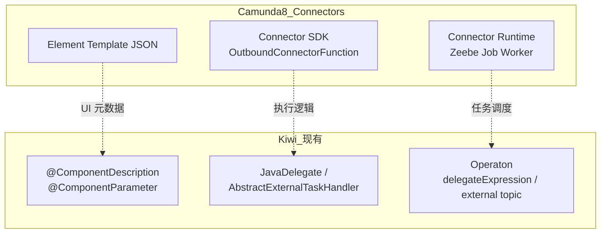
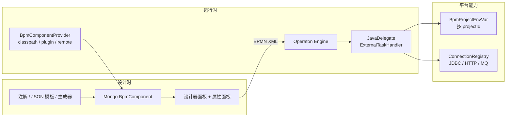
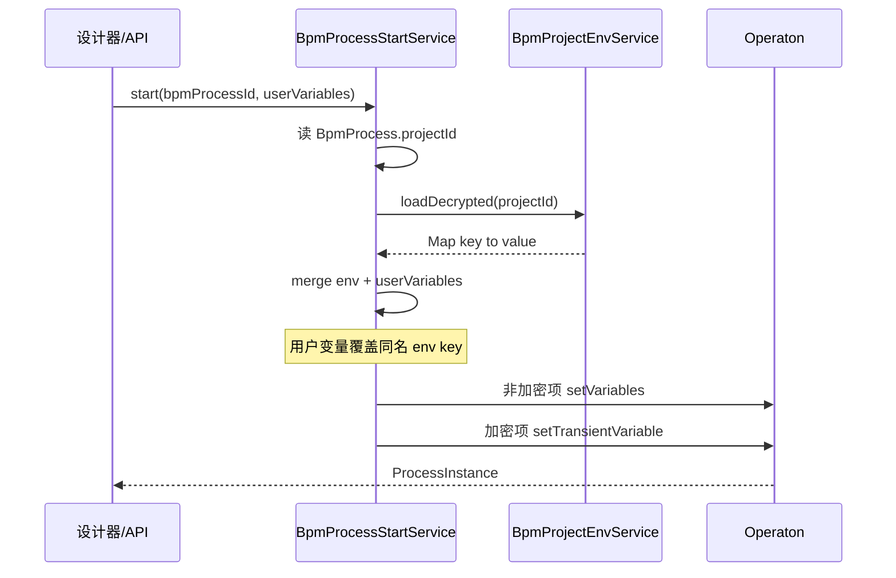
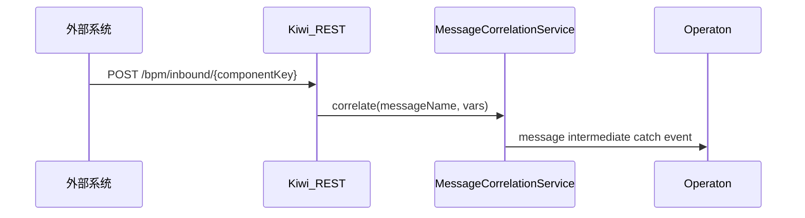
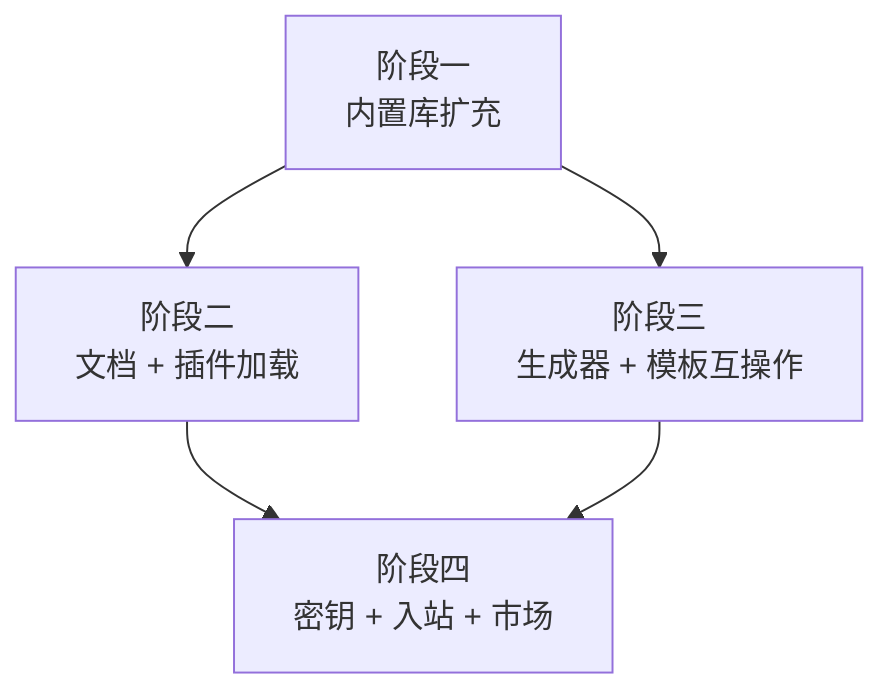

# Kiwi 对标 Camunda 8 丰富组件生态 — 实施路线图

## 实施进度（2026-06-17）

**已完成（主链路）**

- 阶段一：core 扩充（email/webhook/sftp/sleep 等）+ 5 个独立模块（kafka / rabbitmq / s3 / slack / **slurm**）+ 组件数 ≥20；`notification/`、`io/` 等子包已落地
- 阶段二：`kiwi-bpmn-component-example`、`ExecutionUtils` 下沉 core、插件 JAR 加载 + **前端插件页**（上传 / 卸载 / 刷新）、第三方开发文档
- 阶段三：Element Template import/export **后端 API** + **组件管理页 UI**（导入 / 行内导出）；JDBC 表结构生成 UI 已完成
- 阶段四：`BpmProjectEnvVar` 全栈、入站 Webhook **后端 API**、轻量组件市场（插件 JAR）
- OpenSpec `bpm-component-ecosystem` 已归档（`archive/2026-06-16-bpm-component-ecosystem/`）

**仍待办（节选）**

- 插件 `component-bundle.json`、ServiceLoader 自注册、remote provider
- OpenAPI **定时刷新**、CLI 子命令树、GraphQL/WSDL 生成器
- 新内置组件单元测试（email/sftp/sleep 等）、组件 icon 元数据、webhook 重试策略
- 目录重组收尾（sleep/digest 等仍在 `activity/`）、Camunda 社区模板批量验证
- env 多 profile / 导入导出、入站归属校验、AI 组件辅助
- ~~设计器 `${VAR}` 项目环境变量提示~~（已完成）

---

## 术语约定

| 语境 | 用词 |
|---|---|
| **Kiwi 代码、文档、UI、计划** | **组件**（`BpmComponent`、`@ComponentDescription`、组件管理、组件面板） |
| **对比 Camunda 8 时** | 可写 Camunda **Connector**（对方产品术语），并注明 Kiwi 对应物为「组件」 |
| **禁止在 Kiwi 侧引入** | `Connector`、`KiwiConnector`、`connector-sdk`、`BpmConnector*` 等新命名（除非仅作 Camunda 互操作映射说明） |

Kiwi 没有也不新增 connector 领域模型；Camunda 8 的 Connector ≈ Kiwi 的 **BPM 组件**。

## 现状：Kiwi 已有什么

Kiwi **不是从零开始**。现有 **组件** 架构与 Camunda 8 Connector 生态高度同构，只是 **Kiwi 统一叫组件**、引擎绑定为 Operaton：



| Camunda 8 概念 | Kiwi 组件体系对应 | 关键路径 |
|---|---|---|
| Connector 运行时 | Operaton + Spring Bean 组件 | [`ShellActivityBehavior.java`](kiwi-bpmn/kiwi-bpmn-component/src/main/java/com/kiwi/bpmn/component/activity/ShellActivityBehavior.java) |
| Element Template | Java 注解 → Mongo 元数据 | [`ComponentDescription.java`](kiwi-bpmn/kiwi-bpmn-core/src/main/java/com/kiwi/bpmn/core/annotation/ComponentDescription.java) |
| 设计器面板 | `GET /bpm/component/list` → 组件面板 | [`component-pallete-provider.ts`](kiwi-admin/frontend/src/app/pages/bpm/flow-elements/component-pallete-provider.ts) |
| 模板继承扩展 REST | `parentId` 子组件继承 | [`BpmComponentService.fillComponentProperties`](kiwi-admin/backend/src/main/java/com/kiwi/project/bpm/service/BpmComponentService.java) |
| OpenAPI 批量生成 | `OpenApiComponentGenerator` | [`OpenApiComponentGenerator.java`](kiwi-admin/backend/src/main/java/com/kiwi/project/bpm/utils/OpenApiComponentGenerator.java) |
| CLI 批量生成 | `CliHelpParser` | [`BpmComponentCtl`](kiwi-admin/backend/src/main/java/com/kiwi/project/bpm/ctl/BpmComponentCtl.java) |
| 长耗时/异步 | External Task（Slurm） | [`SlurmExternalTaskHandler.java`](kiwi-bpmn/kiwi-bpmn-component-slurm/src/main/java/com/kiwi/bpmn/component/slurm/SlurmExternalTaskHandler.java)（独立模块 `kiwi-bpmn-component-slurm`） |
| 自动注册 | `ClasspathBpmComponentProvider` | [`ClasspathBpmComponentProvider.java`](kiwi-admin/backend/src/main/java/com/kiwi/project/bpm/service/ClasspathBpmComponentProvider.java) |

**当前组件规模 ≥20**：core（Shell、HTTP、JDBC、MongoDB、JSON、文件、赋值、email、webhook、sftp、sleep 等）+ 独立模块（kafka / rabbitmq / s3 / slack / slurm）+ example。文档见 [`docs/bpm-component.zh-CN.md`](docs/bpm-component.zh-CN.md)。

**与 Camunda 8 的剩余差距**（2026-06-10）：

1. **数量**：Camunda connectors-bundle 30+；Kiwi 已 ≥20，仍可继续扩充行业集成
2. **模块化分发**：核心仍在 `kiwi-bpmn-component`；重型集成已拆 5 个可选模块 + 插件 JAR；缺 `remote` 拉取与 `component-bundle.json`
3. ~~**项目级环境变量**~~：已实现 `BpmProjectEnvVar` + 启动注入
4. ~~**入站组件**~~：已实现注册 CRUD + `POST /bpm/inbound/{componentKey}`（无管理端 UI，文档弱化为附录）
5. ~~**Element Template 互操作**~~：已实现 import/export API；缺管理端 UI 与社区模板批量验证
6. **市场/版本治理**：已有插件 JAR 上传/卸载 + `deploymentSignature`；缺包预览、版本发布流

---

## 目标架构（保持 Operaton，不迁 Zeebe）



**设计原则**：

- **不重造引擎**：继续 `camunda:delegateExpression` / `camunda:type=external`，与 Operaton 迁移成果兼容
- **元数据双轨**：Java 注解为主（现有），可选 JSON Element Template 导入（兼容 Camunda 生态）
- **执行分层**：同步短任务 → `JavaDelegate`；长耗时/需锁续期 → `AbstractExternalTaskHandler`
- **组合优于复制**：新组件优先继承 `httpRequest` / `jdbc` / `shell` 父组件，或用 OpenAPI 生成

---

## 阶段一：扩充内置组件库（1–2 个月）

在 [`kiwi-bpmn-component`](kiwi-bpmn/kiwi-bpmn-component) 按 **分组目录** 组织，每个组件一个子包：

```
kiwi-bpmn-component/
  activity/        # shell, http, file, assignment, sleep, digest, base64, uuid
  jdbc/            # 已有
  mongo/           # 已有
  json/            # 已有
  io/              # sftpTransfer（已完成）
  notification/    # emailSend, webhookOutbound（已完成）
# 独立模块（backend 可选依赖或 plugins/ JAR）：
  kiwi-bpmn-component-kafka / -rabbitmq / -s3 / -slack / -slurm
```

**推荐首批（按复用度排序）**：

| 组件 | 实现策略 | 父组件/基类 |
|---|---|---|
| 发送邮件 | JavaMail / Spring Mail | 新 `JavaDelegate` |
| Webhook 出站 | 封装 HTTP + 重试 | 继承 `httpRequest` 元数据 |
| Kafka 生产/消费 | Spring Kafka | `JavaDelegate` 或 External Task |
| S3/MinIO 读写 | AWS SDK v2 | `JavaDelegate` |
| 定时延迟 | Operaton Timer / 消息 | BPMN 原生 + 薄包装组件 |
| SFTP 传输 | JSch / Apache MINA | `JavaDelegate` |

**每个新组件 checklist**（与现有约定一致）：

- `@Component("beanKey")` + `@ComponentDescription(group=…)`
- `@ComponentParameter` key 禁止 `.`，用 `dictKey` 引用连接配置
- 参数读取用 `ExecutionUtils.getStringInputVariable`
- 单元测试放在 `src/test/java`（参考 [`HttpRequestActivityTest`](kiwi-bpmn/kiwi-bpmn-component/src/test/java/com/kiwi/bpmn/component/activity/HttpRequestActivityTest.java)）
- 启动后自动同步 Mongo（`bpm.component.auto-deploy=true`）

**前端**：无需改架构；新组件自动出现在「业务组件」面板（[`ComponentPalleteProvider`](kiwi-admin/frontend/src/app/pages/bpm/flow-elements/component-pallete-provider.ts)）。可为高频组件补充 `icon` 字段（若 `BpmComponent` 扩展 icon 元数据）。

---

## 阶段二：文档化契约与插件分发（1–2 个月）

> **决策修订：不新建独立 SDK 模块；Kiwi 侧统称「组件」**
>
> 现有机制已构成完整对外契约，外部开发者 **无需额外 SDK**：
>
> 

```java
> @ComponentDescription(name = "...", group = "...", inputs = {...}, outputs = {...})
> @Component("myDemoComponent")
> public class MyDemoActivity implements JavaDelegate {
>     @Override
>     public void execute(DelegateExecution execution) { ... }
> }
> 

```
>
> | 已有能力 | 位置 | 外部依赖 |
> |---|---|---|
> | 元数据注解 | [`ComponentDescription`](kiwi-bpmn/kiwi-bpmn-core/src/main/java/com/kiwi/bpmn/core/annotation/ComponentDescription.java) + [`ComponentParameter`](kiwi-bpmn/kiwi-bpmn-core/src/main/java/com/kiwi/bpmn/core/annotation/ComponentParameter.java) | `kiwi-bpmn-core`（零传递依赖） |
> | 同步执行 | `JavaDelegate` | `operaton-engine`（Spring 场景通常由宿主应用提供） |
> | 异步/长任务 | [`AbstractExternalTaskHandler`](kiwi-bpmn/kiwi-bpmn-external-task/src/main/java/com/kiwi/bpmn/external/AbstractExternalTaskHandler.java) | `kiwi-bpmn-external-task` |
> | 参数读取工具 | [`ExecutionUtils`](kiwi-bpmn/kiwi-bpmn-core/src/main/java/com/kiwi/bpmn/core/utils/ExecutionUtils.java) | `kiwi-bpmn-core`（无需 `kiwi-bpmn-component`） |
> | 自动注册 | [`ClasspathBpmComponentProvider`](kiwi-admin/backend/src/main/java/com/kiwi/project/bpm/service/ClasspathBpmComponentProvider.java) | JAR 在 classpath 且被 Spring 扫描即可 |
>
> Camunda 8 需要独立 SDK，是因为其运行时绑定 Zeebe Job Worker + `OutboundConnectorFunction` 专用 API；Kiwi 直接绑定 Spring Bean + `JavaDelegate`，**注解即契约**，再加一层 SDK 主要是重复包装。
>
> 阶段二真正值得做的只有三件事：**写清文档**、**插件 JAR 加载**、**示例/archetype**（脚手架，不是运行时库）。

### 2.1 文档化「第三方组件开发指南」

在 [`docs/bpm-component.zh-CN.md`](docs/bpm-component.zh-CN.md) 增补独立章节：

- Maven 最小依赖：`kiwi-bpmn-core` + `operaton-engine`（provided）+ Spring
- 注解约定、`@ComponentParameter` key 规则、`htmlType`/`dictKey` 用法
- 同步 vs External Task 选型（参考 Slurm）
- 打包方式：① 作为 Maven 依赖编入 backend；② 独立 JAR 放入 `plugins/`（见 2.2）
- 参考实现：[`ShellActivityBehavior`](kiwi-bpmn/kiwi-bpmn-component/src/main/java/com/kiwi/bpmn/component/activity/ShellActivityBehavior.java)

**已完成**：`ExecutionUtils` 已下沉至 `kiwi-bpmn-core`（`com.kiwi.bpmn.core.utils`），第三方 JAR 仅需 `kiwi-bpmn-core` + Spring + Operaton。

### 2.2 扩展 `BpmComponentProvider` 插件发现

现有接口 [`BpmComponentProvider`](kiwi-admin/backend/src/main/java/com/kiwi/project/bpm/service/BpmComponentProvider.java) 仅 `classpath` 一种实现。扩展为：

| source | 机制 | 场景 |
|---|---|---|
| `classpath` | Spring 扫描（现有） | 内置 + 同 JVM 依赖 |
| `plugin` | `ServiceLoader` 或 Spring `spring.factories` | 独立 JAR 放入 `plugins/` |
| `remote` | HTTP 拉取组件包 + 签名校验（可选） | 内部组件市场 |

插件 JAR 结构：

```
kiwi-component-kafka/   # 第三方组件 JAR 示例命名
  META-INF/spring/org.springframework.boot.autoconfigure.AutoConfiguration.imports
  com.acme.kafka.KafkaPublishActivity.java
  component-meta.json   # 可选，供非 Java 工具链
```

### 2.3 示例模块 `kiwi-bpmn-component-example`（推荐落地）

在 monorepo 新增独立 Maven 模块，作为**第三方开发脚手架**（可复制、可 `mvn install` 接入 backend，后续可再抽成 archetype）：

```
kiwi-bpmn/
  kiwi-bpmn-component-example/
    pom.xml
    README.md
    src/main/java/com/kiwi/bpmn/example/
      DemoGreetingActivity.java      # demo 组件
      ComponentExampleAutoConfiguration.java  # @ComponentScan，供 plugin JAR 自注册
    src/test/java/com/kiwi/bpmn/example/
      DemoGreetingActivityTest.java
```

**Demo 组件：`DemoGreetingActivity`**

- `@Component("demoGreeting")`
- `@ComponentDescription(name = "Demo 问候", group = "示例", version = "1.0")`
- 输入：`name`（必填，`required=true`，设计器默认 `${name}`）
- 输出：`greeting`
- 逻辑：`greeting = "Hello, " + name` 写入 `execution.setVariable`
- 刻意保持极简：无外部 IO、无 Spring 注入依赖，一眼能看懂「注解 + JavaDelegate」全流程

示意（实施时以仓库风格为准，优先实例方法、不用 static）：

```java
@ComponentDescription(
    name = "Demo 问候",
    group = "示例",
    description = "第三方组件示例：读取 name，写入 greeting",
    inputs = { @ComponentParameter(key = "name", description = "称呼", required = true) },
    outputs = { @ComponentParameter(key = "greeting", description = "问候语") }
)
@Component("demoGreeting")
public class DemoGreetingActivity implements JavaDelegate {
    @Override
    public void execute(DelegateExecution execution) {
        String name = ExecutionUtils.getStringInputVariable(execution, "name")
            .orElseThrow(() -> new IllegalArgumentException("name 不能为空"));
        execution.setVariable("greeting", "Hello, " + name);
    }
}
```

**`pom.xml` 最小依赖**

- `kiwi-bpmn-core`（注解）
- ~~`kiwi-bpmn-component`~~（已不需要；`ExecutionUtils` 在 `kiwi-bpmn-core`）
- `operaton-engine`（`JavaDelegate`，scope `provided`）
- `spring-context`（`@Component`，scope `provided`）
- 测试：mock `DelegateExecution`（参考 [`HttpRequestActivityTest`](kiwi-bpmn/kiwi-bpmn-component/src/test/java/com/kiwi/bpmn/component/activity/HttpRequestActivityTest.java)）

**README 需写清两种接入方式**

1. **编入 backend**：`kiwi-admin/backend/pom.xml` 增加对 `kiwi-bpmn-component-example` 的依赖 → 重启 → 设计器「示例」分组出现「Demo 问候」
2. **独立插件 JAR**（待 2.2 插件加载落地）：`mvn package` → 放入 `plugins/` → 重启验证

**验证清单**

- [ ] 单元测试：`name=Kiwi` → `greeting=Hello, Kiwi`
- [ ] 启动后 Mongo 出现 `classpath_demoGreeting`（或 `plugin_demoGreeting`）
- [ ] 设计器拖入组件，属性面板有 `name` 字段
- [ ] 部署流程、传入 `name` 变量，实例执行后 `greeting` 有值

**后续可选**：从该模块生成 Maven archetype `kiwi-bpmn-component-archetype`，`artifactId` 默认替换为用户项目名；archetype 不是第一阶段阻塞项。

**不做**：引入 `Connector` / `KiwiConnector` 等新领域名词；不新增与 `@ComponentDescription` 重复的元数据注解。

### 2.4 版本与兼容

- 组件 `version` 字段已有（[`BpmComponent.version`](kiwi-admin/backend/src/main/java/com/kiwi/project/bpm/model/BpmComponent.java)）
- 利用现有 `deploymentSignature`（[`BpmComponentDeploymentSignature`](kiwi-admin/backend/src/main/java/com/kiwi/project/bpm/utils/BpmComponentDeploymentSignature.java)）做升级检测
- 流程 BPMN 存 `componentId`；升级时通过 `sourceKey` 保持稳定映射

---

## 阶段三：强化元数据生成与 Element Template 互操作（1–2 个月）

Camunda 8 的「组件多」很大程度靠 **生成 + 继承**，Kiwi 已有雏形，需产品化。

### 3.1 深化现有生成器

| 生成器 | 增强项 |
|---|---|
| OpenAPI（已有） | 支持 OpenAPI 导入 URL 定时刷新；冲突策略 UI 完善 |
| CLI Help（已有） | 支持多命令工具、子命令树 |
| **新增：GraphQL** | 基于 introspection 生成 HTTP 子组件 |
| **新增：WSDL/SOAP** | 生成继承 `httpRequest` 的 SOAP 子组件 |
| **新增：DB Schema** | 基于 `jdbc-connections` 表结构生成 CRUD 子组件 |

生成结果统一：`parentId` → 基础父组件，`source=openapi|cli|graphql|…`，`sourceKey` 判重（已有 [`preview-conflicts`](kiwi-admin/backend/src/main/java/com/kiwi/project/bpm/ctl/BpmComponentCtl.java)）。

### 3.2 Element Template 导入（可选互操作）

新增 `ElementTemplateImporter`：

- 解析 Camunda Connector JSON 模板（`$schema`, `properties`, `elementType`）
- 映射为 `BpmComponent` + `BpmComponentParameter`（`htmlType`, `dictKey`, `hidden` 等）
- 执行逻辑仍指向 Kiwi 父组件（如 REST 模板 → `httpRequest` 子组件）

这样可复用 Camunda 社区模板库的部分资产，而无需移植其 Java 运行时。

### 3.3 注解 → JSON 导出

反向生成 Element Template JSON，便于：

- 与 Camunda Modeler 用户协作
- 组件市场展示
- CI 校验模板与 Java 实现一致性

---

## 阶段四：平台能力 — 密钥、连接、入站、市场（2–4 个月）

### 4.1 项目环境变量（`BpmProjectEnvVar`）— 采纳方案

> **决策修订**：不做全局 `BpmComponentSecret` 表。采用类 Vault 思路——**每个 BPM Project 一张环境变量表（Mongo 集合）**，`projectId` 为外键，用户在项目设置界面配置；**启动流程时**注入该项目的变量。

#### 为什么这个思路更好

- 与 Kiwi 现有模型自然贴合：[`BpmProcess.projectId`](kiwi-admin/backend/src/main/java/com/kiwi/project/bpm/model/BpmProcess.java) → [`BpmProject`](kiwi-admin/backend/src/main/java/com/kiwi/project/bpm/model/BpmProject.java)
- 项目级隔离（dev 项目 / prod 项目各配各的 key），比全局 secret 表更符合运维心智
- 组件侧 **零改造**：BPMN 继续写 `${API_URL}`、`${API_KEY}`，与今天 `${myCommand}` 一样
- 比 `secret_id` + dict 下拉更直观，更像 CI/CD / K8s 的 project env

#### 数据模型（单表）

Mongo 集合建议名：`bpmProjectEnvVar`（或嵌入 `BpmProject` 的子文档；**推荐独立集合**便于分页、审计、唯一约束）

| 字段 | 说明 |
|---|---|
| `id` | 主键 |
| `projectId` | **外键**，关联 `BpmProject.id` |
| `key` | 变量名，项目内唯一，建议 `[A-Z0-9_]+`（如 `API_URL`、`SMTP_PASSWORD`） |
| `value` | 明文或密文（见 `encrypted`） |
| `encrypted` | `true`：AES 存储，API 不回显明文；`false`：普通配置项（URL、桶名等）可明文存 |
| `description` | 可选说明 |
| `sort` | 界面排序 |
| `createdBy` / 审计字段 | 继承 `BaseEntity` |

**约束**：`(projectId, key)` 唯一索引。

**加密**：`encrypted=true` 时用现有 [`ConnectionService.encrypt`](kiwi-admin/backend/src/main/java/com/kiwi/project/tools/jdbc/connection/service/ConnectionService.java) 同款 `AesUtil` + [`PasswordService.getPasswordSecret`](kiwi-admin/backend/src/main/java/com/kiwi/framework/security/PasswordService.java)。

#### 管理界面

入口：**工作流 → 项目 → [某项目] → 环境变量**（Tab 或子页）

| 能力 | 说明 |
|---|---|
| 列表 | key、description、是否加密（图标）、**不回显 value 明文** |
| 新增/编辑 | key、value（密码框）、encrypted 开关、description |
| 更新语义 | encrypted 项 value 留空 = 不修改 |
| 删除 | 单条删除 |
| 权限 | 复用 [`BpmOwnershipAccessService`](kiwi-admin/backend/src/main/java/com/kiwi/project/bpm/service/BpmOwnershipAccessService.java) 校验项目归属 + Sa-Token 权限码 |

API 建议：`GET/POST/PUT/DELETE /bpm/project/{projectId}/env`（或 `/bpm/project-env` 带 projectId 查询）

#### 启动时注入（核心链路）

挂接点：[`BpmProcessStartService.start`](kiwi-admin/backend/src/main/java/com/kiwi/project/bpm/service/BpmProcessStartService.java)



**合并规则**（建议）：

1. 先加载项目 env 作为底稿
2. 再叠加用户启动时传入的 `variables`（**同名 key 用户优先**）
3. `encrypted=false` → 普通流程变量 `setVariables`（可进历史，适合 `API_BASE_URL`）
4. `encrypted=true` → **Operaton 瞬态变量** `setTransientVariable`（不进 `ACT_HI_VARINST`，避免密钥落历史）

> 实施前验证 Operaton 2.x 瞬态变量 API；若不支持，备选：启动后 ExecutionListener 注入，或自定义 JUEL `env.KEY` 从 `ThreadLocal` 解析（不落引擎变量）。

#### 组件与设计器用法

- HTTP 组件 url：`${API_BASE_URL}/users`
- headers：`{"Authorization":"Bearer ${API_TOKEN}"}`
- **禁止**在 BPMN 属性面板直接填生产密钥；文档约定敏感项走项目 env
- 设计器可选增强：属性面板对 `${VAR}` 提示「来自项目环境变量」

#### 与 JDBC 连接配置的关系

| 场景 | 用法 |
|---|---|
| 多字段连接（JDBC URL+用户+密码） | 继续 [`connection_id`](kiwi-bpmn/kiwi-bpmn-component/src/main/java/com/kiwi/bpmn/component/jdbc/JdbcActivity.java) + `toolConnectionSettings`（工具模块全局） |
| 项目级 API Key、Token、业务 URL | **项目环境变量** |
| 未来 HTTP 组件 | 可 `url=${API_BASE_URL}/path` 或后续再抽 `http-connections` |

两套并存，不强行合并成一张表。

#### 首期不做 / 后续可选

- **首期不做**：多 profile（dev/staging/prod 子环境）；单层 per project 即可，表结构可预留 `profile` 字段
- **首期不做**：Vault 外部集成；Mongo + AES 足够
- **后续可选**：启动流程时选择 profile；env 变量导入/导出；子流程继承父流程项目 env

### 4.2 入站组件（Webhook / 消息）

Camunda 8 Inbound Connector 在 Kiwi 中映射为 **入站组件**：



- 新建 `InboundComponentRegistry`：注册 `{ componentKey → messageName, variableMapping }`
- BPMN 侧用 **Intermediate Message Catch Event**（或 Start Event）等待关联
- 与现有 BPM 权限模型集成（[`BpmOwnershipAccessService`](kiwi-admin/backend/src/main/java/com/kiwi/project/bpm/service/BpmOwnershipAccessService.java)）

### 4.3 组件市场（轻量版）

不必一开始做公开商店；内部版即可：

- 组件包 = JAR + `component-bundle.json`（元数据清单 + 版本 + 依赖父组件）
- 管理端「组件管理」增加：上传包、预览、安装、卸载
- 安装 = 写入 `plugins/` + 触发 `BpmComponentDeploymentService.deploy`
- 可选：Git 仓库作为组件源（类似 Camunda connectors-bundle 发布流）

### 4.4 AI 辅助（Kiwi 差异化）

已有 [`AssistantDesignerTools`](kiwi-admin/backend/src/main/java/com/kiwi/project/system/ai/AssistantDesignerTools.java) 可扩展：

- 从自然语言描述生成子组件草稿
- 从流程缺口分析推荐组件（[`BpmProcessIoAnalysisService`](kiwi-admin/backend/src/main/java/com/kiwi/project/bpm/service/BpmProcessIoAnalysisService.java)）

---

## 实施优先级与依赖



| 阶段 | 产出 | 用户可见价值 |
|---|---|---|
| 一 | 15–20 个常用内置组件 | 开箱即用，接近 Camunda 集成丰富度 |
| 二 | 开发文档 + 插件 JAR 加载 | 团队/合作方按注解契约开发，不污染主仓库 |
| 三 | 生成器 + 模板导入 | 一个 HTTP 基础组件衍生上百 API 组件 |
| 四 | 项目环境变量 + Webhook + 市场 | 按项目配置密钥/配置项，启动注入 |

---

## 不建议做的事

1. **不迁移到 Zeebe 作业模型**：Operaton 迁移刚完成，JavaDelegate/External Task 已足够
2. **不新建 SDK 模块、不引入 Connector 领域名词**：`@ComponentDescription` + `JavaDelegate` + `BpmComponent` 已是契约
3. **不一次性移植 Camunda connectors-bundle 全部 Java 代码**：协议与引擎不同；可参考其集成清单与 Element Template，执行层用 Kiwi 父组件重写
4. **不让每个组件都变成独立微服务**：优先 in-process Spring Bean；仅 Slurm 类长任务走 External Task

---

## OpenSpec Change `bpm-component-ecosystem`

- **状态**：已归档（[`openspec/changes/archive/2026-06-16-bpm-component-ecosystem/tasks.md`](openspec/changes/archive/2026-06-16-bpm-component-ecosystem/tasks.md) 全部勾选）
- 产物：`proposal.md` / `design.md` / specs；文档已更新 [`docs/bpm-component.zh-CN.md`](docs/bpm-component.zh-CN.md)

---

## 成功指标

| 指标 | 状态 |
|---|---|
| 内置组件数量 ≥ 20 | ✅ |
| `kiwi-bpmn-component-example` 可独立构建且 Demo 在设计器可见 | ✅ |
| 第三方可复制 example 发布组件 JAR | ✅（classpath 依赖或 `plugins/`） |
| OpenAPI 5 分钟生成 50+ HTTP 子组件 | ⏳（生成器已有，支持 specUrl 单次拉取；缺定时刷新） |
| Element Template 管理端导入/导出 | ✅ |
| Webhook 入站触发等待中流程实例 | ✅（后端 API） |
