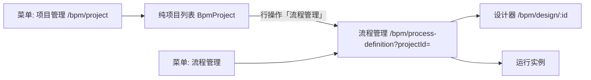

# 用项目管理吸纳流程管理

## 现状

工作流菜单里两套入口在做同一件事：



- [`BpmProject`](kiwi-admin/backend/src/main/java/com/kiwi/project/bpm/model/BpmProject.java) 几乎只有 `name` + 所有权，是流程、环境变量、模板包的容器。
- [`BpmProcess.projectId`](kiwi-admin/backend/src/main/java/com/kiwi/project/bpm/model/BpmProcess.java) 必填；[`BpmProjectEnvVar`](kiwi-admin/backend/src/main/java/com/kiwi/project/bpm/model/BpmProjectEnvVar.java) 按项目注入启动变量；模板市场按项目快照导入/导出。
- 流程页 [`bpm-project-process.ts`](kiwi-admin/frontend/src/app/pages/bpm/project/bpm-project-process.ts) **已经有项目切换器**，但新建/重命名/删除/环境变量仍困在 [`bpm-project.ts`](kiwi-admin/frontend/src/app/pages/bpm/project/bpm-project.ts)。
- 删除项目目前只删 `BpmProject` 文档，**不会级联流程/环境变量**，会留下悬挂 `projectId`。

## 目标信息架构

```text
工作流
  项目管理     ← 唯一设计入口（/bpm/project，当前项目 + 其下流程列表）
  运行实例
  模板市场 / 远程市场
  组件管理
```

用户侧继续叫 **项目**；API / Mongo 仍是 `BpmProject` / `projectId`。不做扁平化（不把 env/模板改挂到单条流程）。

**明确不做：** 去掉 `projectId`、顶级路径 `/bpm-project`（已确认为嵌套 `/bpm/project`）。

## 前端：单一入口

1. **菜单** [`R__SysMenu.json`](kiwi-admin/backend/src/main/resources/mongo/migration/repeatable/R__SysMenu.json)：
   - 保留 `bpm_project`（名称「项目管理」，`path: /bpm/project`）。
   - 删除或 `visible: false` `bpm_process_definition`（「流程管理」）。
2. **路由** [`bpm-routing.ts`](kiwi-admin/frontend/src/app/pages/bpm/bpm-routing.ts)：
   - `''` 默认仍跳 `project`。
   - `project` **改为加载** 现 [`BpmProjectProcess`](kiwi-admin/frontend/src/app/pages/bpm/project/bpm-project-process.ts)（项目切换 + 流程列表），title「项目管理」。
   - `process-definition` 改为 **redirect** 到 `project`（保留 query `projectId`），旧书签不失效。
3. **登录落地**：prod/docker 的 `postLoginPath` **保持** `/bpm/project`（已是该值）。
4. **跳转修正**：模板市场、远程市场安装完成后统一 `navigate(['/bpm/project'], { queryParams: { projectId } })`。远程市场详情里现在有的 `/bpm/project` 无 query 也要带上新项目 id。

## 前端：项目能力留在 /bpm/project

在合并后的项目管理页（现 `bpm-project-process.ts`）工具条/下拉中补齐原列表页能力：

- 切换：已有；无 `projectId` 时用上次项目，再退回列表第一项。
- 新建项目：`POST /bpm/project`，切到新 id。
- 重命名：`PUT /bpm/project/{id}`。
- 环境变量：复用 [`BpmProjectEnvModalComponent`](kiwi-admin/frontend/src/app/pages/bpm/project/bpm-project-env-modal.component.ts)。
- 从模板新建 / 导入合并 / 导出模板：已有入口，装完停在 `/bpm/project?projectId=`。

空状态：没有任何项目时提示「新建项目」，不要空白表格。

纯列表组件 [`bpm-project.ts`](kiwi-admin/frontend/src/app/pages/bpm/project/bpm-project.ts) 在能力迁完后删除。

顺带：流程行操作 tooltip「流程管理」改为「设计」（打开 [`/bpm/design/:id`](kiwi-admin/frontend/src/app/app.routes.ts)）；隐藏表格「项目ID」列。

## 后端：小补丁，不改模型

现有 [`BpmProjectCtl`](kiwi-admin/backend/src/main/java/com/kiwi/project/bpm/ctl/BpmProjectCtl.java) / env / 模板接口保留。

删除项目时补安全语义：

- 项目下仍有流程：**拒绝删除**，提示先清空或迁走。
- 无流程：删除项目，并删掉该 `projectId` 下的 `BpmProjectEnvVar`。

前端在当前项目被删后清掉 [`BpmWorkspaceService`](kiwi-admin/frontend/src/app/pages/bpm/project/bpm-workspace.service.ts) 记忆并切到另一个项目。

## 规格与文档

OpenSpec change 建议名 `merge-bpm-project-into-process`：

- 改 [`bpm-workspace`](openspec/changes/archive/2026-06-17-bpm-project-workspace/specs/bpm-workspace/spec.md)：记忆仍在；进入 **项目管理** `/bpm/project` 时自动选中上次项目；不再需要「列表页回到上次工作区」横幅。
- 菜单只保留「项目管理」；「流程管理」下线。
- 更新 [`docs/bpm-component.zh-CN.md`](docs/bpm-component.zh-CN.md)：路径为 工作流 → 项目管理。

## 验收

- 侧栏没有「流程管理」；点「项目管理」能切换/新建/重命名项目、管环境变量、管该项目下流程。
- URL 为 `/bpm/project`（可带 `?projectId=`）；`/bpm` 与 `/bpm/process-definition` 都落到这里。
- 模板安装/导出仍按项目打包，装完进入对应项目管理页。
- 删除非空项目失败；空项目删除后 env 一并清掉。
