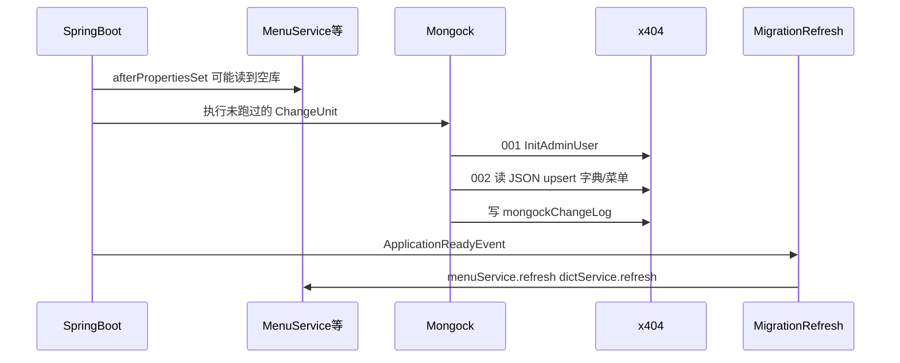

# Kiwi MongoDB 初始化 — 具体实施方案（A + B）

## 目标与范围

| 阶段 | 内容 | 库 |
|------|------|-----|
| **阶段 1（本期）** | **A** `001` admin（Java）+ **B** `002` 字典/菜单（classpath JSON） | 主库 `x404` |
| **本期不做** | cryoems Seed、独立 JSON Seed 框架（C） | — |
| **阶段 2** | cryoems Mongock | `cryoems` |

索引：仍由 `auto-index-creation` + `@Indexed`，不进 ChangeUnit。

### 已确认决策

- **阶段 1 同时实现 A + B**（均在 Mongock `migration.primary` 内，**不**做启动时 Seed）。
- **admin / 密码**：仅 **A**（Java + `PasswordService`），JSON **不含**用户与密码。
- **字典 / 菜单**：**B**（`002` 读 JSON，经 DAO upsert）。

---

## 架构与执行顺序



**说明**：[`MenuService`](kiwi-admin/backend/src/main/java/com/kiwi/project/system/service/MenuService.java) / [`DictService`](kiwi-admin/backend/src/main/java/com/kiwi/project/system/service/DictService.java) 在 `afterPropertiesSet` 会缓存数据；Mongock 往往在之后才写入，故 **必须** 在迁移后 `refresh()`，否则首启前端菜单仍空直到重启。

---

## 阶段 1：文件清单

### 修改

| 文件 | 改动 |
|------|------|
| [`pom.xml`](pom.xml) | `mongock.version`、`mongock-bom` |
| [`kiwi-admin/backend/pom.xml`](kiwi-admin/backend/pom.xml) | Mongock 两依赖 |
| [`application.yml`](kiwi-admin/backend/src/main/resources/application.yml) | `mongock.*`、`kiwi.mongodb.*` |
| [`application-local.example.yml`](kiwi-admin/backend/src/main/resources/application-local.example.yml) | `admin-password` 示例 |
| [`README.md`](kiwi-admin/backend/README.md) | Mongock + JSON 维护说明 |

### 新增（Java）

| 路径 | 职责 |
|------|------|
| `framework/mongo/MongoMigrationConfiguration.java` | `@EnableMongock` + `@ConditionalOnProperty` |
| `framework/mongo/migration/support/ClasspathJsonMigrationSupport.java` | 读 classpath JSON 数组，`Dao.save` upsert |
| `framework/mongo/migration/primary/InitAdminUserChangeUnit.java` | **A** `order=001` |
| `framework/mongo/migration/primary/LoadSystemReferenceDataChangeUnit.java` | **B** `order=002` |
| `framework/mongo/migration/MongoMigrationCacheRefresh.java` | `ApplicationReadyEvent` → refresh Menu/Dict |

### 新增（资源 JSON）

目录：`kiwi-admin/backend/src/main/resources/mongo/migration/data/`

| 文件 | 实体 | 默认集合名（无 @Document） |
|------|------|---------------------------|
| `sys_dict_group.json` | [`SysDictGroup`](kiwi-admin/backend/src/main/java/com/kiwi/project/system/entity/SysDictGroup.java) | `sysDictGroup` |
| `sys_dict.json` | [`SysDict`](kiwi-admin/backend/src/main/java/com/kiwi/project/system/entity/SysDict.java) | `sysDict` |
| `sys_menu.json` | [`SysMenu`](kiwi-admin/backend/src/main/java/com/kiwi/project/system/entity/SysMenu.java) | `sysMenu` |

JSON 为 **JSON 数组**，每项为与实体字段一致的文档，**必须含 `id`**（与 `BaseEntity.id` 一致）。`SysDictGroup` 的 `id` 与 `groupCode` 一致（见实体 `setId` 逻辑）。

**初始数据来源（实施时）**：

1. 从已配置好的开发/测试库用 `mongosh` 导出（推荐），或  
2. 手写最小集：至少覆盖前端 [`system-routing`](kiwi-admin/frontend/src/app/pages/system/system-routing.ts) 所需菜单（`menu`、`user`、`dept`、`dict`、`role`）及常用 `groupCode`（如 `sys_user_sex` 等，按现网对齐）。

导出示例（开发机，库名按环境改）：

```javascript
// mongosh
const docs = db.sysMenu.find().toArray();
// 复制为 sys_menu.json，保留 id/parentId/path/menuType/status 等字段
```

---

## 1. Maven

（同前：父 POM `mongock-bom` 5.5.1；backend `mongock-springboot-v3`、`mongodb-springdata-v4-driver`。）

验证：`mvn -pl kiwi-admin/backend -am compile -q`

---

## 2. 配置

```yaml
mongock:
  migration-scan-package:
    - com.kiwi.framework.mongo.migration.primary

kiwi:
  mongodb:
    migration:
      enabled: ${KIWI_MONGODB_MIGRATION_ENABLED:true}
    init:
      admin-username: ${KIWI_INIT_ADMIN_USERNAME:admin}
      admin-password: ${KIWI_INIT_ADMIN_PASSWORD:}
      admin-nick-name: ${KIWI_INIT_ADMIN_NICK_NAME:Administrator}
```

---

## 3. A — `InitAdminUserChangeUnit`（order `001`）

（逻辑同前：`id=20250601-001-init-admin-user`；`SysUserDao` + `PasswordService`；密码空则 skip。）

---

## 4. B — `LoadSystemReferenceDataChangeUnit`（order `002`）

| 属性 | 值 |
|------|-----|
| `id` | `20250601-002-load-system-reference-data` |
| `order` | `002` |

**依赖**：`ClasspathJsonMigrationSupport`、`SysDictGroupDao`、`SysDictDao`、`SysMenuDao`

**`@Execution` 顺序**（固定）：

1. `mongo/migration/data/sys_dict_group.json` → `SysDictGroup`
2. `mongo/migration/data/sys_dict.json` → `SysDict`
3. `mongo/migration/data/sys_menu.json` → `SysMenu`

**`ClasspathJsonMigrationSupport` 行为**：

- `ClassPathResource` 不存在或 `[]` → `log.info` skip，不失败。
- Jackson `TypeReference<List<T>>` 反序列化；项无 `id` → 抛 `IllegalArgumentException`（实施时发现数据问题）。
- 每条：`dao.save(entity)`（按 `id` upsert，重复执行 ChangeUnit 时 Mongock 已 skip；若手工删 changelog 重跑，upsert 仍安全）。
- **不用** `static` 方法；逻辑放在 `@Component` 实例方法中。

**JSON 字段注意**：

- `SysMenu`：`parentId` 根为 `"0"`（[`SysMenu.Root`](kiwi-admin/backend/src/main/java/com/kiwi/project/system/entity/SysMenu.java)）；`menuType` `M`/`C`；`status` `"0"` 正常；`visible` 布尔。
- `SysDict`：`groupCode` 须对应已导入的 group；`code`/`name` 必填（与 [`DefaultDictsProvider`](kiwi-admin/backend/src/main/java/com/kiwi/project/system/spi/DefaultDictsProvider.java) 过滤逻辑一致）。
- **禁止**在 JSON 中放 `SysUser`、密码、token。

**后续增量**：改菜单/字典应 **编辑 JSON + 新增 `003-...` ChangeUnit**（或改 `002` 仅当库尚未部署过该 changelog）；已上线环境勿改已执行过的 `002` 的语义，应新 `order`。

---

## 5. 迁移后缓存刷新

`MongoMigrationCacheRefresh`：

```java
@EventListener(ApplicationReadyEvent.class)
@ConditionalOnProperty(prefix = "kiwi.mongodb.migration", name = "enabled", havingValue = "true", matchIfMissing = true)
public void refreshAfterStartup() {
    menuService.refresh();
    dictService.refresh();
}
```

（`MenuService`、`DictService` 均已实现 [`Refreshable`](kiwi-admin/backend/src/main/java/com/kiwi/project/system/spi/Refreshable.java)。）

---

## 6. 本期不做

- cryoems Seed / cryoems JSON Contributor  
- 独立 `ApplicationReadyEvent` JSON Seed（方案 C）  
- cryoems Mongock（阶段 2）  
- `mongoimport` 进日常发布流程  

---

## 7. 验证步骤

1. 空库 + `KIWI_INIT_ADMIN_PASSWORD` → `001` 有 admin。  
2. `002` 后：`db.sysDictGroup.count()`、`db.sysMenu.count()` > 0（集合名以库内为准）。  
3. `mongockChangeLog` 含 `001`、`002` 两条。  
4. **首启**不重启：登录后 `/api/.../menus`（或等价接口）能返回 JSON 中的菜单树。  
5. 二次启动：changelog 不重复执行；文档数稳定。  
6. `migration.enabled=false`：应用可启；JSON 不导入（且 refresh 监听器不跑或 no-op，与 `@ConditionalOnProperty` 一致）。

---

## 8. 实施顺序

1. Maven + `MongoMigrationConfiguration` + `application.yml`  
2. `ClasspathJsonMigrationSupport`  
3. `InitAdminUserChangeUnit`（001）  
4. 准备三份 JSON（导出或最小集）  
5. `LoadSystemReferenceDataChangeUnit`（002）  
6. `MongoMigrationCacheRefresh`  
7. README + 本地验证  

---

## 9. PR 建议

- 标题：`feat(mongo): Mongock migrations with admin init and system dict/menu JSON`  
- 含：Java 迁移 + `resources/mongo/migration/data/*.json`（体积大时说明来源为 dev 导出快照）

---

## 10. 方案对照（存档）

| 场景 | 阶段 1 选用 |
|------|-------------|
| admin、改密 | **A** — `001` Java |
| 字典、菜单批量 | **B** — `002` JSON |
| 索引 | Spring Data `@Indexed` |
| 仅 local 玩票 | 不做 C |

阶段 1 **不**再「以后再上 B」；A 与 B 同 PR 交付。
