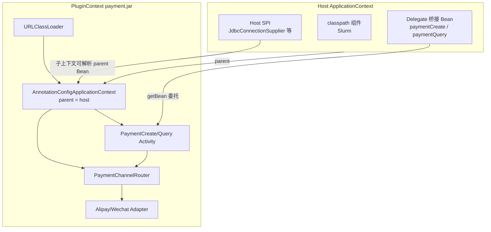

# 插件子 ApplicationContext 架构（根治 Payment / 多 Bean 插件问题）

## 根因（不是「少注册了几个 Bean」）

当前存在 **两套互不兼容的组件模型**：

| 维度 | Classpath 组件（Slurm、kiwi-bpmn-component） | Plugin 组件（当前 Loader） |
|------|---------------------------------------------|---------------------------|
| 容器 | 宿主 `ApplicationContext` 全量扫描 | 手工 `createBean` + `registerSingleton` 进宿主 |
| DI | `@Configuration`、`@Component`、构造器注入 | 仅注册 `JavaDelegate` 入口类 |
| ClassLoader | 单一 AppClassLoader | 每 JAR 一个 `URLClassLoader` |
| 条件注解 | Boot `@ConditionalOn*` 可用 | `createBean` **不跑** Boot 条件求值 |

Payment 按 **classpath 模型** 编写（`PaymentChannelRouter` + `AlipayChannelAdapter` 等多 `@Component`），却按 **plugin 模型** 加载 → 必然失败。

原「方案 A：主上下文补扫 `@Component`」是头痛医头：

- 在主上下文复刻残缺版 ComponentScan，仍不支持 `@Configuration` / `@Bean` / `@ConditionalOnBean`（设计文档 [`design.md`](openspec/changes/bpm-component-modules-as-plugins/design.md) 已注明）
- 插件内部 Bean 污染宿主命名空间
- `reload` 时 ClassLoader 与 Bean 卸载边界更清晰的做法是 **close 子上下文**，而非逐个 `destroySingleton`
- 每出现一种 Spring 特性就要在 Loader 里再打补丁

设计文档对 Slurm 的备选方案 **「增强 Loader 加载子上下文」** 才是正对病根的路径；Slurm 因 `@EnableScheduling` 等仍留 classpath，但 Payment 等插件应走子上下文。

---

## 推荐架构：每插件一个子 ApplicationContext



### 加载流程（替代现有 `loadJar`）

1. **创建** `URLClassLoader(jar, hostCl)`，parent 委托保证 `kiwi-bpmn-core` / Spring / Operaton 由宿主提供（与现契约一致）
2. **创建子上下文** `AnnotationConfigApplicationContext`，`setParent(host)`，`setClassLoader(pluginCl)`
3. **引导配置**（二选一，写入 `component-bundle.json`）：
   - `contextClass`: `com.kiwi.bpmn.component.payment.PaymentPluginConfiguration`
   - 或 `scanPackages`: `["com.kiwi.bpmn.component.payment"]`
4. **`childCtx.refresh()`** — 由 Spring 完成组件扫描、构造器注入、同 JAR 内多 Bean 依赖
5. **桥接到宿主**：仅对带 `@ComponentDescription` 的 `JavaDelegate` / `ExternalTaskHandler` 在宿主注册 **桥接 Bean**（见下）
6. **元数据**：仍从注解 / bundle 生成 `plugin_*` 的 `BpmComponent` 列表（逻辑可保留在 `BpmComponentBundleReader`）

### 桥接 Bean（满足 Operaton）

Operaton Spring 集成通过宿主 `ApplicationContext.getBean("paymentCreate")` 解析 delegate。子上下文内的 Bean **不能** 仅存在于 child，必须对宿主可见。

推荐：`PluginDelegateBridge`（`FactoryBean` 或轻量 holder）

```java
// 伪代码
class PluginDelegateBridge implements FactoryBean<JavaDelegate> {
    private final ConfigurableApplicationContext pluginContext;
    private final String delegateBeanName;

    @Override
    public JavaDelegate getObject() {
        return pluginContext.getBean(delegateBeanName, JavaDelegate.class);
    }
    // singleton：同一插件生命周期内 delegate 实例稳定
}
```

宿主 `registerSingleton("paymentCreate", bridge)`；`ClasspathBpmComponentProvider.isClasspathBean` 仍通过 `pluginLoader.isPluginRegisteredBean` 排除桥接 Bean。

### 卸载 / reload

```
unload(plugin):
  destroySingleton(桥接 beans...)
  pluginContext.close()      // Spring 统一销毁子 Bean
  pluginClassLoader.close()
```

比当前「遍历 destroySingleton + 关 CL」更干净，避免遗漏内部 Bean。

### 宿主 SPI 注入

[`JdbcConnectionSupplier`](kiwi-bpmn/kiwi-bpmn-core/src/main/java/com/kiwi/bpmn/core/spi/JdbcConnectionSupplier.java) 等接口须在 **`kiwi-bpmn-core`**（宿主 CL），子上下文通过 **parent** 解析宿主 Bean。插件实现类若需注入 SPI，接口类型由 parent 加载，实现由宿主注册 — 与现有 SPI 设计一致。

---

## 引入插件框架（PF4J 等）能解决问题吗？

**结论：能部分解决，不能替代子 ApplicationContext；对 Kiwi 现阶段非必需。**

| 能力 | PF4J / 类似框架 | 子 ApplicationContext | Kiwi 现用手工 Loader |
|------|----------------|----------------------|---------------------|
| JAR 发现与 ClassLoader 隔离 | 有 | 需自建（已有 URLClassLoader） | 有 |
| 插件生命周期 start/stop/unload | 有 | `refresh()` / `close()` | 部分（reload） |
| 版本、插件依赖、扩展点 | 有 | 无 | 无 |
| **插件内部 Spring DI** | **无（需 pf4j-spring 再配子上下文）** | **有（核心）** | **无 → 当前 bug** |
| Operaton 宿主 Bean 查找 | 无（仍需桥接） | 需桥接 | 有（但 DI 不全） |

PF4J 解决的是 **「怎么发现、加载、启停插件 JAR」**；Payment 失败解决的是 **「插件内部的 Bean 图如何在 Spring 语义下组装」**。后者即使用 PF4J，仍要写：

- `SpringPlugin` / `PluginApplicationContext` 为每个插件 `refresh` 子上下文
- 将 `JavaDelegate` 桥接到宿主（或自定义 Operaton `DelegateProvider`）

`pf4j-spring` 本质也是 **PF4J 生命周期 + Spring 子上下文** 的胶水，不是魔法。

### 何时值得引入 PF4J

- 第三方插件数量多、需 semver / 依赖解析 / 扩展点注册
- 需要与 Eclipse 式插件市场深度集成

### Kiwi 现阶段建议

- **本期**：自研 `BpmPluginContextManager`（子上下文 + 桥接），不引入 PF4J
- **后续**：若模板市场第三方插件爆发，再评估 PF4J 替换 ClassLoader 层，**保留子上下文与桥接契约**

---

## 与 Slurm / classpath 组件的边界

| 类型 | 分发 | 原因 |
|------|------|------|
| Slurm | classpath Maven 依赖 | `@Configuration`、`@EnableScheduling`、Mongo 跟踪，需 Boot 全生态 |
| kiwi-bpmn-component 核心 | classpath | 与宿主紧耦合、非热插拔 |
| Kafka / S3 / Payment 等 | plugin JAR + **子上下文** | 热部署；Payment 等多 Bean；简单插件（Kafka）子上下文同样适用且无害 |

简单插件（Kafka 单类无 DI）在子上下文中仅多一个空壳 `@Configuration`，成本可接受。

---

## 实施范围（OpenSpec change 建议名：`bpm-plugin-child-context`）

### 1. 契约扩展 — `component-bundle.json`

```json
{
  "schemaVersion": "1",
  "name": "Kiwi 支付组件包",
  "contextClass": "com.kiwi.bpmn.component.payment.PaymentPluginConfiguration",
  "components": [ ... ]
}
```

或 `scanPackages`；`contextClass` 优先。无字段时 fallback：`scanPackages` = 从 delegate 类包名推导的根包（兼容旧 JAR）。

### 2. 新类（backend）

- `BpmPluginContext` — 持有 `URLClassLoader` + `ConfigurableApplicationContext` + jar 文件名
- `BpmPluginContextManager` — load / reload / closeAll；由 `BpmComponentPluginLoader` 委托
- `PluginDelegateBridge` — 宿主侧 FactoryBean

重构 [`BpmComponentPluginLoader.java`](kiwi-admin/backend/src/main/java/com/kiwi/project/bpm/service/BpmComponentPluginLoader.java)：删除主上下文 `createBean` 循环，改为 `contextManager.load(jar)`。

### 3. Payment 模块

新增：

```java
@Configuration
@ComponentScan(basePackageClasses = PaymentCreateActivity.class)
public class PaymentPluginConfiguration {}
```

无需改 Activity / Router 业务代码（子上下文自然完成 DI）。

### 4. 文档与规格

- 更新 [`docs/bpm-component.zh-CN.md`](docs/bpm-component.zh-CN.md)：插件作者契约 = **子上下文内可用标准 Spring DI**；复杂集成用 `contextClass`
- 明确：**禁止**依赖 Boot `@ConditionalOnBean`（子上下文非 Boot 应用）；宿主 SPI 通过 parent 注入

### 5. 验证

- 启动含 payment plugin JAR → 无 `PaymentChannelRouter` 错误
- `POST /bpm/component/plugins/reload` → 旧子上下文 close，新 delegate 生效
- `GET /bpm/component/list` 含 `plugin_paymentCreate`

---

## 不做的事（本期）

- 不引入 PF4J 依赖
- 不把 Slurm 插件化
- 不在主上下文补扫 `@Component`（方案 A 废弃）

---

## 回答你的两个问题

1. **倾向子 ApplicationContext** — 正确，这是与设计文档一致、能根治多 Bean DI 的方向。
2. **引入插件框架能否解决现在的问题** — **不能单独解决**；最多替换 ClassLoader/生命周期层。真正解决 Payment 的是 **子上下文 + Operaton 桥接**；PF4J 可作为后续增强，非阻塞本期。

确认后可执行本计划（建议先 `openspec new change bpm-plugin-child-context`）。
