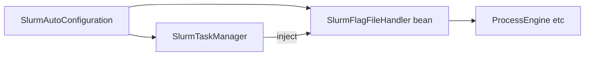

# SlurmFlagFileHandler 内聚实现（不新增协作类）

## 目标（与你的反馈对齐）

- **不**依赖 [`SlurmTaskManager`](kiwi-bpmn/kiwi-bpmn-component/src/main/java/com/kiwi/bpmn/component/slurm/SlurmTaskManager.java) 类型。
- **不**保留 [`SlurmFlagFileHandler`](kiwi-bpmn/kiwi-bpmn-component/src/main/java/com/kiwi/bpmn/component/slurm/SlurmFlagFileHandler.java) 内的嵌套 **`Processor`** 接口。
- **不**新增任何中间协作类；尤其 **禁止** `SlurmFlagExternalTaskSupport`（及同类命名的 Support/Reporter Bean）。
- 将原先由 `Processor` / `SlurmTaskManager` 暴露给 handler 的 **全部逻辑**，**迁入 `SlurmFlagFileHandler` 内部**（私有方法 + 必要的字段依赖）。

## 做法

### 1. `SlurmFlagFileHandler` 膨胀为「完整执行单元」

- **构造注入**当前实现 flag 路径所需的依赖（与今日 [`SlurmTaskManager`](kiwi-bpmn/kiwi-bpmn-component/src/main/java/com/kiwi/bpmn/component/slurm/SlurmTaskManager.java) 中相关字段对齐），例如：
  - `ProcessEngine`（或 `ExternalTaskService` + `RuntimeService` 拆分）
  - `ObjectProvider<ClientProperties>`
  - `ObjectProvider<ExternalTaskRetryPlanner>`
  - `List<SlurmExternalTaskFailureHandler>`
  - `SlurmProperties`
- **删除**嵌套接口 `Processor` 及字段 `Processor processor`。
- **迁入并实现为 `private` 方法**（从 `SlurmTaskManager` 剪切，行为不变）：
  - worker / 重试次数：`effectiveExternalTaskWorkerId`、`shouldProcessWorkerId`、`externalTaskCompleteMaxAttempts`
  - 失败链路：`resolveSlurmFailure`、`handlerForTopic`、`readStringExecutionVariable`、`defaultSlurmFailureException`、`buildHandleFailureDetails`
  - 引擎调用：`handleComplete`、`handleSlurmCommandFailure`
  - `sleepBetweenExternalTaskRetries`（实例 `private` 或 `private static` 均可，保持现有语义）
- `onFileCreate` 内改为调用上述 **本类私有方法**（不再经过 `processor`/`manager`）。

[`SlurmFailureResolution`](kiwi-bpmn/kiwi-bpmn-component/src/main/java/com/kiwi/bpmn/component/slurm/SlurmFailureResolution.java) 仍可留在包内作为私有方法的返回值类型。

### 2. `SlurmTaskManager` 瘦身

- 移除 `implements SlurmFlagFileHandler.Processor` 及 **所有已迁走的方法**（含仅为 Processor 存在的 `@Override`）。
- [`SlurmTaskManager`](kiwi-bpmn/kiwi-bpmn-component/src/main/java/com/kiwi/bpmn/component/slurm/SlurmTaskManager.java) **仅**增加对 [`SlurmFlagFileHandler`](kiwi-bpmn/kiwi-bpmn-component/src/main/java/com/kiwi/bpmn/component/slurm/SlurmFlagFileHandler.java) 的 **直接构造注入**（字段类型即 `SlurmFlagFileHandler`，**不**再经过任何 Support 门面或其它中间类型）。
- [`startFlagWatcher`](kiwi-bpmn/kiwi-bpmn-component/src/main/java/com/kiwi/bpmn/component/slurm/SlurmTaskManager.java) 中：`observer.addListener(slurmFlagFileHandler)`，**禁止** `new SlurmFlagFileHandler(...)`。监听目录仍由 `SlurmTaskManager` 持有 `FileAlterationMonitor` 启动逻辑不变。

### 3. Spring 配置

- 在 [`SlurmAutoConfiguration`](kiwi-bpmn/kiwi-bpmn-component/src/main/java/com/kiwi/bpmn/component/slurm/SlurmAutoConfiguration.java) 增加 **`@Bean SlurmFlagFileHandler`**：构造参数与第 1 节所列依赖一致（与现有 `slurmTaskManager` Bean 可并列声明；`SlurmFlagFileHandler` 需 **`public`** 类以便配置类实例化，或为包可见 + `@Bean` 方法在同一包——优先 **`public` + `@Bean` 工厂方法传入依赖**）。
- **Bean 作用域**：默认 singleton 即可；与当前「全局一个 watcher」语义兼容（`startFlagWatcher` 仍只会注册一次 listener）。

### 4. 验证

- `mvn compile -pl kiwi-bpmn/kiwi-bpmn-component -am`
- 行为等价：worker 过滤、`ERROR_FILE_PATH_VARIABLE`、topic handler、`ExternalTaskRetryPlanner.plan`、`handleFailure` 重试循环。

## 结构示意

`SlurmFlagFileHandler` 由 Spring 创建并注入引擎侧依赖；**`SlurmTaskManager` 只依赖 `SlurmFlagFileHandler`**，在 `startFlagWatcher` 注册为 listener。链路中 **无** `SlurmFlagExternalTaskSupport`。

## Todos

- 将 flag 相关实现迁入 `SlurmFlagFileHandler` 私有方法；构造器接收 Spring 可注入的依赖
- `SlurmAutoConfiguration` 声明 `@Bean SlurmFlagFileHandler`
- `SlurmTaskManager` 构造注入 `SlurmFlagFileHandler`，删除已迁移代码与 `Processor`；`startFlagWatcher` 使用注入的 Bean 注册 listener
- 编译验证
