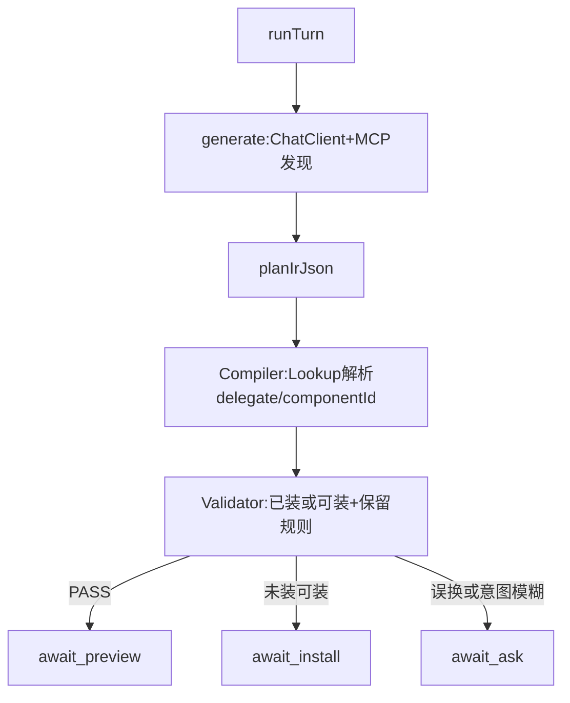

# 修复：MCP 发现后取消 Catalog 菜单

## 结论：Catalog 还有必要吗？

**作为「每轮塞进模型的组件菜单 / Top-N 选型源」——没必要，应取消。**

有了 MCP 之后：

| 旧 Catalog 职责 | 替代方式 |
|-----------------|----------|
| 告诉模型有哪些组件 | MCP：`bpmComp_*` / `bpmRemoteMarket_*` / `bpmMarket_*` |
| 限制 componentId 不得虚构 | 编译/校验时用 `AssistantComponentLookup`（+ 别名）解析真实已装组件 |
| 标记可装插件走 INSTALL | 校验时查远程市场 / `pluginMissingHint`，不必先塞进 Catalog |
| 模板参考 | MCP 拉模板详情/BPMN，不必预置 `catalog.templates` |

**仍需要的不是 Catalog，而是运行时真相源：**

- 已装组件：`BpmComponentService` / `AssistantComponentLookup`
- 未装但可装：远程市场 / 插件 hint → `await_install`
- 原图已用节点：从 `baseBpmnXml` 解析，整理时禁止无故换 `componentId`

会话里若还留 `catalogJson` 字段，仅可作调试快照或 INSTALL 提示缓存，**不再是管线阶段，也不再注入 generate prompt**。

## 选定架构

### 1. 生成：只靠 MCP 发现

- allowlist：`bpmComp_aiPage`（+keyword）、`bpmComp_listGrouped`、`bpmRemoteMarket_list/get`、`bpmMarket_aiPage/get/getProcess`
- 禁止：把静态 Catalog JSON 拼进 prompt；禁止 generate 调 `assistant_designer_*`
- 输出：`summary` + `planIrJson`；服务端编译 XML

### 2. 编译/校验：直接查系统，不查 Catalog

- [AssistantPlanCompiler](kiwi-bpmn-assistant/src/main/java/com/kiwi/bpmn/assistant/AssistantPlanCompiler.java)：`componentId` 经 Lookup（含 `plugin_`↔`classpath_`）取 delegate；找不到则编译失败 → REPAIR/ASK，或标 INSTALL
- [AssistantWorkflowValidator](kiwi-bpmn-assistant/src/main/java/com/kiwi/bpmn/assistant/AssistantWorkflowValidator.java)：去掉「必须在本轮 Catalog」硬依赖；改为「已装 / 可装 / 未知」三态
- 删除或空实现 orchestrator 的 `catalog()` 阶段与 [AssistantCatalogContextBuilder](kiwi-admin/backend/src/main/java/com/kiwi/project/ai/assistant/AssistantCatalogContextBuilder.java) 的 Top-N 注入路径（可保留类作兼容，但默认不调用）

### 3. API

- `bpmComp_aiPage` 增加 `keyword`（可选 `group`）

### 4. 防整理误换（不变）

- 同 node.id 无故换 componentId → ASK
- 模糊「整理」→ 先 ASK
- summary 接地

## 测试

- 无 catalogJson 时，已装 shell 仍能编译
- `plugin_shell` / `classpath_shell` 别名互通
- 仅市场有的插件 → INSTALL，不因「不在 Catalog」ASK
- 「整理这个流程」→ ASK；明确替换 → 允许

## 非本期

- `fileDelete` 组件
- 未经确认的自动 install
