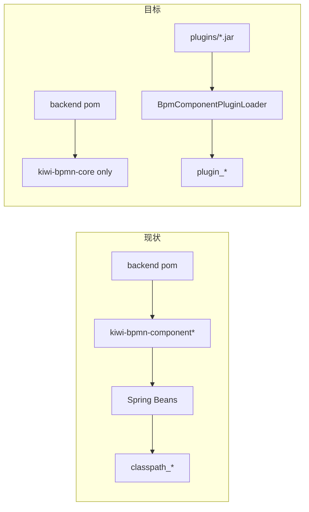
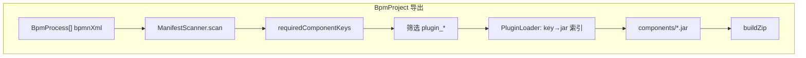

# 模板包捆绑组件 JAR

## 任务拆分

| 任务 | 范围 | 关系 |
|------|------|------|
| **A. 组件模块插件化**（`component-modules-to-plugins`） | Maven 模块 → 插件 JAR；`kiwi-admin` 去掉 component 依赖 | 基础架构；完成后多数组件为 `plugin_*` |
| **B. 模板包捆绑 JAR**（`zip-format` … `frontend-import-wizard`） | zip 导出/导入带 `components/` | 依赖 A 的收益最大；可与 A 并行，但生产分发建议 A 后再默认 |

建议 **OpenSpec**：任务 A 单独 change `bpm-component-modules-as-plugins`；任务 B 续用 `bpm-workflow-template-market`。

---

## 独立任务 A：组件模块插件化（kiwi-admin 不直接依赖）

### 现状

[`kiwi-admin/backend/pom.xml`](kiwi-admin/backend/pom.xml) 直接依赖：

- `kiwi-bpmn-component`（核心：httpRequest、shell、jdbc、mongo…）
- `kiwi-bpmn-component-example`
- `kiwi-bpmn-component-slack` / `kafka` / `rabbitmq` / `s3` / `slurm`

运行时由 [`ClasspathBpmComponentProvider`](kiwi-admin/backend/src/main/java/com/kiwi/project/bpm/service/ClasspathBpmComponentProvider.java) 扫描 **Spring 容器内** `JavaDelegate` Bean → 元数据 `source=classpath`，BPMN 中 `componentId=classpath_{key}`。

插件路径已存在：[`BpmComponentPluginLoader`](kiwi-admin/backend/src/main/java/com/kiwi/project/bpm/service/BpmComponentPluginLoader.java) + `plugins/` 目录 + 上传 API。

### 目标

- 上述 **component 模块全部改为插件 JAR 分发**，`kiwi-admin/backend` **仅保留**：
  - `kiwi-bpmn-core`（注解、ExecutionUtils、引擎集成）
  - `kiwi-bpmn-external-task`（External Task 基础设施，非业务组件）
  - **不**再 `dependency` 任何 `kiwi-bpmn-component*`
- 官方 Docker / 本地 dev 通过 **`plugins/` 种子 JAR** 或 **官方插件包 zip** 提供默认组件，而非打进 backend fat jar。



### 实施步骤

#### A1. 各模块产出可加载的插件 JAR

对每个 `kiwi-bpmn/kiwi-bpmn-component*` 模块：

1. **依赖 scope**：`kiwi-bpmn-core`、`spring-context`、`operaton` 等标 `provided`（由 backend 父 ClassLoader 提供，与现有 `URLClassLoader` 父委托一致）。
2. **打包**：`maven-shade-plugin` 或 `assembly` 打出 **fat jar**（第三方 lib 如 kafka-client、s3 sdk 打进 jar）。
3. **命名约定**：`kiwi-bpmn-component-kafka-1.0.0-plugin.jar` 等，输出到模块 `target/` 或聚合目录 `kiwi-bpmn/plugins-dist/`。
4. **可选**：根 `mvn package` profile `build-plugins` 一次构建全部插件。

模块清单：

| Maven 模块 | 典型 component key | 备注 |
|------------|-------------------|------|
| `kiwi-bpmn-component` | httpRequest, shell, jdbcActivity, mongo… | 体量大，可拆多 jar 或单 fat jar |
| `kiwi-bpmn-component-kafka` | kafkaPublish | |
| `kiwi-bpmn-component-rabbitmq` | rabbitMqPublish | |
| `kiwi-bpmn-component-s3` | s3Object | |
| `kiwi-bpmn-component-slack` | slackNotify | |
| `kiwi-bpmn-component-slurm` | slurm* | 依赖 external-task 类型时文档说明 |
| `kiwi-bpmn-component-example` | demoGreeting | 可选默认不装 |

#### A2. 移除 backend Maven 依赖

从 [`kiwi-admin/backend/pom.xml`](kiwi-admin/backend/pom.xml) 删除全部 `kiwi-bpmn-component*` dependency。

验证：`ClasspathBpmComponentProvider` 扫描结果为空或仅 backend 自有 delegate（若有）；组件元数据来自 `PluginBpmComponentProvider`。

#### A3. 默认插件种子（dev / Docker）

任选一种（可组合）：

- **目录种子**：`kiwi-admin/backend/src/main/resources/plugins/` 或 `docker/plugins/` 构建时 COPY 到运行目录 `plugins/`（**注意 jar 体积**，大文件可用 `.gitignore` + CI 构建时拷贝）。
- **Mongock / 启动脚本**：首次启动若 `plugins/` 为空，从 classpath 资源解压官方插件包（zip）。
- **官方「组件基础包」**：与模板包类似的 `.kiwi-component-pack` zip，管理端一键安装（与任务 B 共用安装逻辑）。

`application.yml` 保持 `bpm.component.plugins-dir` / `plugins-enabled=true`。

#### A4. BPMN `componentId` 迁移（`classpath_*` → `plugin_*`）

存量流程与 Mongo 种子数据使用 `classpath_httpRequest` 等。策略：

| 策略 | 说明 |
|------|------|
| **推荐：一次性数据迁移** | Mongock 或 repeatable JSON：扫描 `bpmProcess.bpmnXml`，`classpath_{key}` → `plugin_{key}`（key 不变） |
| **兼容层（过渡期）** | 设计器/运行时解析 componentId 时，若 `classpath_*` 无 Bean 则 fallback 查 `plugin_*`；导出时规范化为 `plugin_*` |
| **测试** | 更新 [`V20250616_002__BpmProcess.json`](kiwi-admin/backend/src/main/resources/mongo/migration/versioned/V20250616_002__BpmProcess.json) 等种子 |

插件加载后 Mongo 组件 id 为 `plugin_{key}`（[`BpmComponentPluginLoader`](kiwi-admin/backend/src/main/java/com/kiwi/project/bpm/service/BpmComponentPluginLoader.java) 已如此设置）。

#### A5. 文档与 CI

- 更新 [`docs/bpm-component.zh-CN.md`](docs/bpm-component.zh-CN.md)：内置改插件；dev 需先 `mvn -Pbuild-plugins` 或 COPY plugins。
- Docker Compose：挂载或 COPY `plugins/`。
- CI：`package` 后跑插件加载 smoke test。

### 任务 A 非目标

- 不把 `kiwi-bpmn-core` / `kiwi-bpmn-external-task` 打成插件（仍是 backend 硬依赖）。
- 不改变组件 **开发** 方式（仍用 `@ComponentDescription` + `JavaDelegate`）。
- 本期不做组件版本 semver 解析（同名 JAR 覆盖即可）。

### 与任务 B 的衔接

插件化完成后：

- 项目导出时 **几乎所有业务组件** 都是 `plugin_*`，自动打入 `components/` 的逻辑成为主路径。
- `classpath_*` 仅剩极少数 backend 自带 delegate（若有），manifest 中可标注 `builtin`。

---

## 目标（任务 B）

给别人用时，**一次 zip** 包含流程 + 环境变量 + 所需**插件 JAR**；导入时先装 JAR（同名冲突弹窗选覆盖/跳过），再 `installPack`。

---

## 项目打包时：如何识别插件依赖并自动打入

### 核心思路

**依赖的权威来源是 BPMN 里每个节点的 `componentId`**，不是项目表、也不是 Mongo 项目配置。

设计器拖入组件时，[`ComponentService.setComponentId`](kiwi-admin/frontend/src/app/pages/bpm/flow-elements/component-service.ts) 会把完整组件 id 写入 BPMN（如 `plugin_cryoPrepare`、`classpath_httpRequest`）。导出项目时扫描全部流程 XML 即可得到依赖集合。



### 步骤 1：收集项目内全部 BPMN

入口（两条等价）：

| 入口 | 代码路径 |
|------|----------|
| 直接下 zip | [`BpmTemplatePackBundleService.exportProject`](kiwi-admin/backend/src/main/java/com/kiwi/project/bpm/service/BpmTemplatePackBundleService.java) |
| 先发布再导出 | [`BpmTemplatePackPublishService.publishProject`](kiwi-admin/backend/src/main/java/com/kiwi/project/bpm/service/BpmTemplatePackPublishService.java) → `exportPack` |

逻辑：按 `projectId` 查询所有 `BpmProcess`，取出每条的 `bpmnXml`。

### 步骤 2：从 BPMN 扫描 componentId

复用现有 [`BpmTemplatePackManifestScanner`](kiwi-admin/backend/src/main/java/com/kiwi/project/bpm/service/BpmTemplatePackManifestScanner.java)：

- 正则 + XML 扫描提取 `componentId`（`kiwi:componentId`、camunda property 等）
- 合并去重 → `manifest.requiredComponentKeys`
- 同时扫描 CallActivity 绑定（与 JAR 无关，已有逻辑）

示例 BPMN 片段：

```xml
<bpmn:serviceTask ... kiwi:componentId="plugin_cryoPrepare">
  <camunda:property name="componentId" value="plugin_cryoPrepare" />
```

### 步骤 3：区分「需要打 JAR」与「仅声明」

| componentId 前缀 | 含义 | 是否打入 zip |
|------------------|------|----------------|
| `plugin_{key}` | [`PluginBpmComponentProvider`](kiwi-admin/backend/src/main/java/com/kiwi/project/bpm/service/PluginBpmComponentProvider.java) 插件组件 | **是** — 从 `plugins/` 找 JAR |
| `classpath_{key}` | 内置组件（httpRequest、shell…） | **否** — 目标实例随 Kiwi 发行 |
| `openapi_*` / `cli_*` 等 | Mongo 元数据组件（多为 RestApi/配置型） | **否** — 无 JavaDelegate JAR |
| 无 componentId，仅有 `delegateExpression` | 旧图或手改 XML | **兜底** — 见下文 |

筛选规则（实现）：

```java
boolean needsPluginJar(String componentId) {
  return componentId != null && componentId.startsWith("plugin_");
}
String pluginKey(String componentId) {
  return componentId.substring("plugin_".length());
}
```

### 步骤 4：plugin key → JAR 文件（反向索引）

**不在 Mongo 存 jar 路径**（当前插件加载未持久化 jar 名）。导出时**现场扫描** `bpm.component.plugins-dir`（默认 `plugins/`）：

在 [`BpmComponentPluginLoader`](kiwi-admin/backend/src/main/java/com/kiwi/project/bpm/service/BpmComponentPluginLoader.java) 新增**只读**方法（不 registerBean、不 reload）：

```
buildPluginJarIndex() → Map<String, String>  // componentId "plugin_{key}" → jar 文件名
```

算法（与现有 `loadJar` 同类遍历）：

1. 列出 `plugins/*.jar`
2. 对每个 JAR：`JarFile` 遍历 `.class`
3. 带 `@ComponentDescription` 且实现 `JavaDelegate` / `ActivityBehavior` / `ExternalTaskHandler` 的类 → 得到 `key`（`@Component` 名或类名）
4. 写入索引：`plugin_{key}` → `cryo-handler-1.0.0.jar`
5. 同一 JAR 多个 key → 多条索引指向同一文件名

对步骤 3 得到的每个 `plugin_*` id：

- 命中索引 → 收集 JAR（`Set` 去重）
- **未命中** → 导出**失败**，返回明确错误：「流程依赖 `plugin_xxx`，但 plugins 目录未找到提供该组件的 JAR」

### 步骤 5：写入 zip 的 components 目录

扩展 [`buildZip`](kiwi-admin/backend/src/main/java/com/kiwi/project/bpm/service/BpmTemplatePackBundleService.java)：

```
components/
  component-bundle.json    # 清单：fileName、componentKeys[]、sha256
  cryo-handler-1.0.0.jar   # 二进制拷贝自 plugins-dir
```

`component-bundle.json` 便于导入预览、冲突检测、审计；`manifest.json` 内 `kiwiManifest.requiredComponentKeys` 保持完整列表（含 classpath 内置项）。

### 步骤 6：兜底 — 无 componentId 的旧 BPMN

部分图只有 `camunda:delegateExpression="${myBean}"` 而无 `componentId`：

1. 解析 `${beanName}` 得到 bean 名
2. 在插件索引中按 **key** 匹配（bean 名 == plugin component key）
3. 仍无法匹配 → 记入 `manifest.unresolvedDelegates`，导出时 **warning**（可选严格模式改为失败）

本期可先做 warning 日志，不阻断导出。

### 导出 API 统一

以下路径**共用**「scan → resolve jars → buildZip」：

- `GET /bpm/project/{id}/export-template-file`
- `GET /bpm/market/export/project/{projectId}`
- `GET /bpm/market/{packId}/export`（从已发布包的 BPMN 再扫一遍，保证与发布时一致）

`publishProject` 写入 Mongo 时可冗余 `bundledJarNames[]`（仅元数据，便于市场详情展示），**JAR 二进制只在 zip 里**。

---

## Zip 格式（向后兼容）

```
my-pack-1.0.0.kiwi-template-pack/
  manifest.json
  README.md
  env-vars.json
  processes/*.bpmn
  components/                    # 可选
    component-bundle.json
    *.jar
```

无 `components/` 的旧包仍可导入。

---

## 导入侧（摘要）

1. `POST /bpm/market/import/preview` — 解析 zip，返回依赖与 JAR 冲突列表
2. 前端冲突弹窗：覆盖 / 跳过（用户已选）
3. `installJarsFromBundle` → 单次 `reloadAndDeploy`
4. `BpmTemplatePackDependencyService` 校验 `requiredComponentKeys`
5. `importPack` / `importAndInstall`

---

## 非目标

- 手动勾选额外 JAR
- fat-jar 传递依赖分析（任务 A 要求各模块自行 shade）
- 独立组件市场 Registry

---

## 实施顺序建议

1. **任务 A**（组件插件化）— 架构解耦，dev/docker 种子插件
2. **任务 B**（zip 捆绑 + 导入）— 给别人用的一键分发
3. 可选：官方「基础组件包」zip 与模板包一并分发

## 黄金用例（P0 已就绪）

**`payment-integration-demo`**（通用支付集成套件）已完成插件、BPMN、Mongo 种子，作为任务 B 导出/导入 E2E 验收项目。详见 [payment_taskb_e2e_handoff_c4d82f10.plan.md](payment_taskb_e2e_handoff_c4d82f10.plan.md)。

- 导出 API：`GET /bpm/project/payment-integration-demo/export-template-file`
- 预期 zip 内 plugin JAR：payment + slack（`classpath_*` 核心组件不入 zip）
- `buildPluginJarIndex()` 已实现，任务 B 导出侧直接调用

---

## 关键文件

### 任务 A

| 区域 | 文件 |
|------|------|
| 移除依赖 | [`kiwi-admin/backend/pom.xml`](kiwi-admin/backend/pom.xml) |
| 插件打包 | 各 `kiwi-bpmn/kiwi-bpmn-component*/pom.xml` + shade/assembly |
| 插件加载 | [`BpmComponentPluginLoader.java`](kiwi-admin/backend/src/main/java/com/kiwi/project/bpm/service/BpmComponentPluginLoader.java) |
| BPMN 迁移 | Mongock change 或 migration JSON |
| Docker | [`docker/docker-compose.yml`](docker/docker-compose.yml) |

### 任务 B

| 区域 | 文件 |
|------|------|
| 扫描 componentId | `BpmTemplatePackManifestScanner.java` |
| key→jar 索引 | `BpmComponentPluginLoader.java`（新增只读索引） |
| zip 读写 | `BpmTemplatePackBundleService.java` |
| JAR 安装 | `BpmComponentBundleService.java` |
| 项目导出 | `exportProject` / `publishProject` |
