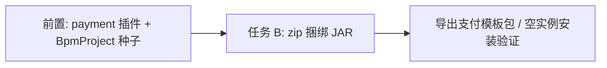

# 通用支付集成 BpmProject（任务 B 前置）

## 定位

用户选定 **支付场景** 作为通用模板方向；v1 采用 **payment 插件模块**（非纯 HTTP mock），先接 **支付宝/微信沙箱** 的下单与查单。

该工作排在 [模板包捆绑组件jar_a901ea96.plan.md](d:\Projects\kiwi\.cursor\plans\模板包捆绑组件jar_a901ea96.plan.md) **任务 B 之前**：先有可导出的真实 `plugin_*` 业务项目，再实现 zip 内 `components/` 捆绑与导入安装。



---

## v1 范围

**包含：**

- Maven 模块 `kiwi-bpmn-component-payment`（shade 插件 JAR，纳入 `build-plugins` profile）
- 2 个统一组件（渠道差异封装在 Java 内，BPMN 保持通用）：
  - `plugin_paymentCreate` — 入参 `channel`（`alipay`|`wechat`）、`outTradeNo`、`amount`、`subject`；出参 `prepayPayload` / `payUrl` 等
  - `plugin_paymentQuery` — 入参 `channel`、`outTradeNo`；出参 `payStatus`、`channelTradeNo`
- Solution 型 `BpmProject`：**主流程 + 子流程 + CallActivity**，共享项目环境变量
- Mongo 种子（versioned migration）：新库启动后 admin 可直接打开、导出、发布

**v1 不含（后续 change）：**

- 生产证书轮换、分账、合单、跨境
- 完整 notify 验签入站（README 说明挂接方式即可）
- 退款审批流（可 v1.1 加独立 `pay-refund` 流程）

---

## BpmProject 结构

**项目 ID：** `payment-integration-demo`  
**名称：** 通用支付集成套件

| 流程 | processKey（种子 id） | entry | 职责 |
|------|----------------------|-------|------|
| 支付主流程 | `pay-main` | true | 创建单号 → 按 `PAY_CHANNEL` 分支 → 查单 → 通知 |
| 创建支付单 | `pay-create` | false | `uuidGenerate` + `assignmentActivity` 生成 `outTradeNo`、校验 `amount` |
| 支付宝下单 | `pay-alipay-create` | false | 调 `plugin_paymentCreate`（channel=alipay） |
| 微信下单 | `pay-wechat-create` | false | 调 `plugin_paymentCreate`（channel=wechat） |
| 查单 | `pay-query` | false | `plugin_sleep` 间隔 + `plugin_paymentQuery` 轮询直至成功/超时 |

**主流程编排（概念）：**

```
Start → CallActivity(pay-create)
     → Exclusive Gateway: ${PAY_CHANNEL}
         alipay → CallActivity(pay-alipay-create)
         wechat → CallActivity(pay-wechat-create)
     → CallActivity(pay-query)
     → plugin_slackNotify 或 plugin_assignmentActivity（写 payResult 摘要）
     → End
```

**CallActivity `calledElement`：** 指向子流程的 `processKey`（与现有 [BpmTemplatePackInstallService](kiwi-admin/backend/src/main/java/com/kiwi/project/bpm/service/BpmTemplatePackInstallService.java) 安装重映射行为一致）。

**依赖的 plugin JAR（任务 B 导出时应打入 zip）：**

| JAR | 组件 |
|-----|------|
| `kiwi-bpmn-component-*-plugin.jar` | httpRequest、assignmentActivity、uuidGenerate、sleep 等 |
| `kiwi-bpmn-component-slack-*-plugin.jar` | slackNotify（可选，失败通知） |
| `kiwi-bpmn-component-payment-*-plugin.jar` | paymentCreate、paymentQuery |

---

## 项目环境变量

| key | 说明 | 加密 |
|-----|------|------|
| `PAY_CHANNEL` | 默认渠道：`alipay` / `wechat` | 否 |
| `PAY_AMOUNT` | 演示金额（分），如 `100` | 否 |
| `PAY_SUBJECT` | 商品标题 | 否 |
| `ALIPAY_APP_ID` | 沙箱 AppId | 否 |
| `ALIPAY_PRIVATE_KEY` | 应用私钥 PEM | **是** |
| `ALIPAY_GATEWAY_URL` | 默认沙箱网关 | 否 |
| `WECHAT_MCH_ID` | 商户号 | 否 |
| `WECHAT_API_V3_KEY` | APIv3 密钥 | **是** |
| `WECHAT_CERT_SERIAL` | 证书序列号 | 否 |
| `PAY_QUERY_MAX_ATTEMPTS` | 查单次数，如 `10` | 否 |
| `PAY_QUERY_INTERVAL_SECONDS` | 查单间隔 | 否 |
| `SLACK_WEBHOOK_URL` | 可选通知 | 是 |

种子 migration **只写 key + description**，不写真实密钥；`README.md`（模板包内）说明沙箱申请与填写步骤。

---

## 插件模块设计

**路径：** [kiwi-bpmn/kiwi-bpmn-component-payment/](kiwi-bpmn/kiwi-bpmn-component-payment/)（新建，父 POM 对齐 [kiwi-bpmn-component-slack/pom.xml](kiwi-bpmn/kiwi-bpmn-component-slack/pom.xml)）

**要点：**

- `kiwi-bpmn-core`、`spring-context`、`operaton-engine` → `provided`
- 第三方 SDK（支付宝 OpenAPI、微信支付 Java SDK）→ compile + **shade 打进 JAR**
- [`META-INF/kiwi/component-bundle.json`](kiwi-bpmn/kiwi-bpmn-component-example/src/main/resources/META-INF/kiwi/component-bundle.json) 声明 `paymentCreate`、`paymentQuery`
- 凭证读取：优先流程入参，缺省从 **项目环境变量** 注入（与现有 env 机制对齐；实现时查 [BpmProjectEnvVar](kiwi-admin/backend/src/main/java/com/kiwi/project/bpm/model/BpmProjectEnvVar.java) 在 delegate 中的注入方式，若无则 v1 用节点 inputParameter 显式 `${ALIPAY_APP_ID}`）

**实现分层（模块内）：**

```
PaymentCreateActivity / PaymentQueryActivity  (JavaDelegate)
  → PaymentChannelRouter
      → AlipayChannelAdapter (sandbox)
      → WechatChannelAdapter (sandbox)
```

签名、时间戳、错误码映射 **不得** 暴露在 BPMN 节点参数中。

**构建集成：**

- 根 [pom.xml](pom.xml) `build-plugins` profile 的 `-pl` 列表增加 `kiwi-bpmn-component-payment`
- 产物复制到 `kiwi-admin/backend/plugins/`（与任务 A 一致）
- 更新 [plugins/README.md](kiwi-admin/backend/plugins/README.md)、[docs/bpm-component.zh-CN.md](docs/bpm-component.zh-CN.md)

---

## 种子数据落盘

新增 versioned Mongo migration（日期序在 `V20250616_*` 之后）：

| 文件 | 实体 |
|------|------|
| `V20250701_001__BpmProject.json` | 追加 `payment-integration-demo`，`createdBy: admin` |
| `V20250701_002__BpmProcess.json` | 5 条流程，`projectId` 指向上述项目，BPMN 内 **全部 `plugin_*`** |
| `V20250701_003__BpmProjectEnvVar.json` | 环境变量定义（首份 env 种子） |

**可维护性：** BPMN 源文件另存于 `kiwi-admin/backend/src/main/resources/bpm/payment-integration-demo/*.bpmn`，编写 migration 时从该目录复制转义进 JSON（避免只在 JSON 里手改 XML）。

---

## 与任务 B 的验收关系

完成本前置 + 任务 B 后，应用以下 **E2E 验收**：

1. 空库启动 → 出现「通用支付集成套件」项目
2. `GET /bpm/project/payment-integration-demo/export-template-file`（admin）
3. zip 含 `components/component-bundle.json` + **3 类** plugin JAR（core、slack、payment）
4. `manifest.requiredComponentKeys` 含 `plugin_paymentCreate`、`plugin_paymentQuery` 等
5. 导入到无 payment 插件的实例 → 冲突策略安装 JAR → `installPack` → 流程可设计器打开
6. 填沙箱 env 后手动跑 `pay-main`（查单可 mock 成功路径或真沙箱）

---

## 实施顺序

1. **脚手架** — `kiwi-bpmn-component-payment` 模块、pom shade、`component-bundle.json`、空 Activity 占位
2. **渠道适配器** — 支付宝/微信沙箱 create + query（单元测试 mock HTTP）
3. **BPMN 五流程** — 设计器或手写 XML，`plugin_*` 规范
4. **Mongo 种子** — Project / Process / EnvVar migration
5. **`build-plugins` 集成** — 本地 plugins 目录有 payment JAR
6. **文档** — 沙箱配置、模板安装、notify 后续扩展说明
7. **再启动任务 B** — jar 索引、zip 导出、导入预览（以本项目为黄金用例）

---

## 风险与约束

- **密钥安全：** 种子与导出 zip 均不得含明文私钥；加密 env 字段走现有 `encrypted` 标记
- **SDK 体积：** payment JAR 可能较大，shade 时 exclude 平台 `provided` 依赖
- **沙箱差异：** 支付宝/微信沙箱规则常变，README 注明版本与文档链接
- **回调：** v1 以 **主动查单** 为主；异步 notify 在模板 README 中描述「生产推荐架构」，不阻塞任务 B

---

## 关键文件（新建/修改）

| 区域 | 路径 |
|------|------|
| 新插件模块 | `kiwi-bpmn/kiwi-bpmn-component-payment/` |
| 根 POM profile | [pom.xml](pom.xml) |
| BPMN 源 | `kiwi-admin/backend/src/main/resources/bpm/payment-integration-demo/` |
| Mongo 种子 | `mongo/migration/versioned/V20250701_00*__*.json` |
| 文档 | [docs/bpm-component.zh-CN.md](docs/bpm-component.zh-CN.md) |
| 任务 B（后续） | [BpmTemplatePackBundleService.java](kiwi-admin/backend/src/main/java/com/kiwi/project/bpm/service/BpmTemplatePackBundleService.java)、[BpmComponentPluginLoader.java](kiwi-admin/backend/src/main/java/com/kiwi/project/bpm/service/BpmComponentPluginLoader.java) |
