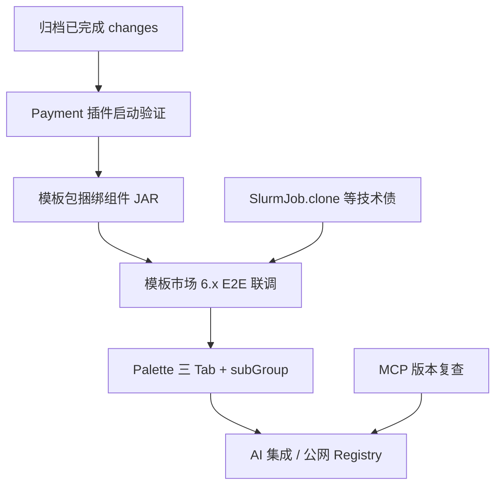

# Kiwi 项目功能缺口与优化路线图

## 背景

本计划来自一次项目级扫描，覆盖：

- OpenSpec 活跃 change：`openspec/changes/`
- 现有计划：`.cursor/plans/`
- 源码 TODO / deprecated 标记
- README、`AGENTS.md`、`docs/bpm-component.zh-CN.md` 等文档

当前结论：Kiwi 的 BPM 核心、设计器基础能力、组件插件加载、模板市场 C1/C2 已基本可用；剩余工作主要集中在模板市场闭环、设计器组件面板 UX、AI/MCP 增强、组件生态长尾与少量技术债。

## 优先级路线

## P0：近期收尾与闭环

### 1. 归档已完成或接近完成的 OpenSpec change

目标：

- `bpm-component-modules-as-plugins`：tasks 已全部勾选，执行归档。
- `bpm-plugin-child-context`：仅剩 payment 插件启动验证，验证后归档。

建议动作：

- 运行 `mvn -pl kiwi-admin/backend -am package -Pbuild-plugins -DskipTests`。
- 启动 backend，确认含 payment 插件时子 `ApplicationContext` 与多 Bean DI 正常。
- 完成后按 OpenSpec 流程归档。

验收标准：

- `bpm-component-modules-as-plugins` 从 active changes 移入 archive。
- `bpm-plugin-child-context` tasks 全部勾选并归档。

### 2. 模板市场 6.x 质量与联调

来源：`openspec/changes/bpm-workflow-template-market/tasks.md`

未完成项：

- 6.1 发布项目 -> 市场可见 -> `installPack` -> 验证多流程 + env + CallActivity。
- 6.2 详情页下载是否已经使用带 Token 的 blob 下载，需要复核并同步 tasks。
- 6.3 项目流程页「导入模板」从 `prompt('模板包 ID')` 改成市场选择器。
- 6.4 安装前对 `requiredComponentKeys` 缺失组件进行警告或拦截。

建议动作：

- 优先实现 6.3 与 6.4，减少手动 ID 输入和安装后失败。
- 用 payment demo 作为模板市场黄金用例，跑通发布、导出、导入、安装、启动。
- 6.x 完成后归档 `bpm-workflow-template-market`，将 C3 Registry 与 AI 集成拆为后续 change。

验收标准：

- 模板市场安装不依赖手工输入 packId。
- 缺失组件时安装前给出明确提示或阻断。
- 多流程、env、CallActivity 重映射通过 E2E 验证。

### 3. 模板包捆绑组件 JAR + payment E2E

相关计划：

- `.cursor/plans/模板包捆绑组件jar_a901ea96.plan.md`
- `.cursor/plans/payment_taskb_e2e_handoff_c4d82f10.plan.md`

目标：

- `.kiwi-template-pack` 支持包含所需 plugin JAR。
- 导入时能识别缺失组件并提示安装。
- payment-integration-demo 成为模板包导入/安装/运行的黄金用例。

建议动作：

- 定义 zip 内 `components/*.jar` 目录与 manifest 关联关系。
- 导入包时解析 bundled jars，给出安装确认或冲突提示。
- 与 `requiredComponentKeys` 校验合并设计，避免重复提示。

验收标准：

- 新环境导入 payment 模板包时，可同时获得流程、env、组件依赖。
- 缺失组件时有清晰处理路径。

## P1：产品体验与架构一致性

### 4. BPM Palette 三 Tab + subGroup

来源：`openspec/changes/bpm-palette-group-subgroup/tasks.md`

当前状态：0/8，未开始。

目标：

- 后端元数据增加 `subGroup`。
- `GET /bpm/component/list` 支持 paletteGroup -> subGroup 嵌套返回。
- 设计器 Palette 拆为「基本组件 / 内置组件 / 扩展组件」三 Tab。
- 每个 Tab 内按 subGroup 折叠展示。
- Context Pad 弹层按「内置组件/扩展组件 · subGroup」分组。

建议动作：

- 先实施后端元数据与兼容：旧 Mongo 数据无 subGroup 时保留默认分组。
- 再调整前端 provider 类型和 Palette UI。
- 最后补 Context Pad 分组与搜索跨两级。

验收标准：

- classpath 组件进入「内置组件」。
- plugin 组件进入「扩展组件」。
- 搜索可跨 group / subGroup / name / key。

### 5. 明确 classpath + plugin 策略

现状：

- OpenSpec 曾以「组件模块插件化」为目标。
- 实际代码仍保留核心 classpath 依赖与可选 plugin JAR 并存。
- Slurm 当前仍为 backend classpath 依赖，不需要 plugin 打包。

建议动作：

- 决定官方策略：保留混合模型，还是继续推进完全插件化。
- 如果保留混合模型，同步 OpenSpec NOTES、AGENTS、docs，避免“已完全 plugin 化”的歧义。
- 如果推进完全插件化，需另开 change，处理 backend 依赖、fallback key、迁移兼容与部署文档。

验收标准：

- 文档、代码、OpenSpec 对组件分发模型表述一致。

## P2：中长期能力

### 6. 模板市场 C3 公网 Registry

来源：`bpm-workflow-template-market` 后续项。

范围：

- Registry 服务与实例 sync API。
- 审核流：`PendingReview` -> `Published`。
- GPG `SIGNATURE` 与 trustKeys 校验。

建议动作：

- 从当前 `bpm-workflow-template-market` 中拆出独立 OpenSpec change。
- 先设计信任模型和同步协议，再实现服务与 UI。

### 7. AI 模板集成与场景生图

相关计划：

- `.cursor/plans/ai_场景生图优化_73adc83b.plan.md`
- `bpm-workflow-template-market` 8.x

范围：

- `applyWorkflowTemplate` ClientAction。
- AI prompt：检索模板 -> installPack -> 微调。
- Planner / Builder、Market 集成、RAG。

建议动作：

- 先做最小闭环：AI 能搜索模板市场并触发安装。
- 再做 Planner / Builder 的复杂流程生成。

### 8. MCP / OpenAPI 增强

来源：`admin-mcp-wait-infobip`

当前阻塞：

- infobip-openapi-mcp 暂不匹配 Spring Boot 4 + Spring AI 2.x。

建议动作：

- 2026-09 前复查 infobip 版本。
- 如长期不满足，评估自研 Springdoc 驱动 `inputSchema` 增强。
- 补全关键 Controller 的 `@Parameter` / `@Schema`，提升 MCP schema 质量。

## P3：技术债与小优化

### 9. 高风险技术债

优先处理：

- `kiwi-bpmn/kiwi-bpmn-component-slurm/src/main/java/com/kiwi/bpmn/component/slurm/SlurmJob.java`
  - `clone()` 需确保 `expiration`、`createdTime`、`updatedTime` 等 `Date` 字段深拷贝。
  - 当前磁盘版本已包含修复逻辑，建议补回归测试后关闭 TODO。
- `kiwi-common/src/main/java/com/kiwi/common/query/QueryParams.java`
  - `QueryParams.of()` 不支持嵌套字段映射。

验收标准：

- `SlurmJob.clone()` 有回归测试覆盖。
- QueryParams 是否支持嵌套字段有明确设计结论：实现、拆分 change，或标注非目标。

### 10. 前端质量项

候选项：

- Signal 用法修正：`nav-bar`、`footer-submit`、`sub-window-with`。
- `theme.service` 与 `$themeStyle` 重复逻辑合并。
- 密码强度校验优化。
- 登录错误码拦截逻辑说明与行为整理。
- crypto polyfill 兼容处理。
- ESLint a11y 规则逐步启用。

建议动作：

- 单独开一个 frontend-quality change，避免与 BPM 主线混在一起。
- 先处理 Signal 和 theme service，再评估 a11y 规则开启后的修复量。

### 11. 组件生态长尾

来源：`.cursor/plans/kiwi_组件生态路线图_0125f55e.plan.md`

候选项：

- webhookOutbound 独立重试策略。
- 新内置组件单元测试补齐。
- BpmComponent icon 元数据 + 设计器图标。
- remote provider（HTTP 拉取组件包 + 签名校验）。
- ServiceLoader / spring.factories 自注册。
- OpenAPI specUrl 定时刷新。
- GraphQL introspection 生成 HTTP 子组件。
- WSDL / SOAP 生成继承 httpRequest 的子组件。
- 项目 env 多 profile 与导入/导出。

建议动作：

- 将 icon、webhook retry、单元测试作为近期小步优化。
- remote provider、GraphQL、WSDL 放入组件生态二期 change。

## 建议执行顺序

1. 完成 `bpm-plugin-child-context` 启动验证并归档。
2. 归档 `bpm-component-modules-as-plugins`。
3. 补 `SlurmJob.clone()` 回归测试。
4. 实施模板市场 6.3 市场选择器与 6.4 组件缺失校验。
5. 跑通 payment 模板包 E2E，并推进模板包捆绑 JAR。
6. 归档 `bpm-workflow-template-market`，将 C3 / AI 拆出新 change。
7. 启动 `bpm-palette-group-subgroup`。
8. 处理 frontend-quality 与组件生态长尾。

## 非目标

- 本计划不直接修改代码，只作为项目级执行路线图。
- CryoEMS 仓外系统联调项不纳入 Kiwi 核心近期主线。
- 入站 Webhook 管理端 UI 已在文档中弱化为可选，不作为默认待办。
