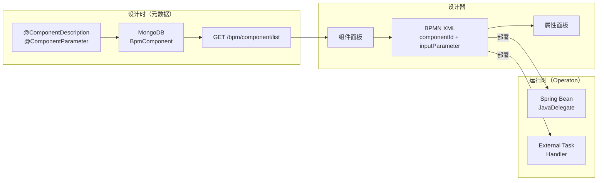
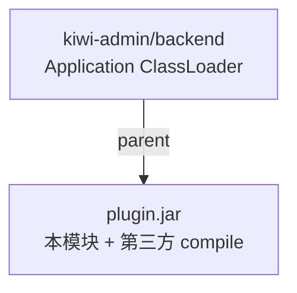

# Kiwi BPM 组件说明

本文介绍 Kiwi 流程组件的架构，以及如何**添加**、**配置**与**使用**组件。平台总览见 [README.zh-CN.md](../README.zh-CN.md)。

## 一、架构概览

Kiwi 的「组件」是 BPMN **Service Task**（或 Call Activity / External Task）与后端执行逻辑的绑定单元，分为三层：



| 层级 | 位置 | 职责 |
|------|------|------|
| 注解 | `kiwi-bpmn-core` | 声明组件名称、分组、输入/输出参数 Schema |
| 实现 | `kiwi-bpmn-component` 等 | `JavaDelegate` / `ActivityBehavior` / `ExternalTaskHandler` 执行业务 |
| 元数据 | MongoDB `BpmComponent` | 设计器读取的参数定义、分组、继承关系 |
| 设计器 | `kiwi-admin/frontend/.../pages/bpm/design` | 拖入节点、填写参数、生成 BPMN XML |
| 引擎 | Operaton 2.x | `delegateExpression` 或 `external` topic 触发执行（BPMN 仍用 `camunda:` 扩展命名空间） |

### 组件类型

`BpmComponent.type` 决定 BPMN 节点如何绑定运行时：

| 类型 | 运行时绑定 | 典型场景 |
|------|-----------|----------|
| `SpringBean` | `camunda:delegateExpression="${beanKey}"` | Shell、HTTP、JDBC、MongoDB |
| `SpringExternalTask` | `camunda:type="external"` + `camunda:topic` | Slurm 长耗时作业 |
| `CallActivity` | `calledElement` 指向子流程 | 流程复用 |

### 启动时自动注册

官方业务组件（HTTP、Shell、JDBC 等）以 **插件 JAR** 形式由 `BpmComponentPluginLoader` 从 `plugins/` 加载，元数据 id 为 `plugin_{key}`（如 `plugin_shell`）。Slurm 仍通过 `ClasspathBpmComponentProvider` 扫描 classpath（`classpath_*`）。二者经 `BpmComponentDeploymentService` 同步到 MongoDB。配置项 `bpm.component.auto-deploy` 默认为 `true`。

**本地开发**：官方 plugin JAR 已随仓库提交在 `kiwi-admin/backend/plugins/`，clone 后从 **`kiwi-admin/backend`** 工作目录启动后端即可加载（如 `plugin_httpRequest`），**日常无需** `build-plugins`。

**仅修改 `kiwi-bpmn-component*` 模块时**，维护者需重新打包并 commit JAR：

```bash
mvn -pl kiwi-admin/backend -am package -Pbuild-plugins -DskipTests
git add kiwi-admin/backend/plugins/*.jar && git commit -m "chore: refresh BPM component plugin JARs"
```

IDE 工作目录须为 `kiwi-admin/backend`，否则 `plugins` 路径解析错误。详见 [`kiwi-admin/backend/plugins/README.md`](../kiwi-admin/backend/plugins/README.md)。

关键代码路径：

| 路径 | 说明 |
|------|------|
| [kiwi-bpmn-core/.../ComponentDescription.java](../kiwi-bpmn/kiwi-bpmn-core/src/main/java/com/kiwi/bpmn/core/annotation/ComponentDescription.java) | 组件元数据注解 |
| [BpmComponentPluginLoader.java](../kiwi-admin/backend/src/main/java/com/kiwi/project/bpm/service/BpmComponentPluginLoader.java) | 官方/第三方插件 JAR 加载 |
| [ClasspathBpmComponentProvider.java](../kiwi-admin/backend/src/main/java/com/kiwi/project/bpm/service/ClasspathBpmComponentProvider.java) | Slurm 等 classpath 组件 |
| [ComponentUtils.java](../kiwi-admin/backend/src/main/java/com/kiwi/project/bpm/utils/ComponentUtils.java) | 注解 → `BpmComponent` 转换 |
| [component-provider.ts](../kiwi-admin/frontend/src/app/pages/bpm/flow-elements/component-provider.ts) | 前端拉取 `GET /bpm/component/list` |

---

## 二、如何添加组件

### 方式 A：Java 代码（推荐，内置组件做法）

1. 在 `kiwi-bpmn-component`（或 backend 模块）新建类，实现 `JavaDelegate` 或继承 `AbstractBpmnActivityBehavior`。
2. 添加 Spring `@Component("beanKey")` 与 `@ComponentDescription`。
3. 重启后端 → 自动写入 MongoDB。

最小示例（参考 [ShellActivityBehavior.java](../kiwi-bpmn/kiwi-bpmn-component/src/main/java/com/kiwi/bpmn/component/activity/ShellActivityBehavior.java)）：

```java
@ComponentDescription(
    name = "命令行",
    group = "脚本",
    inputs = {
        @ComponentParameter(key = "command", description = "要执行的命令", required = true),
        @ComponentParameter(key = "waitFlag", htmlType = "CheckBox", description = "是否等待结束")
    },
    outputs = {
        @ComponentParameter(key = "result", description = "命令输出"),
        @ComponentParameter(key = "errorCode", description = "退出码")
    }
)
@Component("shell")
public class ShellActivityBehavior implements JavaDelegate {
    @Override
    public void execute(DelegateExecution execution) {
        String command = ExecutionUtils.getStringInputVariable(execution, "command")
            .orElseThrow(() -> new IllegalArgumentException("command 不能为空"));
        // 执行逻辑，结果写入 execution.setVariable("result", ...)
    }
}
```

**External Task 组件**（如 Slurm）额外添加 `@ExternalTaskSubscription(topicName = "slurm")`，类型自动识别为 `SpringExternalTask`。参考 [SlurmExternalTaskHandler.java](../kiwi-bpmn/kiwi-bpmn-component-slurm/src/main/java/com/kiwi/bpmn/component/slurm/SlurmExternalTaskHandler.java)（独立模块 `kiwi-bpmn-component-slurm`）。

运行时读取参数统一使用 [`ExecutionUtils`](../kiwi-bpmn/kiwi-bpmn-core/src/main/java/com/kiwi/bpmn/core/utils/ExecutionUtils.java)（`kiwi-bpmn-core`）的 `getStringInputVariable(execution, "xxx")` 等顶层 API；`@ComponentParameter` 的 `key` **禁止使用 `.`**，用下划线扁平命名（见 `.cursor/rules/component-parameter-key-no-dot.mdc`）。

### 方式 B：管理端「组件管理」

路径：**工作流 → 组件管理**（`/bpm/component`）

- **手动新建**：填写名称、继承父组件（`parentId`）、自定义输入/输出参数。
- **CLI 生成**：解析 `--help` 输出，基于 `shell` 父组件批量生成。
- **OpenAPI 生成**：基于 `httpRequest` 父组件从 Swagger 生成 HTTP 组件。
- **JDBC 表结构生成**：选择 `jdbc-connections` 连接与表，每张表生成 5 个继承 `jdbcActivity` 的 CRUD 子组件（`POST /bpm/component/from-jdbc-schema`，`source=dbschema`）。

子组件通过 `parentId` 继承父组件参数，可只覆盖或追加差异字段（`BpmComponentService.fillComponentProperties`）。

---

## 三、如何配置组件

配置分两层：**开发时声明 Schema** + **设计时填参数值**。

### 1. 开发时：声明参数 Schema

用 `@ComponentParameter` 描述每个输入/输出：

```java
@ComponentParameter(
    key = "connection_id",      // 流程变量 key，禁止用 "."
    name = "连接",
    required = true,
    dictKey = "jdbc-connections" // 设计器渲染为下拉（字典数据源）
)
@ComponentParameter(
    key = "waitFlag",
    htmlType = "CheckBox"         // 仅特殊控件才显式写 htmlType
)
@ComponentParameter(
    key = "mappings",
    htmlType = "assignments-editor" // 键值对编辑器
)
```

约定：

- 必填输入无默认值 → 设计器自动填 `${key}`（JUEL 引用流程变量）。
- 输出参数默认映射到同名流程变量。
- 普通字符串输入**不要**写 `htmlType = "#text"`（见 `.cursor/rules/component-parameter-htmltype.mdc`）。

更多示例见 [JdbcActivity.java](../kiwi-bpmn/kiwi-bpmn-component/src/main/java/com/kiwi/bpmn/component/jdbc/JdbcActivity.java)、[JsonMapActivity.java](../kiwi-bpmn/kiwi-bpmn-component/src/main/java/com/kiwi/bpmn/component/json/JsonMapActivity.java)。

### 2. 设计时：在 BPMN 设计器填值

1. 打开 **项目流程** → 进入设计器。
2. 从左侧**组件面板**拖入节点（或右键「追加组件」）。
3. 选中节点，在右侧**属性面板**填写各参数。

参数持久化为 Camunda 扩展，例如：

```xml
<bpmn:serviceTask camunda:delegateExpression="${shell}">
  <bpmn:extensionElements>
    <camunda:properties>
      <camunda:property name="componentId" value="classpath_shell" />
    </camunda:properties>
    <camunda:inputOutput>
      <camunda:inputParameter name="command">${myCommand}</camunda:inputParameter>
      <camunda:inputParameter name="directory">/tmp/work</camunda:inputParameter>
    </camunda:inputOutput>
  </bpmn:extensionElements>
</bpmn:serviceTask>
```

- `componentId`：关联 MongoDB 中的组件定义（设计器在 `setComponentId` 时自动写入）。
- `camunda:inputParameter`：参数值，可以是字面量或 `${变量名}` JUEL 表达式。
- 设置 `componentId` 时，设计器自动写入 `delegateExpression` 或 `external` topic（见 [camunda-element-model.ts](../kiwi-admin/frontend/src/app/pages/bpm/design/extension/camunda/camunda-element-model.ts)）。

Kiwi 扩展命名空间定义见 [kiwi.json](../kiwi-admin/frontend/src/app/pages/bpm/flow-elements/kiwi.json)（`kiwi:componentId` 扩展属性）。

---

## 四、如何使用组件

完整流程：

```
创建/选择项目 → 新建流程 → 拖入组件 → 配置参数 → 保存 → 部署 → 启动实例
```

### 1. 在设计器中使用

1. **工作流 → 项目流程** → 选择项目 → 点击「流程管理」打开设计器。
2. 从左侧拖入「命令行」「HTTP 请求」等组件。
3. 在属性面板配置参数（如 `command` 填 `${scriptPath}` 或固定值 `ls -la`）。
4. 用连线串联多个组件，保存 BPMN。

拖入组件时，`ComponentService.initElement` 会按组件元数据写入默认 `inputParameter`。

### 2. 部署与运行

1. 在流程列表点击「部署」，将 BPMN 发布到 Operaton 引擎。
2. 启动流程实例时传入初始变量，例如：

```json
{
  "myCommand": "echo hello",
  "connection_id": "db-prod-01"
}
```

3. 运行时组件通过 `ExecutionUtils` 读取 `camunda:inputParameter` 解析后的值。
4. 执行结果写入 `execution.setVariable(...)`，供后续节点使用。

### 3. 串联示例

```
[开始] → [赋值组件: message="hello"] → [命令行: command="echo ${message}"] → [结束]
                                              ↓
                                        result 写入流程变量
```

---

## 五、数据流小结

```
Java 类 + @ComponentDescription
    ↓ 启动时 ClasspathBpmComponentProvider 扫描
MongoDB BpmComponent（元数据）
    ↓ GET /bpm/component/list
设计器组件面板 + 属性面板
    ↓ 用户配置
BPMN XML（componentId + camunda:inputParameter）
    ↓ 部署
Operaton 引擎执行 delegateExpression / external topic
    ↓
JavaDelegate.execute() 读取参数、写回输出变量
```

---

## 六、第三方组件开发（示例模块）

仓库提供 [`kiwi-bpmn-component-example`](../kiwi-bpmn/kiwi-bpmn-component-example/README.md)：

- `DemoGreetingActivity`：`@Component("demoGreeting")` + `@ComponentDescription`
- 在 `kiwi-admin/backend/pom.xml` 增加对 `kiwi-bpmn-component-example` 的依赖即可编入 classpath
- 启动后自动注册为 `classpath_demoGreeting`，设计器「示例」分组可见

契约：`kiwi-bpmn-core`（注解 + `ExecutionUtils`）+ `JavaDelegate` + Spring `@Component`；第三方**无需**依赖 `kiwi-bpmn-component`。

---

## 七、项目环境变量

每个 BPM **项目**可配置环境变量（Mongo 集合 `bpmProjectEnvVar`，`projectId` 外键）：

| 字段 | 说明 |
|------|------|
| `key` | 变量名（项目内唯一），如 `API_URL`、`API_KEY` |
| `value` | 值；`encrypted=true` 时 AES 存储，API 不回显 |
| `encrypted` | 敏感项开启；启动时以 Operaton **瞬态变量**注入，避免进历史 |

**管理**：工作流 → 项目流程 → 选择项目 → **环境变量** Tab。

**启动注入**：`BpmProcessStartService` 读取流程所属 `projectId` 的 env，与用户启动 variables 合并（**同名 key 用户优先**）。组件 BPMN 中可写 `${API_URL}`、`${API_KEY}` 等。

**约定**：勿在 BPMN 属性面板明文填写生产密钥；非敏感配置（URL、桶名）可 `encrypted=false`。

---

## 八、内置组件扩充（阶段一）

`kiwi-bpmn-component` 在原有 Shell / HTTP / JDBC / Mongo 等基础上新增：

| Bean Key | 名称 | 分组 |
|----------|------|------|
| `webhookOutbound` | Webhook 出站（流程内调外部/内部 HTTP） | 通知 |
| `emailSend` | 发送邮件 | 通知 |
| `sftpTransfer` | SFTP 传输 | 文件 |
| `sleep` | 延时等待 | 通用 |
| `digestHash` | 摘要哈希 | 通用 |
| `base64Codec` | Base64 编解码 | 通用 |
| `uuidGenerate` | 生成 UUID | 通用 |

敏感 SMTP/SFTP 凭据请通过**项目环境变量**注入，BPMN 使用 `${SMTP_PASSWORD}` 等形式引用。

### 独立可选模块（按项目拆分）

重型集成不塞进 `kiwi-bpmn-component`，各自独立 Maven 模块，backend 按需依赖或打 JAR 放 `plugins/`：

| 模块 | Bean Key | 分组 |
|------|----------|------|
| `kiwi-bpmn-component-slack` | `slackNotify` | 通知 |
| `kiwi-bpmn-component-kafka` | `kafkaPublish` | 消息 |
| `kiwi-bpmn-component-rabbitmq` | `rabbitMqPublish` | 消息 |
| `kiwi-bpmn-component-s3` | `s3Object` | 存储 |

各模块 README 见 `kiwi-bpmn/kiwi-bpmn-component-*/README.md`。

---

## 八点五、插件 JAR 打包契约

第三方或官方 BPM 组件若以 **plugin JAR** 分发（放入 `plugins/` 或由 `POST /bpm/component/plugins/upload` 安装），须遵守下列约定，避免将 Spring / Operaton / Kiwi 平台库重复打入 JAR（单 jar 可达数十 MB 且易引发类加载冲突）。

### 宿主提供（`provided`，禁止打入 JAR）

| 依赖 | 说明 |
|------|------|
| `kiwi-bpmn-core` | 注解、`ExecutionUtils` 等 |
| `spring-context` | Spring 容器由 backend 提供 |
| `operaton-engine` | BPM 引擎 API |
| `kiwi-common` / `kiwi-bpmn-external-task` | 若组件用到，同样 `provided` |

继承 `kiwi-parent` 时，其全局 compile 依赖（`spring-boot-starter-web`、`operaton-bpm-spring-boot-starter` 等）会误入 shade。**官方组件模块**应继承 [`kiwi-bpmn-component-parent`](../kiwi-bpmn/kiwi-bpmn-component-parent/pom.xml)，由 parent 统一覆写为 `provided`。

### 插件自带（`compile`，shade 保留）

仅宿主**没有**的第三方库，例如：

| 模块 | 打入 JAR 的第三方依赖 |
|------|----------------------|
| `kiwi-bpmn-component` | `commons-io`、`jsch`、邮件相关（`jakarta.mail` / `angus-mail` 等） |
| `kiwi-bpmn-component-kafka` | `kafka-clients` |
| `kiwi-bpmn-component-rabbitmq` | `amqp-client` |
| `kiwi-bpmn-component-s3` | AWS SDK `s3`、`url-connection-client` |
| `kiwi-bpmn-component-slack` | 无（纯 JDK） |

### 推荐产物与 ClassLoader



- **无第三方依赖** → thin jar（仅本模块 class）即可，如 Slack 组件。
- **有第三方依赖** → `maven-shade-plugin` 打 fat jar，并配合根 `pom.xml` `pluginManagement` 中的 `artifactSet` excludes（排除 `org.springframework:*`、`org.operaton:*`、`com.kiwi:kiwi-bpmn-core` 等）。
- 激活打包：`-Dkiwi.build.plugins=true` 或 `-Pbuild-plugins`（见 [`kiwi-bpmn-component-parent`](../kiwi-bpmn/kiwi-bpmn-component-parent/pom.xml) 的 `plugin-jar` profile）。
- 运行时 `BpmComponentPluginLoader` 以 `applicationContext.getClassLoader()` 为 **parent**，插件内类可解析宿主已加载的平台类。

### 反模式

- 使用 `spring-boot-maven-plugin` **repackage** 打可执行 fat jar（会捆绑整个 Spring Boot）。
- shade **无 excludes** 的全量依赖（把 Operaton / MongoDB 等打进 plugin）。
- 继承带全局 compile 的 parent 却不把平台库标为 `provided`。

### 最小 `pom.xml` 片段（第三方组件）

```xml
<parent>
    <groupId>com.kiwi</groupId>
    <artifactId>kiwi-bpmn-component-parent</artifactId>
    <version>1.0.0-SNAPSHOT</version>
</parent>

<dependencies>
    <dependency>
        <groupId>com.kiwi</groupId>
        <artifactId>kiwi-bpmn-core</artifactId>
        <scope>provided</scope>
    </dependency>
    <dependency>
        <groupId>org.operaton.bpm</groupId>
        <artifactId>operaton-engine</artifactId>
        <scope>provided</scope>
    </dependency>
    <dependency>
        <groupId>org.springframework</groupId>
        <artifactId>spring-context</artifactId>
        <scope>provided</scope>
    </dependency>
    <!-- 仅示例：宿主没有的库用 compile -->
    <!-- <dependency><groupId>com.example</groupId><artifactId>client</artifactId></dependency> -->
</dependencies>
```

完整示例见 [`kiwi-bpmn-component-example`](../kiwi-bpmn/kiwi-bpmn-component-example/)。

---

## 九、插件 JAR 加载

官方组件与第三方扩展均通过 `plugins/` 目录分发（见上文「启动时自动注册」）。

| 配置 | 默认 | 说明 |
|------|------|------|
| `bpm.component.plugins-dir` | `plugins` | 插件 JAR 目录（相对工作目录） |
| `bpm.component.plugins-enabled` | `true` | 是否扫描插件 |

- 将含 `@ComponentDescription` + `JavaDelegate` 的 JAR 放入 `plugins/`，启动时由 `PluginBpmComponentProvider` 注册 Bean 并同步 Mongo（`source=plugin`）。
- **上传安装**：`POST /bpm/component/plugins/upload`（multipart `file`）
- **手动刷新**：`POST /bpm/component/plugins/reload`
- **卸载**：`DELETE /bpm/component/plugins/{fileName}`
- 管理端入口：**工作流 → 组件插件**（`/bpm/plugins`，上传 / 重新扫描 / 卸载）。
- 第三方开发仍推荐参考 `kiwi-bpmn-component-example`；插件方式适合运维侧热更新。

---

## 十、Camunda 8 Element Template 互操作（阶段三）

与 **Camunda 8** Modeler / `connectors-bundle` 的 Connector Element Template 互操作：仅迁移**设计时元数据**（属性面板字段 → Kiwi `BpmComponent`），执行仍由 Kiwi 组件（`JavaDelegate` / External Task）完成，**不绑定 Zeebe Job Worker**。

字段映射：`camunda:inputParameter` / `outputParameter` → Kiwi 组件输入/输出参数。

### 管理端（工作流 → 组件管理）

| 操作 | 入口 |
|------|------|
| **导入** | 工具栏「生成组件」→「**从 Camunda 8 Template 导入**」：粘贴或上传 Camunda 8 Element Template JSON；REST Connector 类模板建议勾选「继承 HTTP 请求」 |
| **导出** | 行操作「**导出 Camunda 8 Template**」→ 下载 `{sourceKey}.element-template.json`，可供 Camunda Modeler 协作 |

导入后若 `sourceKey` 与库中或本批重复，会弹出与 OpenAPI 生成相同的冲突确认（覆盖 / 新增 / 取消）。

### API

- **导出**：`GET /bpm/component/{id}/element-template` → Camunda 8 兼容 Element Template JSON
- **导入草稿**：`POST /bpm/component/from-element-template`，body `{ "template": "...", "inheritHttpRequest": true }`

---

## 十一、阶段四：内部集成与插件安装

Kiwi 的**默认集成方式**是集群内服务通过已认证 API 与流程协作，而不是对外暴露 Webhook 入站。

### 内部服务调用（推荐）

| 场景 | 做法 |
|------|------|
| 另一服务**启动**流程 | `POST /bpm/process/{processId}/start`，body 传 `variables`；自动合并该项目环境变量（见第七节） |
| 流程**调用**内部 REST | 使用 `httpRequest` / `webhookOutbound` 组件；基址、Token 用项目 env 的 `${API_URL}`、`${API_KEY}` |
| 长耗时 / 异步回调 | External Task（如 Slurm），或业务服务完成后调引擎/管理端 API（须携带登录 Token） |

以上路径**不需要**入站注册表，也**不需要**在 BPMN 里画 Message Catch 专门等外部 POST。

### 插件包安装（组件市场轻量形态）

- `POST /bpm/component/plugins/upload`：上传第三方组件 JAR 至 `plugins/`
- `POST /bpm/component/plugins/reload`：重新扫描并同步组件库
- 无需改 `backend/pom.xml` 即可试用可选组件

### 附录：外部 Webhook 入站（可选，可忽略）

仅当存在**未经登录的第三方**（如 GitHub、支付网关）需要 POST 唤醒**已在运行、且停在 Message Catch 上**的流程实例时，才使用下列 API。  
**无此类需求时整块可忽略**；不提供管理端 UI，由脚本或运维一次性配置即可。

1. **注册**（需登录）：`POST /bpm/inbound/registration` — `componentKey`、`messageName`、可选 `projectId` / `secretToken`
2. **触发**（无需登录）：`POST /bpm/inbound/{componentKey}`，body 为流程变量 JSON；可选请求头 `X-Kiwi-Inbound-Token`

BPMN 中须有 **Intermediate Message Catch Event**，message 名称与注册一致。

---

## 十二、相关文档

| 文档 | 内容 |
|------|------|
| [README.zh-CN.md](../README.zh-CN.md) | 平台总览与快速开始 |
| [slurm-workdir-cleanup.md](../kiwi-bpmn/kiwi-bpmn-component-slurm/docs/slurm-workdir-cleanup.md) | Slurm 组件运维 |
| `.cursor/rules/component-parameter-key-no-dot.mdc` | `@ComponentParameter` key 命名 |
| `.cursor/rules/component-parameter-htmltype.mdc` | `htmlType` 使用约定 |
| `.cursor/rules/java-minimize-static-methods.mdc` | 组件实现优先实例方法 |
