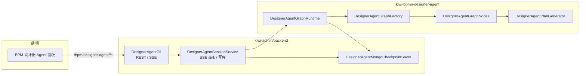
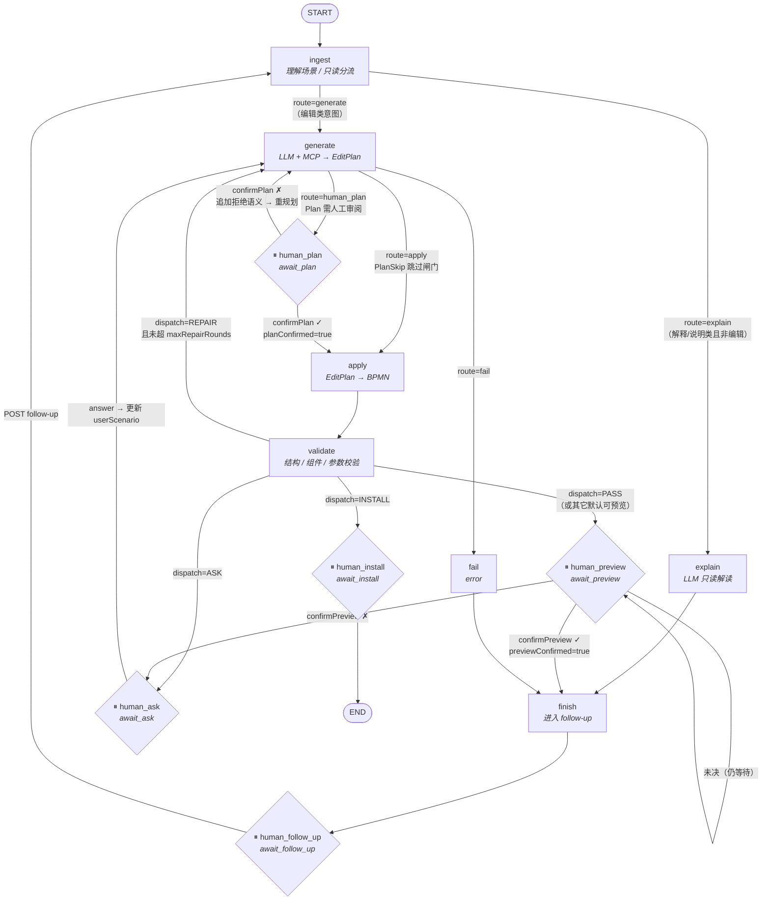
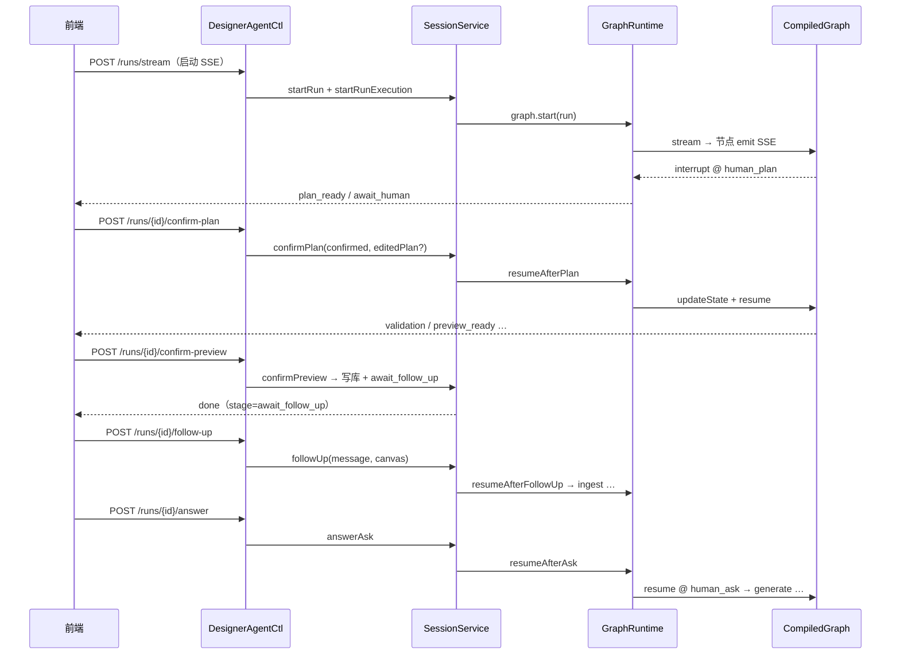

# kiwi-bpmn-designer-agent

BPM 设计器 Agent：基于 **EditPlan IR** 驱动画布变更，使用 **Spring AI Alibaba Graph**（`StateGraph` + interrupt/checkpoint）编排 run 生命周期，经 SSE 向前端推送 `AgentStreamEvent`。

## 分层架构



| 层次 | 职责 |
|------|------|
| **DesignerAgentCtl** | HTTP/SSE 契约；`confirm-plan` / `confirm-preview` / `answer` 等人机接口 |
| **DesignerAgentSessionService** | 分配 `runId`、绑定 SSE sink、异步 `start`/`resume`；预览确认后写 BPMN 到库 |
| **DesignerAgentGraphRuntime** | Graph 真相源：`threadId = runId`，checkpoint 持久化状态 |
| **DesignerAgentGraphNodes** | 各节点业务：ingest、generate、apply、validate 等 |

Checkpoint 配置：`kiwi.bpm.designer-agent.checkpoint` = `memory` \| `mongodb`（admin 默认 `mongodb`）。

---

## StateGraph 主流程

下图对应 `DesignerAgentGraphFactory` 编译的图。带 **⏸** 的节点在 `interruptBefore` 处暂停，等待 REST resume。



**会话生命周期**：每个 `targetProcessId` 对应一个长期 open 的 run（`designer_agent_session` 索引 + Graph checkpoint）。`finish` 后进入 `await_follow_up`，**不会**释放 checkpoint；仅 `POST /sessions/clear` 或用户在前端点「清空会话」时 hard end。

### Plan 跳过闸门（generate → apply）

`PlanSkipEvaluator` 在 **planMode + planModeSkipSimple** 开启时，满足以下条件可跳过 `human_plan`：

- EditPlan 操作数 ≤ 2，且均为简单 op（`addNode` / `updateNode` / …）
- 用户场景不含「网关 / 分支 / 重构 / 整流程」等复杂意图关键词

---

## 人机闸门（HITL）与 REST 续跑

Graph 在以下节点 **执行前 interrupt**；Session 层收到 REST 请求后 `updateState` + `resume`：



| 阶段 | Graph 节点 | REST 续跑 | SSE 典型事件 |
|------|-----------|-----------|--------------|
| 计划审阅 | `human_plan` | `POST …/confirm-plan` | `plan_ready`, `await_human` |
| 预览确认 | `human_preview` | `POST …/confirm-preview` | `preview_ready`, `await_human` |
| 补充信息 | `human_ask` | `POST …/answer` | `await_human` |
| 会话续聊 | `human_follow_up` | `POST …/follow-up` | `done`（stage=`await_follow_up`） |
| 插件安装 | `human_install` | （暂无前端 REST） | `await_human` + `pluginHintJson` |

预览**接受**后：Graph 进入 `finish`；**写 BPMN 到库**由 `DesignerAgentSessionService` 在 admin 侧完成（Graph 只设置 `persistRequested` 意图）。

---

## 节点说明

| 节点 ID | 说明 | 主要 SSE |
|---------|------|----------|
| `ingest` | 读取场景与画布；只读 / 编辑分流 | `stage` |
| `explain` | 只读 LLM 解读，不产出 EditPlan | `stage`, `text_delta`, `done` |
| `generate` | LLM + MCP 生成 EditPlan；可进入 repair 轮次 | `stage`, `thinking_delta`, `plan_ready` |
| `human_plan` | interrupt：等待用户确认/编辑/拒绝计划 | `await_human` |
| `apply` | EditPlanApplicator 应用补丁 | `stage` |
| `validate` | AssistantWorkflowValidator 校验 | `stage`, `validation` |
| `human_preview` | interrupt：等待预览确认 | `preview_ready`, `await_human` |
| `human_ask` | interrupt：等待用户补充说明 | `await_human` |
| `human_install` | interrupt：提示安装缺失插件 | `await_human` |
| `fail` / `finish` | 失败或正常结束 | `error` / `done` |

校验 `dispatch` 优先级（`AssistantWorkflowValidator.toDispatchCode`）：**INSTALL** → **ASK** → **REPAIR**（未超限）→ 否则视为可预览（PASS）。

---

## 关键源码

| 文件 | 作用 |
|------|------|
| `runtime/DesignerAgentGraphFactory.java` | 建图、条件边、`interruptBefore`、编译 |
| `runtime/DesignerAgentGraphNodes.java` | 节点业务与 route 决策 |
| `runtime/DesignerAgentGraphRuntime.java` | start / resume / checkpoint 投影 |
| `runtime/DesignerAgentStateKeys.java` | OverAllState 扁平 key |
| `runtime/DesignerAgentPlanGenerator.java` | LLM + MCP 生成 EditPlan |
| `../kiwi-admin/.../DesignerAgentSessionService.java` | SSE façade + 写库 |
| `../kiwi-admin/.../DesignerAgentMongoCheckpointSaver.java` | Mongo checkpoint |

## 本地测试

```bash
mvn -pl kiwi-bpmn-designer-agent -am test
```

Graph interrupt/resume 与 SSE 事件序列见 `DesignerAgentOrchestratorSseTest`。
