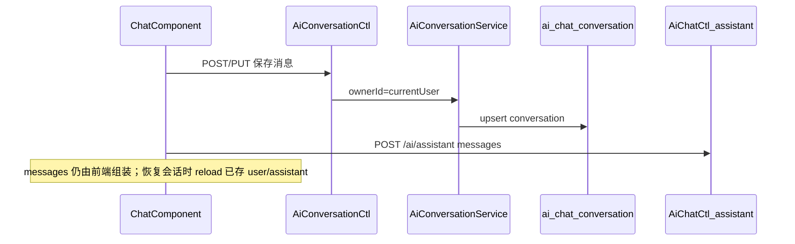

# Design

## 架构

**与 `/ai/assistant` 的关系**：推理接口保持无状态；会话 API 只负责存储/读取，不替代 `AiAssistantService`。

## 数据模型

集合 `ai_chat_conversation`，实体 `com.kiwi.project.ai.conversation.AiChatConversation`：

| 字段 | 说明 |
|------|------|
| 继承 `BaseEntity<String>` | Mongo 审计字段（`MongoAuditor`） |
| `ownerId` | 冗余当前用户 ID（与 `createdBy` 一致，便于查询与 audit） |
| `scope` | `global` \| `bpm-designer` |
| `scopeRef` | 可选，如 BPM `processId` |
| `title` | 会话标题，默认首条 user 消息前 40 字 |
| `searchText` | 最近 N 条 user/assistant 摘要，供 `QueryParams` 模糊检索 |
| `lastMessagePreview` | 最后一条消息预览 |
| `messageCount` | 消息条数 |
| `messages` | `List<AiChatMessage>`，**仅 `user` / `assistant`** |

**不持久化 `system` 消息**（BPM `messagesEnricher` 注入的大段 BPMN/XML）。恢复 BPM 会话时仍由 enricher 在发送前注入上下文。

Dao：`AiChatConversationDao extends BaseMongoRepository`；按 `ownerId` + `scope` 排序查询；audit 用 `QueryParams` 不限 owner。

## API

| 方法 | 路径 | 鉴权 | 行为 |
|------|------|------|------|
| GET | `/ai/conversations` | `@SaCheckLogin` | 分页；默认 `ownerId=currentUser`；`scope` / `q` 查询 |
| GET | `/ai/conversations/{id}` | `@SaCheckLogin` | 详情含 `messages`；非 owner 且无 audit → 403 |
| POST | `/ai/conversations` | `@SaCheckLogin` | 创建；设置 `ownerId`、scope |
| PUT | `/ai/conversations/{id}` | `@SaCheckLogin` | 更新 title 或 `mode: append \| replace` 消息 |
| DELETE | `/ai/conversations/{id}` | `@SaCheckLogin` | 仅 owner |
| GET | `/ai/conversations/audit` | `ai:conversation:audit` | 管理员跨用户分页 |

Controller 继承 `BaseCtl`；Service 内 `assertOwnerOrAudit`。普通用户 CRUD 仅需 `@SaCheckLogin`（`user_scoped_login`）。

权限：`permission.json` 注册 `ai:conversation:audit`。

## 容量护栏

- `kiwi.ai.conversation-max-messages`（默认 200）
- `kiwi.ai.conversation-max-content-length`（默认 32000）；超出截断

## 前端

- `AiConversationService`：`list` / `get` / `create` / `update` / `remove`；列表读 `CollectionResult.content`
- `ChatComponent`：`conversationScope`（`global` \| `bpm-designer`）、`scopeRef`；标题栏会话下拉 / 新建 / 删除；发送后 append 持久化
- `localStorage` 记录各 scope 下 `lastConversationId`
- 嵌入：`main.component`（`global`）、`bpm-ai-chat`（`bpm-designer` + `processId`）

## 测试要点

- 用户 A 无法读写用户 B 的会话（403）
- BPM scope + `scopeRef` 列表互不串线
- 恢复会话后发送：历史 user/assistant + 运行时 system enricher（BPM）
- 追加后 `updatedTime`、`searchText`、`title` 正确
- audit：无权限 403；有权限可跨用户分页

## 主要文件

**后端**：`.../ai/conversation/AiChatConversation.java`、`AiChatConversationDao.java`、`AiConversationService.java`、`AiConversationCtl.java`、`AiChatProperties.java`、`permission/permission.json`

**前端**：`ai-conversation.service.ts`、`chat.component.ts|html|less`、`bpm-ai-chat.component.html`
