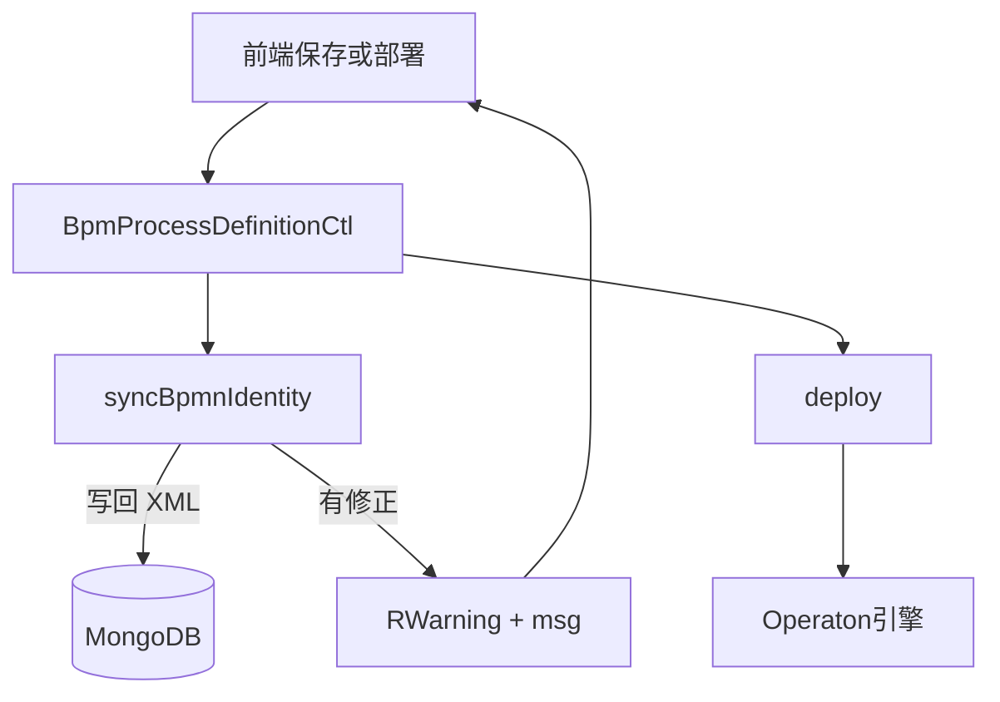

# Design

## 策略

| 项 | 约定 |
|----|------|
| 权威来源 | `BpmProcess.id`（Mongo 主键） |
| 修正时机 | 保存 `bpmnXml`、改名、克隆/另存为、部署前 |
| 用户提示 | 仅 save/deploy 且修正前不一致时返回带 `msg` 的 warning 响应；create/clone 内部对齐不提示 |
| 失败 | XML 无法解析 → `IllegalArgumentException` |

## 后端

`syncBpmnIdentity(BpmProcess process)` 实例方法（namespace-aware DOM）：

- 第一个 `<process>` 的 `id`（及非空 `name`）与 `BpmProcess` 对齐
- 全部 `<BPMNPlane>` 的 `bpmnElement` 设为 `process.getId()`
- 保留 `isExecutable` 等其它属性
- 返回值：修正前不一致 → `true`

**控制器接入**

| 端点 | 行为 |
|------|------|
| `PUT {id}` save | 有 `bpmnXml`/`name` 变更则 sync；有修正 → `RWarning` |
| `POST {id}/deploy` | 部署前 sync；修正则先落库再 deploy → `RWarning` |
| clone / save-as / create | sync，不设 `msg` |

常量文案：`已自动将 BPMN 中的流程 ID 与库内 id 对齐（process / BPMNPlane）`

## 前端

- `BaseHttpService`：`warningCode` 含 warning 业务码时 `message.warning(item.msg)`
- `process-design.service`：保存/部署走上述 HTTP 层
- `bpm-editor`：成功回调若 `data.bpmnXml` 与服务端修正一致则 `importXML` 回灌

## 验证清单

1. 手动改画布 process id 后保存 → XML 对齐、`msg` warning、画布回灌
2. 仅 DB 脏数据 deploy → 成功且 Mongo XML 已修正
3. 无修正保存 → 无 warning
4. `BpmProcessDefinitionServiceTest` 通过
