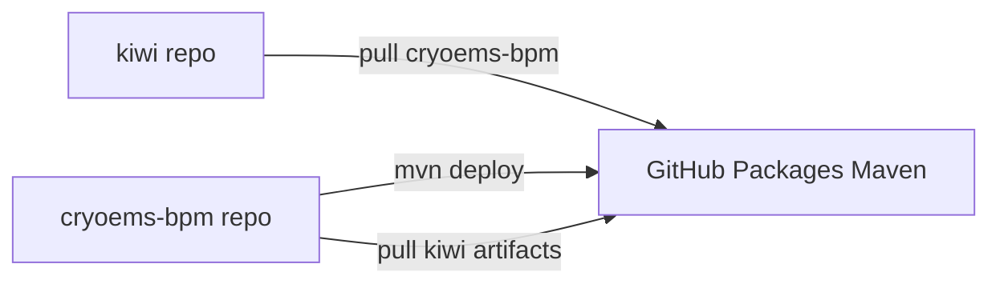

# Design

## 目标结构

```
d:\Projects\
├── kiwi\                 # 不再包含 cryoems-bpm/
└── cryoems-bpm\          # 独立 Git → github.com/xc404/cryoems-bpm
```



## cryoems-bpm 独立 POM

- 移除 `kiwi-parent`；使用 `spring-boot-starter-parent`
- `groupId` `com.kiwi`，`artifactId` `cryoems-bpm`，独立版本号
- kiwi 依赖：`kiwi-bpmn-core`、`kiwi-bpmn-component`、`kiwi-bpmn-external-task`、`kiwi-common` 使用 `${kiwi.version}`
- `distributionManagement` → `https://maven.pkg.github.com/xc404/cryoems-bpm`（`server.id=github-cryoems-bpm`）

## kiwi 侧

- 删除 `<module>cryoems-bpm</module>`
- 属性 `<cryoems-bpm.version>`
- `repositories` 拉取 GitHub Packages
- Profile `cryoems-bpm-local`：`<module>../cryoems-bpm</module>` 同级目录联调
- `kiwi-admin/backend`：`com.kiwi:cryoems-bpm:${cryoems-bpm.version}`

## 构建工作流

| 场景 | 命令 |
|------|------|
| 本地联调 | `mvn -Pcryoems-bpm-local -pl kiwi-admin/backend -am -DskipTests compile` |
| 发布 cryoems-bpm | `cd cryoems-bpm && mvn deploy -DskipTests` |
| kiwi CI | 从 GitHub Packages 解析 `cryoems-bpm` |

## 风险

- GitHub Packages 可见性跟随仓库；私有需 PAT
- `server id` 四处一致：`github-cryoems-bpm` / `github-kiwi`
- `kiwi.version` 与 `cryoems-bpm.version` 解耦后需人工对齐
- 首次构建需 kiwi 构件已在 `.m2` 或 Packages
