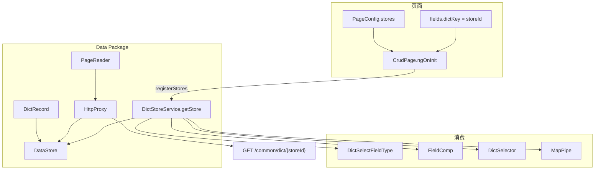

# Design

## ExtJS 对齐

| ExtJS | Kiwi |
|-------|------|
| `Ext.data.Model` | `DictRecord` |
| `Ext.data.proxy.Proxy` | `HttpProxy` / `CrudProxy` |
| `Ext.data.reader.Reader` | `PageReader`（`content` + 分页） |
| `Ext.data.Store` | `DataStore<T>`；`CrudDataSource` 子类 |
| `Ext.data.StoreManager` | `StoreManager` + `DictStoreService` |



## 目录结构

```
shared/datastore/
  model/dict-record.ts
  proxy/{data,http,crud,memory}-proxy.ts
  reader/page-reader.ts
  data-store.ts, array-store.ts, dict-store.ts
  dict-store.service.ts, store-manager.ts
shared/components/crud/crud-datastore.ts
```

## 页面 stores 声明

`collectDictStoreConfigs` 规则：

1. `fields[].dictKey` → 默认 `{ autoLoad: true }`
2. `PageConfig.stores` 同 `storeId` 覆盖（可设 `autoLoad: false`）

非 CRUD 页：`<app-dict-selector storeId="..." />` 经 `DictStoreService.getStore`。

## 消费侧

| 场景 | 实现 |
|------|------|
| 下拉编辑 | `dict-select` + `props.storeId` |
| 表格展示 | `FieldComp.getDisplayName` |
| 独立选择器 | `DictSelector` + 分页 `nextPage` |
| BPM | Java `@ComponentParameter(dictKey=...)` 不变 |

## 明确不做

- 字典管理页保存后 `StoreManager.reload` — 用户刷新页面即可

## 可选后续

- 业务页显式 `stores` 示例
- 删除 `GET /common/dict/groups`
