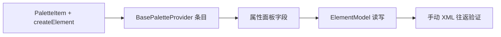

# Design

## 目标

1. Palette 拖出中间消息/定时/信号捕获事件、接收任务
2. 新建节点 XML 含正确 `<bpmn:xxxEventDefinition>`
3. 属性面板配置 messageRef（消息名）、timer、signalRef（信号名）

## Palette

`PaletteItem.eventDefinitionType` 可选；`pallete.ts` `createElement` 在 `bpmnFactory.create` 后：

```ts
const def = bpmnFactory.create(eventDefinitionType, {});
businessObject.eventDefinitions = [def];
def.$parent = businessObject;
```

**中间事件**（网关前分组）：

| 条目 | eventDefinitionType | icon |
|------|---------------------|------|
| 中间消息捕获 | `bpmn:MessageEventDefinition` | `bpmn-icon-intermediate-event-catch-message` |
| 中间定时捕获 | `bpmn:TimerEventDefinition` | `bpmn-icon-intermediate-event-catch-timer` |
| 中间信号捕获 | `bpmn:SignalEventDefinition` | `bpmn-icon-intermediate-event-catch-signal` |

**基本任务**：`ReceiveTask`（无 eventDefinitionType）

图标：palette 用 `<span [class]="paletteItem.icon">`；原有图元数字 icon 改为官方 `bpmn-icon-*`。

## 属性面板

`buildEventProperties(element)`：

| 类型 | 字段 |
|------|------|
| MessageEventDefinition / ReceiveTask | `messageName`（input） |
| SignalEventDefinition | `signalName` |
| TimerEventDefinition | `timerType`（timeDuration/timeDate/timeCycle）+ `timerValue` |

## ElementModel 读写

- `messageName` / `signalName`：读 `messageRef.name` / `signalRef.name`；写时在 `definitions.rootElements` 按 name 复用或新建 `bpmn:Message` / `bpmn:Signal`
- `timerType` / `timerValue`：切换 timeDuration/timeDate/timeCycle 子元素并写 `body`
- 不主动清理孤儿 rootElements Message/Signal

## Context Pad

事件/ReceiveTask 使用 bpmn-js 原生 context-pad；`kiwi-append-component-module` 已允许 FlowNode 追加业务组件。

## 实施顺序



## 验证清单

- 拖出 3 catch + ReceiveTask，配置后导出/导入 XML 正确
- 已有含 catch event 的 BPMN 导入可编辑
- Palette 官方图标正常显示
