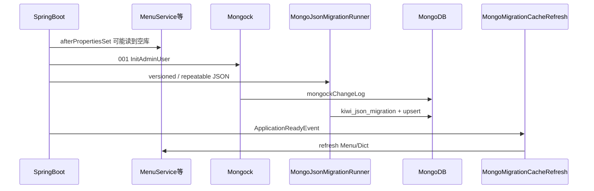

# Design

## 架构



## 阶段 1（已实现）

### A — Mongock `InitAdminUserChangeUnit`（order `001`）

- `id`: `20250601-001-init-admin-user`
- `SysUserDao` + `PasswordService`；`kiwi.mongodb.init.admin-password` 为空则 skip
- JSON **不含**用户与密码

### B — 参考数据 JSON（实施偏离 plan）

plan 为单次 `002` ChangeUnit + `mongo/migration/data/*.json`。

**实际**：`MongoJsonMigrationRunner` 扫描：

| 目录 | 命名 | 行为 |
|------|------|------|
| `mongo/migration/versioned/` | `V{date}_{seq}__{Entity}.json` | 只执行一次 |
| `mongo/migration/repeatable/` | `R__{Entity}.json` | checksum 变化时重跑 |

示例：`R__SysMenu.json`、`R__SysDict.json`、`R__SysDictGroup.json`、`V20250601_001__SysDept.json`。

`ClasspathJsonMigrationSupport` 仍用于 JSON 反序列化与 DAO upsert；每项须含非空 `id`。

### 配置

```yaml
kiwi.mongodb.migration.enabled: true
kiwi.mongodb.init.admin-username: admin
kiwi.mongodb.init.admin-password: # 首启必填
mongock.migration-scan-package: com.kiwi.framework.mongo.migration.primary
mongock.transactional: false  # 单机 Mongo
```

### 迁移后刷新

`MongoMigrationCacheRefresh`：`ApplicationReadyEvent` → `menuService.refresh()` + `dictService.refresh()`（`@ConditionalOnProperty` migration.enabled）。

## 阶段 2（未做）

cryoems 库独立 Mongock Runner。

## 验证

1. 空库 + admin 密码 → `mongockChangeLog` 含 `001`
2. `kiwi_json_migration` 有 versioned/repeatable 记录；菜单/字典 count > 0
3. 首启不重启：登录后菜单接口有数据
4. 改 `R__SysMenu.json` checksum → 重启后菜单更新
5. `migration.enabled=false` → 应用可启，迁移与 refresh 跳过
