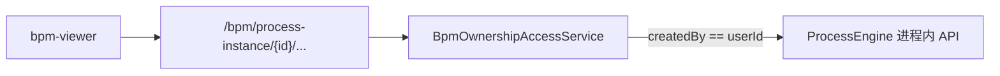

# Design

## 目标架构



External Task（`LocalEngineClient`）与 cryoEMS 机机集成不经 `/engine-rest` HTTP。

## 实例只读 API

| 端点 | 替代 engine-rest |
|------|------------------|
| `GET .../definition-xml` | `GET /process-definition/{id}/xml` |
| `GET .../history-activities` | `GET /history/activity-instance?...` |
| `GET .../variables` | `GET /history/variable-instance?...` |

DTO：`BpmProcessDefinitionXmlDto`、`BpmHistoricActivityInstanceDto`、`BpmHistoricVariableInstanceDto`。

## 所有权（阶段一）

| 资源 | 规则 |
|------|------|
| `BpmProcess` | `createdBy == currentUserId` |
| 流程实例 | `processDefinitionKey` → 对应 `BpmProcess.createdBy` |

`BpmOwnershipAccessService`：`ownsProcess` / `ownsInstance` / `assert*` / `ownedProcessKeys`。

- 人类 UI 端点：必须校验
- cryoEMS `state` / `batchStates` / `complete`：可豁免或 `bpm:admin`
- `BpmProjectCtl`：本阶段不改

## engine-rest HTTP 开关

```yaml
kiwi.bpm.engine-rest-http-enabled: ${KIWI_BPM_ENGINE_REST_HTTP_ENABLED:false}
```

- `false`（默认）：`EngineRestHttpBlockConfiguration` → `/engine-rest/*` 403（OPTIONS 放行）
- `true`：不注册 Filter，Jersey Servlet 可达（仍无 Sa-Token，仅限受控环境）

进程内 `ProcessEngine` 不受开关影响。

## 前端

- `process-instance.service`：`baseHttp.get` 上述三端点
- 删除 `engineRestRoot`、`camundaEngineRestPath`
- `bpm-viewer`：按 `instanceId` 拉 XML；移除 `ensureProcessDefinitionName`

## 验证清单

1. 本人流程/实例 viewer 正常
2. 跨用户 instanceId → 403
3. 实例列表不串用户
4. 默认 `/engine-rest` → 403
5. `KIWI_BPM_ENGINE_REST_HTTP_ENABLED=true` 可恢复 HTTP
6. cryoEMS 集成端点仍可用
7. 设计器流程列表仅本人创建（非 admin）
