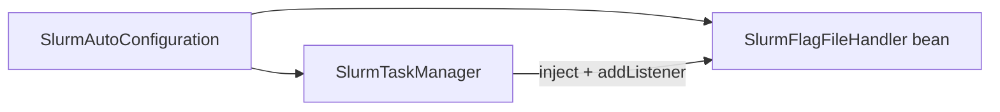
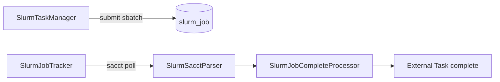

# Design（plan 草案 — 未实施）

## 目标结构（历史）

- 禁止 `SlurmFlagExternalTaskSupport`
- handler 内私有方法：`handleComplete`、`handleSlurmCommandFailure`、`resolveSlurmFailure` 等
- `onFileCreate` 直接调用本类私有方法

## 当前架构（替代）

无 `SlurmFlagFileHandler`、无 `.flag` 文件监听。

## 验证（plan 原意）

- `mvn compile -pl kiwi-bpmn/kiwi-bpmn-component -am`
- worker 过滤、重试、`handleFailure` 行为等价

（已由 slurm 模块 sacct 路径与单测覆盖，非本 plan 验收项。）
