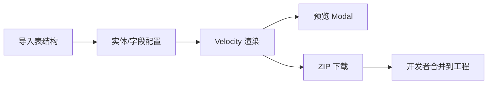

# Design

## 流程

## 后端渲染

- `renderFiles(entityId): List<GeneratedFile>` — `path` + `content`
- 预览不写磁盘；可选落盘需 `genPath` + `app.gen.allowOverwrite` 且路径校验
- `previewCode` → `Map<相对路径, content>`
- `buildZip` → `ZipOutputStream`

## 模板栈

| daoTpl | 输出 |
|--------|------|
| MongoDB | entity（`BaseEntity`）、dao（`BaseMongoRepository`）、controller |
| MybatisPlus | entity（`@TableName`）、mapper、mapper.xml、controller 分支 |

| webTpl | 输出 |
|--------|------|
| Angular | `component.ts/html`、CrudPage `pageConfig` |

**integration/**：`routing-snippet.ts`、`menu.json`、`permissions.txt`、`readme.txt`

## API

| 方法 | 路径 | 说明 |
|------|------|------|
| GET | `/{id}/preview` | 相对路径 → 内容 |
| GET | `/{id}/download` | `{className}-codegen.zip` |

`@SaCheckLogin`；download 需 `gen:entity:generate`。

## 前端

- 导入向导：step 从 1 开始；选连接再选表
- `codegen-preview-modal`：左侧文件列表、右侧代码
- 行操作/工具栏触发 preview 与 download

## 约束

- MyBatis 生成为标准脚手架；业务以 Mongo 为主时需自行接数据源
- `gen:*` 权限由 `PermissionService` 扫描注册

## 验证

- Mongo / MyBatis 各生成一次，ZIP 含 integration 片段
- `mvn compile`、前端 lint/build 冒烟
