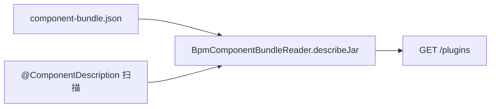

# Design: component-bundle.json 元数据

## 契约

- 路径：`META-INF/kiwi/component-bundle.json`
- `schemaVersion` 固定 `"1"`；`name`、`version`、`components[]` 必填
- `components[].key` 必须与 JAR 内 `@ComponentDescription` 扫描结果一致

## 合并策略

- 有 JSON：以 JSON 为主；未列出的扫描组件 → warnings + `source=scanned` 追加
- 无 JSON：文件名作包名，组件全来自扫描

## API

| 端点 | 行为 |
|------|------|
| `GET /bpm/component/plugins` | 已安装 descriptor 列表 |
| `POST /bpm/component/plugins/preview` | 临时文件 describe，校验失败 400 |
| `POST /bpm/component/plugins/upload` | preview 通过后 copy 落盘 + reload |

## 非目标

- `.kiwi-component-pack` 多 JAR zip 上传
- JSON 中重复完整 inputs/outputs Schema
- 强制历史 JAR 必须带 JSON
