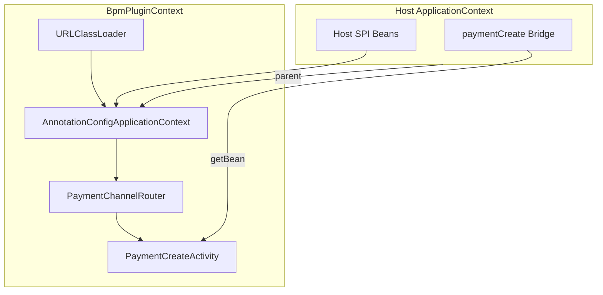

# Design — BPM 插件子 ApplicationContext

## Context

- **现状**：[`BpmComponentPluginLoader`](kiwi-admin/backend/src/main/java/com/kiwi/project/bpm/service/BpmComponentPluginLoader.java) 扫描 JAR 内 `@ComponentDescription` delegate，在主上下文 `createBean` + `autowireBean`，不支持 `@Configuration` / 同 JAR 多 Bean 图。
- **失败案例**：Payment（`PaymentCreateActivity` 构造器注入 `PaymentChannelRouter` → Adapter 链）按 classpath 编写、按 plugin 加载。
- **约束**：Operaton 通过宿主 `ApplicationContext.getBean("paymentCreate")` 解析 delegate；子上下文 Bean 对宿主不可见，必须桥接。
- **Slurm**：保留 classpath（`@EnableScheduling` 等），本期不插件化。

## Goals / Non-Goals

**Goals:**

- 每插件 JAR 一个 `AnnotationConfigApplicationContext`（parent = 宿主，ClassLoader = 插件 URLClassLoader）
- 子上下文内完整 Spring 组件扫描与构造器注入
- 仅 delegate 桥接至宿主；`ClasspathBpmComponentProvider.isClasspathBean` 通过 `isPluginRegisteredBean` 排除
- reload：`destroySingleton(桥接)` → `pluginContext.close()` → `classLoader.close()`
- `component-bundle.json` 支持 `contextClass` / `scanPackages`

**Non-Goals:**

- 引入 PF4J
- Slurm 插件化
- 主上下文补扫 `@Component`（方案 A）
- Boot `@ConditionalOnBean` 在子上下文求值

## Decisions

| 决策 | 选择 | 理由 |
|------|------|------|
| 子上下文类型 | `AnnotationConfigApplicationContext` | 轻量、支持 `@Configuration` / `@ComponentScan` |
| 引导方式 | `contextClass` > `scanPackages` > delegate 包推导 | 兼容旧 JAR；复杂插件显式 `contextClass` |
| 桥接实现 | `PluginDelegateBridge` 实现 `JavaDelegate` / `ExternalTaskHandler`，懒委托子上下文 Bean | `registerSingleton` 不触发 `FactoryBean` 解析 |
| 元数据扫描 | 仍扫描 JAR 注解（`BpmComponentBundleReader`） | 与 bundle JSON 合并逻辑不变 |
| SPI | 接口在 `kiwi-bpmn-core`，子上下文经 parent 解析宿主 Bean | 与现有 ClassLoader 契约一致 |

### 加载流程



### 卸载

```
unload(jar):
  for each bridgeBeanName: host.destroySingleton(name)
  pluginContext.close()
  classLoader.close()
```

## Risks / Trade-offs

- 子上下文非 Boot 应用 → `@ConditionalOn*` 不可用（文档明确）
- 简单单类插件（Kafka）多一个 scan 成本可忽略
- 桥接 Bean 的 class 在宿主 CL，delegate 在插件 CL → `ClasspathBpmComponentProvider` 须继续排除 `isPluginRegisteredBean`

## Migration

- 旧 JAR 无 `contextClass`：自动 `scan` delegate 所在包根（如 `com.kiwi.bpmn.component.payment`）
- Payment 新增 `PaymentPluginConfiguration` 并在 bundle 中可选填写 `contextClass`
