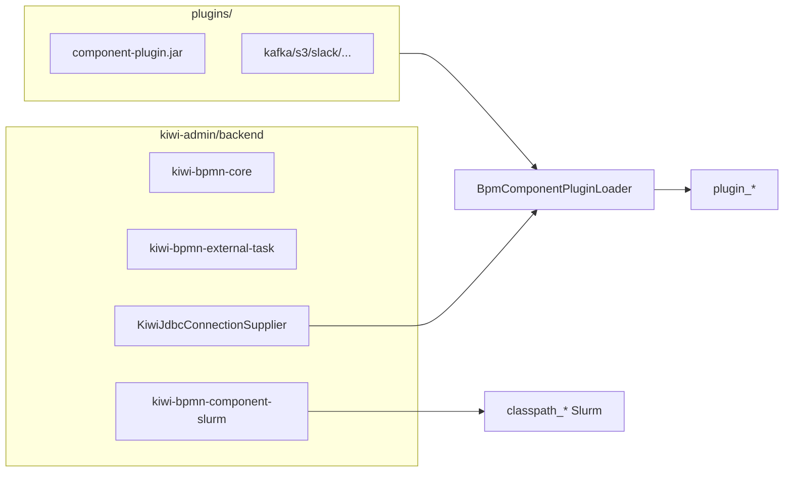

# Design — BPM 组件模块插件化

## Context

- **现状**：[`kiwi-admin/backend/pom.xml`](kiwi-admin/backend/pom.xml) 直接依赖 7 个 `kiwi-bpmn-component*` 模块；[`Application`](kiwi-admin/backend/src/main/java/com/kiwi/framework/springboot/Application.java) `scanBasePackages=com.kiwi` 将组件注册为 Spring Bean → [`ClasspathBpmComponentProvider`](kiwi-admin/backend/src/main/java/com/kiwi/project/bpm/service/ClasspathBpmComponentProvider.java) 产出 `classpath_*` 元数据。
- **已有插件路径**：[`BpmComponentPluginLoader`](kiwi-admin/backend/src/main/java/com/kiwi/project/bpm/service/BpmComponentPluginLoader.java) 扫描 `bpm.component.plugins-dir`（默认 `plugins/`），`URLClassLoader` 父委托为 application ClassLoader，元数据 `plugin_*`。
- **约束**：Slurm 含 [`SlurmAutoConfiguration`](kiwi-bpmn/kiwi-bpmn-component-slurm/src/main/java/com/kiwi/bpmn/component/slurm/SlurmAutoConfiguration.java)（`@Configuration`、`@EnableScheduling`、Mongo Bean），当前 PluginLoader 仅注册单个 `JavaDelegate`/`ExternalTaskHandler`，**本期 Slurm 保留 classpath**。
- **关联 change**：[`bpm-workflow-template-market`](../../bpm-workflow-template-market/) 任务 B 依赖本 change 完成后，BPMN 中 `plugin_*` 成为导出 JAR 的主路径。

## Goals / Non-Goals

**Goals:**

- 除 Slurm 外，全部官方业务组件以 `plugins/*.jar` 分发；backend 仅硬依赖 `kiwi-bpmn-core`、`kiwi-bpmn-external-task`、`kiwi-bpmn-component-slurm`。
- `mvn -Pbuild-plugins package` 产出官方种子插件并 COPY 至 dev/Docker 可用目录。
- 存量 BPMN / Mongo 组件 id 迁移为 `plugin_*`（Slurm 除外）。
- PluginLoader 支持同 JAR 多 Bean 依赖注入；预埋 `buildPluginJarIndex()`。

**Non-Goals:**

- Slurm 插件化、组件 semver、`.kiwi-component-pack` 官方基础包 UI。
- 移除 `ClasspathBpmComponentProvider`。
- 模板包 zip `components/` 目录（任务 B）。

## Decisions

| 决策 | 选择 | 理由 | 备选 |
|------|------|------|------|
| Slurm 处理 | 保留 classpath | PluginLoader 不支持 `@Configuration` 生态；改动面可控 | 增强 Loader 加载子上下文（工作量大） |
| 种子插件 | Maven profile `build-plugins` + COPY | 与 CI 自然集成；jar 不入 git | 启动时从 classpath 解压 zip |
| SPI 位置 | `kiwi-bpmn-core` 包 `com.kiwi.bpmn.core.spi` | 父/子 ClassLoader 共享接口类，避免双加载 | 留在 component 模块（会注入失败） |
| 插件打包 | `maven-shade-plugin` fat jar | 第三方 lib（aws-sdk、kafka-clients 等）随 jar 分发 | assembly 薄 jar + lib 目录（Loader 需改） |
| provided 依赖 | core、spring-context、operaton、kiwi-common 标 provided | 由 backend 父 CL 提供，与现有 URLClassLoader 父委托一致 | 全打入 jar（体积与冲突风险） |
| `@ConditionalOnBean` | Jdbc/Mongo 组件去掉条件注解 | PluginLoader `createBean` 不跑 Boot 条件；无 SPI 时运行时报错 | 在 Loader 内模拟条件（复杂） |
| Slurm 传递依赖 | 从 slurm pom 移除对 `kiwi-bpmn-component` 的依赖 | 避免 core 组件 classpath 与 plugins 双份 | 保留传递依赖（接受双轨，文档说明） |
| id 迁移 | Mongock + 种子 JSON 一次性替换 | 干净；key 不变仅前缀变 | 仅运行时 fallback `classpath_*` → `plugin_*` |
| 空 plugins 目录 | 启动成功但组件列表缺官方项；文档强调 build-plugins | 不阻断 Slurm-only 场景 | fail-fast（影响 dev 体验） |

### 目标架构

### 插件 JAR 模块清单

| Maven 模块 | 输出名示例 | shade 第三方 |
|------------|-----------|-------------|
| `kiwi-bpmn-component` | `kiwi-bpmn-component-1.0.0-SNAPSHOT-plugin.jar` | commons-io、jsch、mail 等 |
| `kiwi-bpmn-component-kafka` | `...-kafka-...-plugin.jar` | kafka-clients |
| `kiwi-bpmn-component-rabbitmq` | `...-rabbitmq-...-plugin.jar` | amqp-client |
| `kiwi-bpmn-component-s3` | `...-s3-...-plugin.jar` | aws-sdk |
| `kiwi-bpmn-component-slack` | `...-slack-...-plugin.jar` | （按模块依赖） |
| `kiwi-bpmn-component-example` | 可选，默认种子不含 | — |

验证顺序：kafka → s3 → rabbitmq → slack → `kiwi-bpmn-component` 大 jar。

### PluginLoader 增强

1. **同 JAR 多 Bean**：`loadJar` 收集本 jar 注册的 bean 名列表；全部 `registerBean` 完成后，对每个实例调用 `autowireBean` 解析 `WebhookOutboundActivity` → `HttpRequestActivity`。
2. **buildPluginJarIndex**（只读，不 reload）：遍历 `plugins/*.jar`，扫描 `@ComponentDescription` + delegate 类 → `Map<componentId, jarFileName>`；供任务 B 导出时解析 `plugin_*` → JAR 文件。

### BPMN / Mongo 迁移

- Mongock `@ChangeUnit`：对 `bpmProcess` 集合 `bpmnXml` 字段、`bpmComponent` 集合 `id`/`parentId` 执行 `classpath_{key}` → `plugin_{key}`，**排除** key 以 `slurm` 开头或已知 Slurm 专用 id。
- 更新 [`V20250616_002__BpmProcess.json`](kiwi-admin/backend/src/main/resources/mongo/migration/versioned/V20250616_002__BpmProcess.json)。
- [`BpmComponentService.resolveHttpRequestParentComponentId()`](kiwi-admin/backend/src/main/java/com/kiwi/project/bpm/service/BpmComponentService.java) fallback：`plugin_httpRequest`。
- 可选过渡期：`getComponent(id)` 对 `classpath_*` 未命中时 fallback 查 `plugin_*`（Slurm 不受影响）。

## Risks / Trade-offs

| 风险 | 缓解 |
|------|------|
| ClassLoader 双加载 SPI | 接口迁至 `kiwi-bpmn-core`，插件 jar 不 shade core |
| 开发者忘记 build-plugins | README / AGENTS.md / 组件列表为空时日志 WARN |
| Slurm pom 去 component 依赖改动大 | `dependency:tree` 验证；必要时最小保留 compile 依赖 |
| 插件 jar 体积大（aws-sdk、core 组件） | `.gitignore` plugins/；CI 构建时生成 |
| OpenAPI/CLI 生成器 parentId 断裂 | 修改 fallback + 规格 delta；缓存查找仍优先 |
| 双份组件 Bean（若 Slurm 传递依赖未清干净） | 文档 + pom 审查；classpath 与 plugin 同名 bean 时 Loader 已 skip 主上下文同名 |

## Migration Plan

1. 合并代码后：开发者/CI 执行 `mvn -pl kiwi-admin/backend -am package -Pbuild-plugins -DskipTests`。
2. 部署 backend：确保运行目录 `plugins/` 含官方种子 jar（Docker 镜像内置）。
3. Mongock 变更在首次启动执行 `classpath_*` → `plugin_*` 迁移（已存在库）。
4. 回滚：恢复 backend pom 对 component 模块的依赖，清空 plugins/，回滚 Mongock（需手工或反向 change）。

## Open Questions

- `kiwi-bpmn-component-example` 是否纳入默认种子包？（建议：否，仅文档说明可选安装。）
- CI 是否增加「插件加载 smoke test」作为 quality gate？（建议：后续 PR 加，非本 change 阻塞。）
