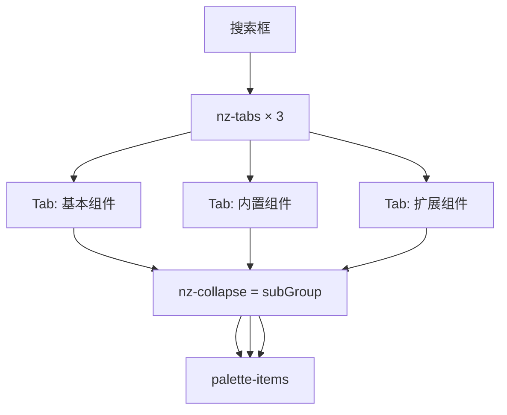

# Design

## 目标结构

| 元数据 | UI | 含义 |
|--------|-----|------|
| **group** | `nz-tab` | 顶层 Tab（暂时固定 3 个） |
| **subGroup** | Tab 内 `nz-collapse-panel` | 功能子类（原 `@ComponentDescription.group` 值） |

### 顶层 Tab

| Tab 名称 | 内容来源 | 示例 |
|----------|----------|------|
| **基本组件** | Camunda/BPMN 原生元素 | 开始/结束事件、用户任务、网关、调用活动… |
| **内置组件** | `source=classpath` | 赋值、文件、Mongo、HTTP、Shell… |
| **扩展组件** | `source=plugin` | `plugins/` 上传的第三方组件 |



注意：`BpmComponentParameter.group` 仍是属性面板参数分组，与组件 Tab 无关。

## 元数据与归类规则

### 注解与实体

`ComponentDescription` 新增：

```java
String subGroup() default "";
```

**顶层 group（Tab）赋值**（部署 / list 时推导，不必每类手写）：

| 条件 | palette group |
|------|----------------|
| 前端 `BasePaletteProvider` | **基本组件**（不进 Mongo/API） |
| `source == "classpath"` | **内置组件** |
| `source == "plugin"` | **扩展组件** |
| 其它 source（xbpm / openapi / cli） | **暂归入扩展组件**，subGroup=`自定义` |

**subGroup 赋值**：

1. 优先 `@ComponentDescription.subGroup()`
2. 否则现有 `@ComponentDescription.group()`（旧功能分类）
3. 仍空 → `"未分类"`

`BpmComponent` 新增 `subGroup`；palette group 建议在 list API **运行时**由 `source` 推导，减少 Mongo 迁移。子组件继承父组件 `subGroup`（`fillComponentProperties`）。`BpmComponentDeploymentSignature` 纳入 `subGroup`。

### List API

`GET /bpm/component/list` 返回嵌套结构（无组件的 Tab 可省略）：

```typescript
interface ComponentPaletteTab {
  group: string; // 基本组件 | 内置组件 | 扩展组件
  subGroups: {
    subGroup: string;
    components: ComponentDescription[];
  }[];
}
```

「基本组件」不在此 API 返回，由 `BasePaletteProvider` 独占。

**兼容**：旧 Mongo 无 `subGroup` 时，`subGroup = 原 group`；Tab 由 `source` 推导。

### 内置组件 subGroup 迁移表

| subGroup（原 group） | 代表组件 |
|---------------------|----------|
| 通用 | Assignment, Sleep, Uuid, DigestHash, Base64, JsonMap |
| 文件 | FileRead, FileWrite, SftpTransfer |
| 数据 | Mongo, Jdbc |
| HTTP | HttpRequest |
| 通知 | EmailSend, SlackNotify, WebhookOutbound |
| 消息 | KafkaPublish, RabbitMqPublish |
| 存储 | S3Object |
| 脚本 | Shell, Slurm |
| 示例 | DemoGreeting |

独立 Maven 模块（kafka/s3/slack/rabbitmq）只要 `source=classpath`，仍属内置组件。

### 扩展组件

插件 `@ComponentDescription(subGroup=...)` 决定 Collapse 标题；未声明 →「未分类」。插件作者不应手写 group 为「扩展组件」。

## 前端 Palette

| Provider | Tab | subGroup 来源 |
|----------|-----|---------------|
| `BasePaletteProvider` | 基本组件 | 现有 `PaletteGroup.group` |
| `ComponentPalleteProvider` | 内置 + 扩展 | API `subGroups` |

`ComponentPalleteProvider` 消费新 API，产出 0–2 个 `PalleteTab`。`pallete.ts` 合并后 2–3 个 Tab。

**模板**（`pallete.html`）：Tab = group；Tab 内 `nz-collapse` = subGroup；默认仅首组 `nzActive`；搜索匹配 group、subGroup、组件名。

**Context Pad**：popup 分组 id/name 为 `${paletteGroup} · ${subGroup}`。

## 非目标

- 用户自建组件（xbpm/openapi/cli）单独 Tab — 暂并入扩展 / subGroup「自定义」
- 最近使用、侧栏加宽、虚拟滚动、自定义 icon

## 验证清单

1. 左侧 2–3 个 Tab：基本组件、内置组件、（有插件时）扩展组件
2. classpath 组件（含 kafka/s3 等）在内置 Tab 下正确 subGroup
3. 上传插件 JAR 后出现在扩展 Tab
4. 基本组件 Tab 仅 BPMN 图元，拖拽正常
5. 搜索、Context Pad、旧 Mongo 数据兼容
