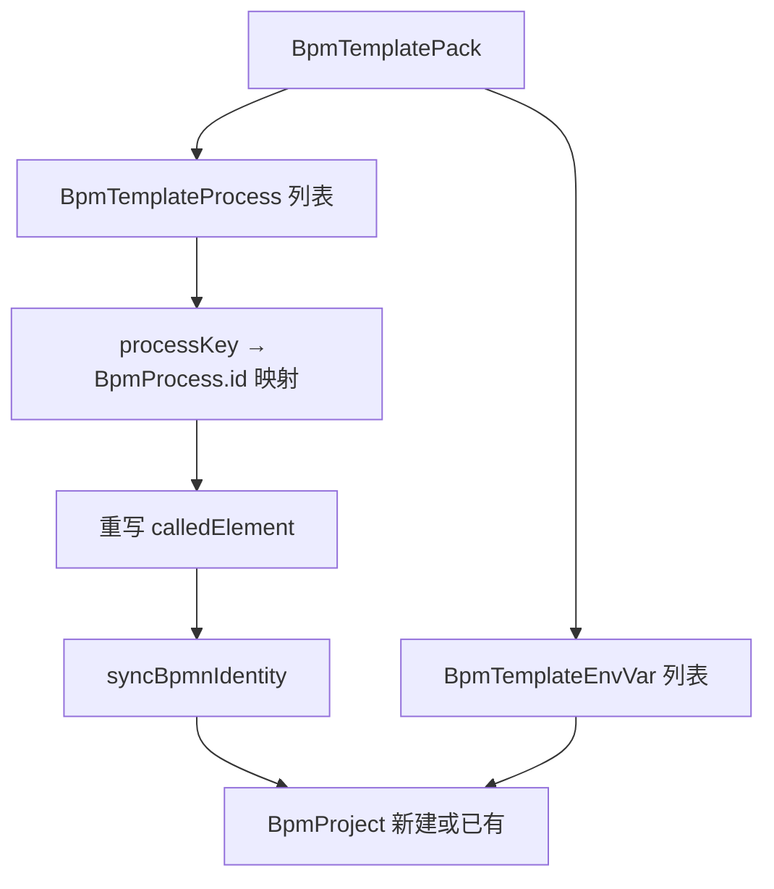

# Design — BPM 流程模板 Market

## Context

- 用户工作区：`BpmProject` → 多 `BpmProcess` + `BpmProjectEnvVar`。
- Market 发布态镜像为：`BpmTemplatePack` → 多 `BpmTemplateProcess` + `BpmTemplateEnvVar`。
- 已有能力可复用：`BpmProcessDefinitionService.syncBpmnIdentity`、`BpmComponentBundleService` 的 manifest/zip 心智、`BpmOwnershipAccessService` 权限。
- 实施分三阶段：C1 站内、C2 文件包、C3 公网 Registry。本 change **C1+C2 已落地**，C3 留待后续 change。

## Goals / Non-Goals

**Goals:**

- 模板包作为 Market 唯一 listing 单位（`kind`: `Single` | `Solution`）。
- 发布：整个项目或单流程 → `BpmTemplatePack`；可选导出 `.kiwi-template-pack`。
- 安装：新建项目或装入已有项目；复制 env；CallActivity 引用按 `processKey` → 新 `BpmProcess.id` 重映射。
- 可见性：`Private` / `Org` / `Public`；列表按当前用户可读范围过滤。

**Non-Goals:**

- 跨实例 Registry 同步、版本审核、GPG 签名（C3）。
- 安装时缺失 BPM 组件的硬失败（仅 manifest 记录 `requiredComponentKeys`）。
- 替换现有「另存为组件」流程。

## Decisions

| 决策 | 选择 | 理由 |
|------|------|------|
| 售卖单位 | `BpmTemplatePack` | 与 `BpmProject` 一一对应，支持多流程 + env + entry |
| 包类型 | `Single` / `Solution` | 单流程退化为单元素包，UI 可简化 |
| 安装主路径 | `installPack` 新建项目 | 与「从模板创建项目」心智一致 |
| CallActivity | 安装时重写 `calledElement` | 包内 `processKey` 与运行时 `BpmProcess.id` 不同 |
| BPMN identity | 安装后调用 `syncBpmnIdentity` | 与现有保存/部署对齐策略一致 |
| 文件格式 | `.kiwi-template-pack`（zip） | 与 component bundle 分发一致；含 `manifest.json` |
| 完整性 | SHA-256 checksum 存 `BpmTemplatePack.checksum` | C2 基础校验；GPG 留 C3 |
| API 前缀 | `/bpm/market` + `bpmMarket_*` | MCP 自动注册；项目域别名 `bpmProj_*` |
| AI 检索 | `GET /bpm/market/search/ai-page` | 扁平 query 参数，page 从 0，size≤100 |

### 数据模型（MongoDB）

```
bpmTemplatePack      — listing + manifest 摘要 + visibility/status
bpmTemplateProcess   — packId, processKey, bpmnXml, entry, sort
bpmTemplateEnvVar    — packId, key, value, sort（镜像 BpmProjectEnvVar）
```

`BpmTemplatePackManifest`：`requiredComponentKeys`、`callActivityBindings`（发布时 `BpmTemplatePackManifestScanner` 扫描 BPMN）。

### 安装流程



### `.kiwi-template-pack` 结构（C2）

| 路径 | 内容 |
|------|------|
| `manifest.json` | 包元数据 + manifest + process 索引 |
| `README.md` | readme 文本 |
| `env-vars.json` | 环境变量数组 |
| `processes/{processKey}.bpmn` | 各流程 BPMN XML |

导入：解析 zip → 校验 checksum（若 manifest 含）→ `publishFromBundle` 或 `importAndInstall`。

### 前端

| 路由 | 用途 |
|------|------|
| `/bpm/market` | crud-page 列表 |
| `/bpm/market/:packId` | 详情、安装、下载 |
| 项目页 / 项目流程页 | 导出为模板、导入 zip、跳转市场 |

## Risks / Trade-offs

| 风险 | 缓解 |
|------|------|
| 详情页 `window.open` 下载缺 Sa-Token | 后续改为带 Token 的 blob 下载 |
| 项目流程页「导入模板」用 prompt 输入 packId | 后续改为市场选择器 |
| `requiredComponentKeys` 未强校验 | C3 或独立 change 加安装前检查 |
| 多流程 `installPackInto` 流程名冲突 | 当前追加复制；冲突策略待产品定义 |
| Org 可见性未接组织模型 | 现阶段 Org 与 Public 查询逻辑可简化 |

## Migration Plan

1. 部署后端：新 Mongo 集合随首次写入自动创建。
2. 部署前端：菜单「模板市场」出现。
3. 无破坏性迁移；新集合 `bpmTemplatePack` / `bpmTemplateProcess` / `bpmTemplateEnvVar` 自动创建。

## Open Questions

- C3 Registry：slug 全局唯一 vs 实例内唯一？
- 安装冲突：同名 `processKey` 装入已有项目时覆盖还是拒绝？
- AI：`applyWorkflowTemplate` 是否默认 `installPack` 还是 `installProcess`？
